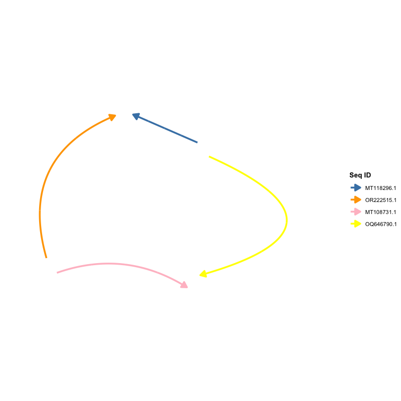
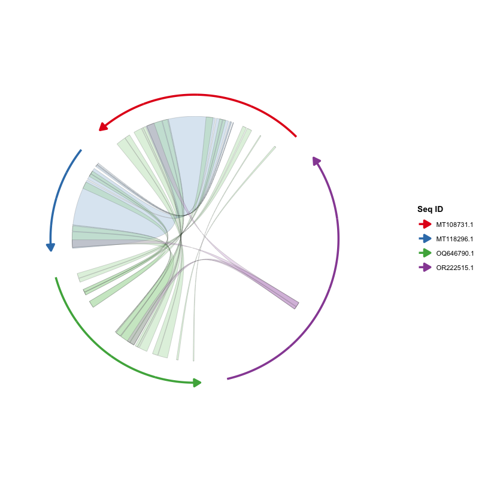
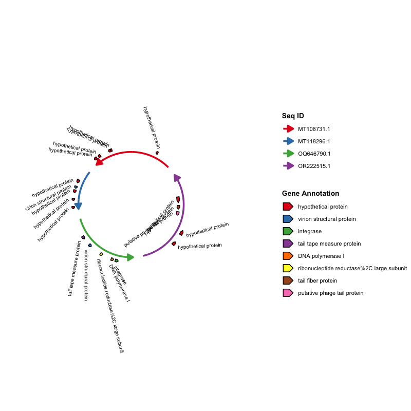
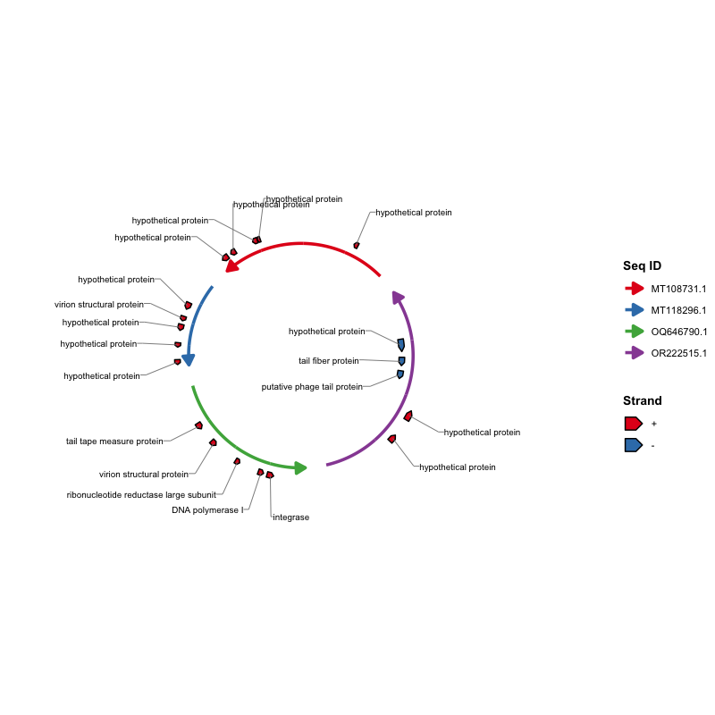
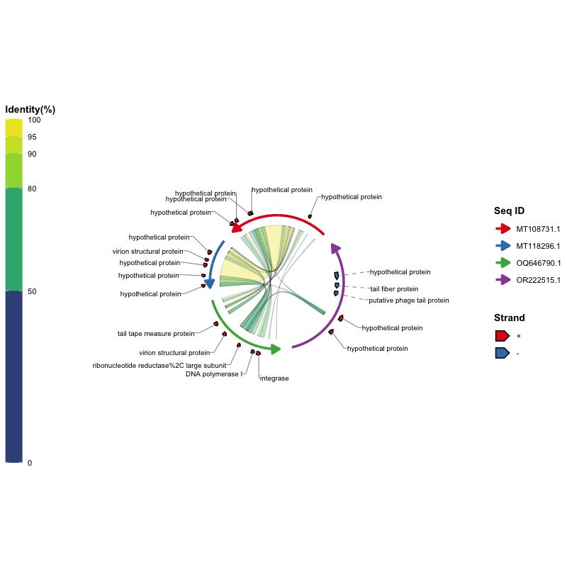
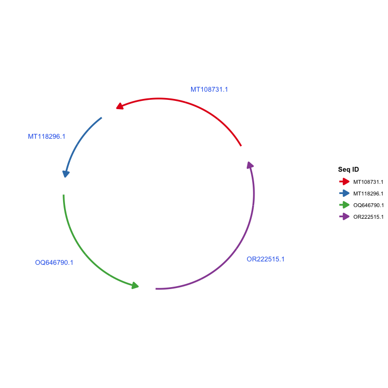
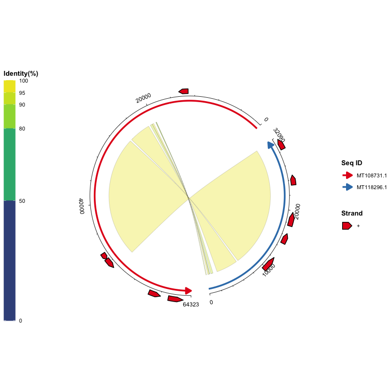
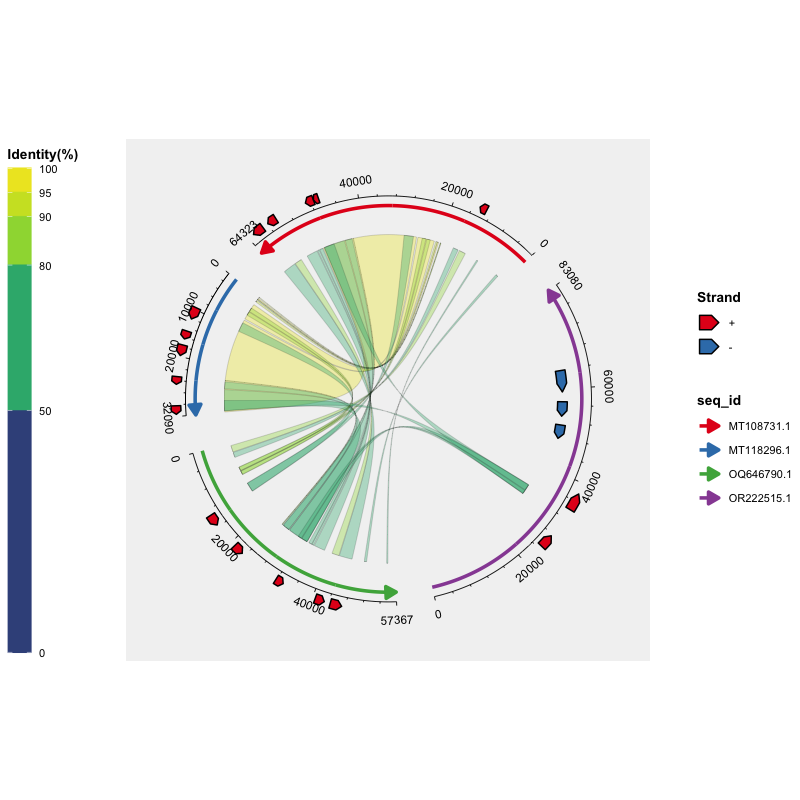

🌐 语言切换：【[现代汉语（Hans）](README-Hans.md) | [English](README.md)】

# ggchord：基于 ggplot2 的多序列弦图可视化工具

## 概述

`ggchord` 是一个基于 `ggplot2` 的 R 语言包，采用**分层的图形语法**将多序列数据绘制为直观的弦图。与"一个大函数"不同，你通过叠加图层来构建图形：`ggchord()` 负责提供数据与全局选项，每个 `geom_*` 图层负责绘制一类元素（序列弧线、比对连接带、基因注释、坐标轴、标签）。每个图层都有合理的默认值，因此**一行代码即可画出完整的弦图**，需要精细控制时也可以分别微调每个图层。

- 每条序列以圆弧呈现，长度按比例映射。
- 连接带（ribbon）表示序列之间的比对/同源区域。
- 基因（或其他特征）以箭头多边形绘制在序列弧上。
- 坐标轴与标签标注序列位置。
- 由于 ggchord 图形是真正的 `ggplot2` 对象，`theme()`、`scale_*()`、`ggsave()`、`ggplot_build()` 与 `plotly::ggplotly()` 均可直接使用。

该包是通用的多序列比较工具，可用于序列比较、基因邻域分析、噬菌体-宿主关系、泛基因组区块、共线性分析等——你只需要准备三张规整的数据表。

## 主要功能

- **真正的 `ggplot2` 分层风格**：`ggchord()` 只接收数据和全局选项，每个 `geom_*` 图层管理自己的布局参数。
- **开箱即用**：`ggchord(data) + geom_seq() + geom_ribbon() + geom_gene() + geom_axis()` 即可得到完整图形。
- **多序列支持**：可同时展示两条、三条、四条或更多序列。
- **逐序列参数**：顺序、方向、间距、半径、曲率等均在 `geom_seq()` 中设置；支持单值、向量、命名向量与列表等多种格式（见[灵活的参数格式](#灵活的参数格式)）。
- **灵活的连接带**：可按相似度、查询序列、目标序列或单一颜色着色；支持自定义贝塞尔曲率与描边。
- **基因注释**：按链方向或功能类别着色，并可通过 `geom_gene_label_repel()` 实现防重叠标签。
- **精细的坐标轴**：主/次刻度，标签文字支持 `"parallel"`（平行于坐标轴）、`"perpendicular"`（垂直于坐标轴）、`"horizontal"`（水平）或任意角度。
- **与 ggplot2 生态无缝衔接**：`theme()`、`scale_*()`、`ggsave()`、`ggplot_build()`、`plotly::ggplotly()` 均可使用。

## 安装

`ggchord` 需要 R（≥ 4.1.0）和 `ggplot2`（≥ 4.0.0）。

```r
install.packages("ggplot2")   # 如需要
```

从 CRAN 安装：

```r
install.packages("ggchord")
```

从 GitHub 安装（开发版）：

```r
devtools::install_github("DangJem/ggchord")
```

## 快速开始

包内自带三份示例数据，直接运行以下代码即可：

```r
library(ggchord)

# 加载内置示例数据
data(seq_data_example)
data(ribbon_data_example)
data(gene_data_example)

# 像 ggplot2 一样叠加图层
p <- ggchord(
  seq_data     = seq_data_example,
  ribbon_data  = ribbon_data_example,
  gene_data    = gene_data_example
) +
  geom_seq() +      # 序列弧线
  geom_ribbon() +   # 比对连接带
  geom_gene() +     # 基因注释
  geom_axis()       # 位置坐标轴

print(p)
```


核心思想就一句话：**数据交给 `ggchord()`，样式交给各图层**。下表概括了每个图层的作用，下一节会逐一演示。

| 图层 | 作用 |
| --- | --- |
| `geom_seq()` | 绘制序列弧线（含方向箭头） |
| `geom_ribbon()` | 绘制序列之间的连接带 |
| `geom_gene()` | 绘制基因/特征箭头多边形 |
| `geom_gene_label()` / `geom_gene_label_repel()` | 绘制基因标签（固定位置或力导向防重叠） |
| `geom_axis()` | 绘制坐标轴线、刻度与刻度标签 |
| `geom_seq_label()` | 在弧线内侧/外侧放置序列名称 |

---

## 使用说明

### 1. 前期数据准备

包需要三类输入数据，均为普通数据框。

#### 【必须】序列信息数据（`seq_data`）

| 列名 | 类型 | 说明 |
| --- | --- | --- |
| `seq_id` | 字符 | 序列唯一标识 |
| `length` | 整数 | 序列长度（必须为正数） |

示例：

| seq_id | length |
| --- | --- |
| MT108731.1 | 64323 |
| MT118296.1 | 32090 |
| OQ646790.1 | 57367 |
| OR222515.1 | 83080 |

从 FASTA 文件生成该表格的常见方法：

```bash
seqkit fx2tab -nil *.fna | sed '1i seq_id\tlength' > seq_track.tsv
```

#### 【可选】比对数据（`ribbon_data`）

每行表示两条序列之间的一个比对片段（列名遵循常见比对工具的输出约定）：

| 列名 | 类型 | 说明 |
| --- | --- | --- |
| `qaccver` | 字符 | 查询序列 ID |
| `saccver` | 字符 | 目标序列 ID |
| `length` | 整数 | 比对长度（bp） |
| `pident` | 数值 | 相似度百分比（0–100） |
| `qstart` | 整数 | 查询序列上的起始位置 |
| `qend` | 整数 | 查询序列上的终止位置 |
| `sstart` | 整数 | 目标序列上的起始位置 |
| `send` | 整数 | 目标序列上的终止位置 |

示例行：

| qaccver | saccver | length | pident | qstart | qend | sstart | send |
| --- | --- | --- | --- | --- | --- | --- | --- |
| MT108731.1 | MT118296.1 | 24856 | 98.612 | 26298 | 51139 | 7121 | 31959 |
| MT108731.1 | MT118296.1 | 4412 | 97.031 | 21513 | 25922 | 2365 | 6772 |
| MT108731.1 | MT118296.1 | 464 | 94.181 | 20691 | 21146 | 1032 | 1495 |

例如，BLAST 的 `-outfmt 7` 标准输出可以直接解析为该表格：

```bash
seqs=("MT108731.1" "MT118296.1" "OQ646790.1" "OR222515.1")
ext="fna"
for ((i=0; i<${#seqs[@]}-1; i++)); do
  for ((j=i+1; j<${#seqs[@]}; j++)); do
    blastn \
      -outfmt '7 qaccver saccver pident length mismatch gapopen qstart qend sstart send evalue bitscore qcovs qlen slen sstrand stitle' \
      -query "${seqs[$i]}.${ext}" \
      -subject "${seqs[$j]}.${ext}" \
      -out "${seqs[$i]}__${seqs[$j]}.o7"
  done
done
```

#### 【可选】基因数据（`gene_data`）

每行表示一条序列上的一个基因（或其他特征）：

| 列名 | 类型 | 说明 |
| --- | --- | --- |
| `seq_id` | 字符 | 基因所属序列 ID |
| `start` | 整数 | 基因起始位置 |
| `end` | 整数 | 基因终止位置 |
| `strand` | 字符 | 链方向（`+` 或 `-`） |
| `anno` | 字符 | 基因注释 / 功能类别 |

示例行：

| seq_id | start | end | strand | anno |
| --- | --- | --- | --- | --- |
| MT108731.1 | 60709 | 63087 | + | hypothetical protein |
| MT118296.1 | 14628 | 16301 | + | virion structural protein |
| OQ646790.1 | 43765 | 46140 | + | integrase |
| OQ646790.1 | 13194 | 15551 | + | tail tape measure protein |

例如，可由 GFF3 文件转换得到：

```r
library(tidyverse)
gff3FilesPath <- list.files(path = ".", pattern = "*.gff3")
gff3Table <- map_df(gff3FilesPath, ~read_tsv(.x, show_col_types = F, comment = "#",
  col_names = F) %>% set_names(c("seq_id", "source", "type", "start", "end",
  "score", "strand", "phase", "attributes")))
geneTrackTable <- gff3Table %>%
  filter(type == "CDS") %>%
  mutate(anno = str_extract(attributes, "(?<=product=)[^;]+(?=;)")) %>%
  select(seq_id, start, end, strand, anno)
write_tsv(geneTrackTable, "gene_track.tsv")
```

### 2. 由浅入深示例

以下示例均使用内置数据，可以直接复制运行：

```r
library(ggchord)

data(seq_data_example)
data(ribbon_data_example)
data(gene_data_example)
```

#### 第 1 步：绘制序列弧线

最简单的图形只需要 `seq_data`：

```r
ggchord(seq_data = seq_data_example) + geom_seq()
```


自定义序列布局——顺序、方向、曲率与颜色都属于 `geom_seq()`：

```r
ggchord(seq_data = seq_data_example) +
  geom_seq(
    seq_order      = c("MT118296.1", "OR222515.1", "MT108731.1", "OQ646790.1"),
    seq_orientation = c(1, -1, 1, -1),
    seq_curvature   = c(0, 2, -2, 6),
    seq_colors      = c("steelblue", "orange", "pink", "yellow")
  )
```



#### 第 2 步：加入比对连接带

添加 `ribbon_data` 并绘制连接带。默认按相似度百分比着色（`ribbon_color_scheme = "pident"`）：

```r
ggchord(seq_data_example, ribbon_data_example) +
  geom_seq() + geom_ribbon()
```


其他配色方案：

```r
# 按查询序列着色
ggchord(seq_data_example, ribbon_data_example) +
  geom_seq() + geom_ribbon(ribbon_color_scheme = "query")
```


```r
# 按目标序列着色
ggchord(seq_data_example, ribbon_data_example) +
  geom_seq() + geom_ribbon(ribbon_color_scheme = "subject")
```



```r
# 全部连接带使用单一颜色
ggchord(seq_data_example, ribbon_data_example) +
  geom_seq() +
  geom_ribbon(ribbon_color_scheme = "single", ribbon_colors = "orange")
```


#### 第 3 步：加入基因注释与标签

添加 `gene_data` 并将基因绘制为箭头。默认按链方向（`+` / `-`）着色：

```r
ggchord(seq_data_example, gene_data = gene_data_example) +
  geom_seq() + geom_gene()
```


按注释类别着色，并用 `geom_gene_label()` 添加标签：

```r
ggchord(seq_data_example, gene_data = gene_data_example) +
  geom_seq() +
  geom_gene(gene_color_scheme = "manual") +
  geom_gene_label(
    gene_label_rotation = 45,
    gene_label_radial_offset = 0.1
  )
```



当注释较长或基因较密集时，标签容易重叠。`geom_gene_label_repel()` 采用类似 ggrepel 的力导向布局将标签推开，并用引导线连接对应的基因；还可以自动换行（`gene_label_wrap`）并隐藏最拥挤的标签（`max_overlaps`）：

```r
ggchord(seq_data_example, gene_data = gene_data_example) +
  geom_seq() +
  geom_gene() +
  geom_gene_label_repel(
    gene_label_wrap = 15,
    max_overlaps = 5
  )
```


如需全部横向文字和 L 形引导线，可设置 `gene_label_orientation = "horizontal"` 与 `gene_label_segment = "elbow"`：

```r
ggchord(seq_data_example, gene_data = gene_data_example) +
  geom_seq() +
  geom_gene() +
  geom_gene_label_repel(
    gene_label_orientation = "horizontal",
    gene_label_segment = "elbow",
    gene_label_wrap = 15
  )
```



L 形引导线的长短会随每个标签的位置和文字宽度自适应，标签可以自由摆放，
不会强制所有引导线段等长。

当 ribbon 占据弦图内部时，内侧的标签容易压到 ribbon 上。
设置 `gene_label_side = "outside"` 可将这些标签移到弧线外侧；
被移出去的标签对应的引导线默认会变成虚线
（`gene_label_segment_linetype` 可调节所有引导线的线型）：

```r
ggchord(seq_data_example, ribbon_data_example, gene_data_example) +
  geom_seq() +
  geom_ribbon() +
  geom_gene() +
  geom_gene_label_repel(
    gene_label_orientation = "horizontal",
    gene_label_segment = "elbow",
    gene_label_side = "outside",
    gene_label_wrap = 15
  )
```



#### 第 4 步：加入坐标轴与序列标签

坐标轴用主/次刻度标注序列位置。默认刻度标签平行于坐标轴；
`geom_seq_label()` 将序列名称放在弧线周围。`seq_label_radius` 是弧线半径的
倍数：`1` 表示在弧线上，`> 1` 表示移到弧线外侧（远离圆心，如 `1.2` = 弧外
20%），`< 1` 表示移到内侧：

```r
ggchord(seq_data_example) +
  geom_seq() +
  geom_axis(
    axis_tick_major_length = 0.03,
    axis_tick_minor_length = 0.015,
    axis_label_size = 2.5
  ) +
  geom_seq_label(seq_label_radius = 1.2)
```


序列标签默认沿弧线旋转并自动保持文字可读；设置
`seq_label_orientation = "horizontal"` 可以让所有标签保持水平，
文字从圆心向外延伸：

```r
ggchord(seq_data_example, rotation = 30) +
  geom_seq() +
  geom_seq_label(
    seq_label_radius = 1.15,
    seq_label_orientation = "horizontal",
    seq_label_size = 3.5,
    colour = "#2563EB"
  )
```



#### 第 5 步：双序列比较

可以绘制任意子集。保留两条序列及其对应的连接带与基因：

```r
seq2 <- seq_data_example[seq_data_example$seq_id %in%
                           c("MT108731.1", "MT118296.1"), ]
ribbon2 <- ribbon_data_example[
  ribbon_data_example$qaccver %in% seq2$seq_id &
    ribbon_data_example$saccver %in% seq2$seq_id, ]
gene2 <- gene_data_example[gene_data_example$seq_id %in% seq2$seq_id, ]

ggchord(seq2, ribbon2, gene2) +
  geom_seq() + geom_ribbon() + geom_gene() + geom_axis()
```



#### 第 6 步：三序列比较

同样的思路适用于三条序列：

```r
seq3 <- seq_data_example[seq_data_example$seq_id %in%
                           c("MT108731.1", "MT118296.1", "OQ646790.1"), ]
ribbon3 <- ribbon_data_example[
  ribbon_data_example$qaccver %in% seq3$seq_id &
    ribbon_data_example$saccver %in% seq3$seq_id, ]
gene3 <- gene_data_example[gene_data_example$seq_id %in% seq3$seq_id, ]

ggchord(seq3, ribbon3, gene3) +
  geom_seq() + geom_ribbon() + geom_gene() + geom_axis()
```


#### 第 7 步：组合所有图层并精细控制

每个图层都可以接收精细参数。下图把 ggchord 的特色功能全部组合在一起：
逐序列的半径、方向与弯曲度，按一致性着色的 ribbon，按链向着色的基因箭头，
被推到弧线外侧（不会压到 ribbon）的防重叠标签、序列名称、位置坐标轴，
以及自定义主题与精心挑选的配色：

```r
ggchord(
  seq_data     = seq_data_example,
  ribbon_data  = ribbon_data_example,
  gene_data    = gene_data_example,
  title        = "ggchord",
  rotation     = 45,
  panel_margin = list(t = 1.5, r = 0.6, b = 0.6, l = 0.6)
) +
  labs(subtitle = "Layered multi-sequence chord diagrams for ggplot2") +
  geom_seq(
    seq_radius      = c(3.3, 2.5, 1.8, 1.25),
    seq_orientation = c(-1, -1, 1, -1),
    seq_curvature   = c(0.8, 1, 1.4, 1),
    seq_gap         = 0.035,
    seq_colors      = c(
      "MT108731.1" = "#E76F51",
      "MT118296.1" = "#264653",
      "OQ646790.1" = "#2A9D8F",
      "OR222515.1" = "#D9A62E"
    ),
    linewidth = 1.6
  ) +
  geom_ribbon(
    ribbon_color_scheme = "pident",
    ribbon_gap = 0.12,
    ribbon_alpha = 0.45,
    ribbon_outline_color = "#FBF9F6",
    ribbon_outline_width = 0.03
  ) +
  geom_gene(
    gene_offset = 0.1,
    gene_width = 0.06,
    gene_colors = c("+" = "#4C6EF5", "-" = "#F06595")
  ) +
  geom_gene_label_repel(
    gene_label_orientation = "horizontal",
    gene_label_segment = "elbow",
    gene_label_side = "outside",
    gene_label_wrap = 12,
    gene_label_size = 2,
    seed = 42
  ) +
  geom_seq_label(
    seq_label_radius = 1.1,  # 大于 1 时名称放在弧线外侧
    seq_label_size = 3.4,
    colour = "#52525B"
  ) +
  geom_axis(
    axis_gap = 0.07,
    axis_tick_major_number = 4,
    axis_tick_major_length = 0.025,
    axis_tick_minor_number = 4,
    axis_tick_minor_length = 0.012,
    axis_label_size = 1.8
  ) +
  theme(
    plot.background  = element_rect(fill = "#FBF9F6", colour = NA),
    panel.background = element_rect(fill = "#FBF9F6", colour = NA),
    plot.title       = element_text(
      size = 26, face = "bold", colour = "#1F2937",
      hjust = 0.5, margin = margin(t = 10, b = 2)
    ),
    plot.subtitle = element_text(
      size = 12, colour = "#6B7280",
      hjust = 0.5, margin = margin(b = 12)
    ),
    legend.position = "right",
    legend.title    = element_text(size = 9, face = "bold", colour = "#374151"),
    legend.text     = element_text(size = 8, colour = "#4B5563"),
    legend.key.size = unit(0.7, "cm")
  )
```


#### 第 8 步：用 `+` 添加主题与 scale

ggchord 图形是真正的 ggplot2 对象，`theme()` 与 `scale_*()` 可以像在 ggplot2 中一样使用：

```r
ggchord(seq_data_example, ribbon_data_example, gene_data_example) +
  geom_seq() + geom_ribbon() + geom_gene() + geom_axis() +
  theme(panel.background = element_rect(fill = "grey95")) +
  scale_color_manual(
    values = c("MT108731.1" = "#E41A1C",
               "MT118296.1" = "#377EB8",
               "OQ646790.1" = "#4DAF4A",
               "OR222515.1" = "#984EA3")
  )
```



> 提示：出现 "Scale for colour is already present" 信息只是表示你的
> `scale_color_manual()` 替换了内置的默认 scale，属于正常现象，不影响结果。

**图例摆放**。默认情况下各图层的图例独立摆放：Seq ID 图例与链/基因注释图例在右侧，Identity(%) 色条在左侧。可通过 `geom_seq()`、`geom_ribbon()`、`geom_gene()` 各自的 `legend_position` 参数分别移动。若将 `legend_position` 设为 `NULL`，该图例将遵循 `theme(legend.position = ...)`，从而可以把所有图例放在一起：

```r
ggchord(seq_data_example, ribbon_data_example, gene_data_example) +
  geom_seq(legend_position = NULL) +
  geom_ribbon(legend_position = NULL) +
  geom_gene(legend_position = NULL) +
  geom_axis() +
  theme(legend.position = "bottom", legend.box = "horizontal")
```


### 3. 灵活的参数格式

序列级参数（`seq_radius`、`seq_gap`、`axis_label_size` 等）支持**单值、无名向量、按序列 ID 命名的向量/列表、按序列顺序命名的列表（`"1"`、`"2"`...）或无名列表**。基因级参数（`gene_label_rotation`、`gene_offset` 等）还额外支持按链方向（`+`/`-`）指定。以下写法均合法：

```r
# 1. 全部使用同一个值
gene_label_rotation = 20

# 2. 每条序列按链方向分别指定
gene_label_rotation = c("+" = -15, "-" = -45)

# 3. 按序列 ID 名称指定
gene_label_rotation = list(
  "MT118296.1" = c("+" = -15, "-" = -45),
  "OR222515.1" = c("+" = 30, "-" = -30),
  "MT108731.1" = c("+" = 15, "-" = -15),
  "OQ646790.1" = c("+" = 0,  "-" = 0)
)

# 4. 按序列顺序指定（"1" 表示第一条序列）
gene_label_rotation = list(
  "1" = c("+" = -15, "-" = -45),
  "2" = c("+" = 30, "-" = -30),
  "3" = c("+" = 15, "-" = -15),
  "4" = c("+" = 0,  "-" = 0)
)

# 5. 无名列表：按序列顺序（与 #4 等价）
gene_label_rotation = list(
  c("+" = -15, "-" = -45),
  c("+" = 30, "-" = -30),
  c("+" = 15, "-" = -15),
  c("+" = 0,  "-" = 0)
)

# 6. 长度为一的列表会循环应用到每条序列
gene_label_rotation = list(20)
```

## 图层参考

| 图层 | 函数 | 说明 |
| --- | --- | --- |
| 序列弧线 | `geom_seq()` | 为每条序列绘制弧线（或直线），含方向箭头 |
| 比对连接带 | `geom_ribbon()` | 根据比对结果绘制彩色连接带 |
| 基因箭头 | `geom_gene()` | 绘制基因/特征箭头多边形 |
| 基因标签 | `geom_gene_label()` | 在固定位置绘制基因标签 |
| 防重叠基因标签 | `geom_gene_label_repel()` | 类 ggrepel 标签：带引导线、支持换行与重叠隐藏 |
| 坐标轴 | `geom_axis()` | 绘制坐标轴线、主/次刻度与刻度标签 |
| 序列标签 | `geom_seq_label()` | 在弧线内侧/外侧放置序列名称 |

## 参数详情

### ggchord() 参数

| 参数 | 类型 | 默认值 | 说明 |
| --- | --- | --- | --- |
| `seq_data` | data.frame | - | 序列信息；必须包含 `seq_id`、`length` |
| `ribbon_data` | data.frame | NULL | 比对结果 |
| `gene_data` | data.frame | NULL | 基因注释数据 |
| `title` | character | NULL | 图形标题 |
| `rotation` | numeric | 45 | 全局旋转角度（度） |
| `panel_margin` | numeric/list | 0 | 面板边距 |
| `show_legend` | logical | TRUE | 是否显示图例 |
| `debug` | logical | FALSE | 是否输出调试信息 |

### geom_seq() 参数

| 参数 | 类型 | 默认值 | 说明 |
| --- | --- | --- | --- |
| `seq_order` | 字符向量 | NULL | 序列绘制顺序 |
| `seq_labels` | 字符向量 | NULL | 序列标签 |
| `seq_orientation` | 数值 (1/-1) | 1 | 序列方向 |
| `seq_gap` | 数值 [0, 0.5) | 0.03 | 序列之间的间隔比例 |
| `seq_radius` | 数值 (> 0) | 1.0 | 序列弧线半径 |
| `seq_curvature` | 数值 | 1.0 | 曲率：0=直线，1=标准，>1=更弯曲 |
| `seq_colors` | 颜色向量 | Set1 | 序列弧线颜色 |
| `linewidth` | 数值 | 1.2 | 弧线宽度 |
| `show_legend` | logical | TRUE | 是否显示 Seq ID 图例 |
| `legend_position` | 字符 | "right" | Seq ID 图例位置：`"left"`、`"right"`、`"top"`、`"bottom"` 或 `"inside"`（`NULL` = 遵循 `theme(legend.position = ...)`） |

### geom_seq_label() 参数

| 参数 | 类型 | 默认值 | 说明 |
| --- | --- | --- | --- |
| `seq_label_radius` | 数值/向量 | 1.15 | 标签径向位置（弧线半径的倍数：1 = 在弧线上，> 1 = 外侧，< 1 = 内侧） |
| `seq_label_rotation` | 数值/向量 | 0 | 标签额外旋转角度（度）；水平模式下忽略 |
| `seq_label_size` | 数值/向量 | 3 | 标签字号 |
| `seq_labels` | 字符向量 | NULL | 覆盖标签文本（默认使用 `geom_seq()` 中的序列标签） |
| `seq_label_orientation` | 字符 | "arc" | 标签文字方向：`"arc"`（沿弧线旋转并保持可读）或 `"horizontal"`（全部水平） |
| `seq_label_hjust` | 数值/向量 | NULL (0.5) | 水平对齐方式；水平模式下自动设为文字远离圆心 |
| `seq_label_vjust` | 数值/向量 | NULL (0.5) | 垂直对齐方式 |
| `check_overlap` | logical | FALSE | 跳过会与已有标签重叠的标签 |
| `show_legend` | logical | FALSE | 是否显示图例 |

### geom_ribbon() 参数

| 参数 | 类型 | 默认值 | 说明 |
| --- | --- | --- | --- |
| `ribbon_color_scheme` | 字符 | "pident" | 配色方案：`"pident"`、`"query"`、`"subject"`、`"single"` |
| `ribbon_colors` | 颜色向量 | 自动 | 连接带颜色参数 |
| `ribbon_alpha` | 数值 (0-1) | 0.35 | 连接带透明度 |
| `ribbon_ctrl_point` | 向量/列表 | c(0, 0) | 贝塞尔控制点 |
| `ribbon_gap` | 数值/向量 | 0.15 | 序列与连接带之间的径向间距 |
| `ribbon_outline_color` | 字符 | "black" | 连接带轮廓（边框）颜色 |
| `ribbon_outline_width` | 数值 | 0.05 | 连接带轮廓线宽 |
| `ribbon_outline_linetype` | 数值/字符 | 1 | 连接带轮廓线型（1 = 实线） |
| `show_legend` | logical | TRUE | 是否显示 Identity(%) 图例 |
| `legend_position` | 字符 | "left" | Identity(%) 色条位置：`"left"`、`"right"`、`"top"`、`"bottom"` 或 `"inside"`（`NULL` = 遵循 `theme(legend.position = ...)`） |
| `legend_key_length` | unit/数值 | NULL | Identity(%) 色条的长度（竖直时指高度、水平时指宽度）；数值按厘米计，如 `legend_key_length = 5` 或 `unit(5, "cm")` |

### geom_gene() 参数

| 参数 | 类型 | 默认值 | 说明 |
| --- | --- | --- | --- |
| `gene_offset` | 数值/向量/列表 | 0.1 | 基因箭头的径向偏移 |
| `gene_width` | 数值/向量/列表 | 0.05 | 基因箭头宽度 |
| `gene_color_scheme` | 字符 | "strand" | 配色方案：`"strand"` 或 `"manual"` |
| `gene_colors` | 颜色向量 | 自动 | 基因箭头填充颜色 |
| `gene_order` | 字符向量 | NULL | 基因在图例中的显示顺序 |
| `show_legend` | logical | TRUE | 是否显示链/基因图例 |
| `legend_position` | 字符 | "right" | 链/基因图例位置：`"left"`、`"right"`、`"top"`、`"bottom"` 或 `"inside"`（`NULL` = 遵循 `theme(legend.position = ...)`） |

### geom_gene_label() 参数

| 参数 | 类型 | 默认值 | 说明 |
| --- | --- | --- | --- |
| `gene_label_size` | 数值 | 2.5 | 标签字号 |
| `gene_label_rotation` | 数值/向量/列表 | 0 | 标签旋转角度 |
| `gene_label_radial_offset` | 数值/向量/列表 | 0 | 标签径向偏移 |
| `gene_label_circum_offset` | 数值/向量/列表 | 0 | 环向偏移 |
| `gene_label_circum_limit` | logical/向量/列表 | TRUE | 是否限制环向偏移 |
| `gene_label_wrap` | 数值 | NULL | 长注释按该字符数换行（如 15） |
| `show_legend` | logical | FALSE | 是否显示图例 |

### geom_gene_label_repel() 参数

包含 `geom_gene_label()` 的全部参数，另加：

| 参数 | 类型 | 默认值 | 说明 |
| --- | --- | --- | --- |
| `max_overlaps` | 数值 | Inf | 防重叠后仍与其他标签重叠过多的标签将被隐藏 |
| `box_padding` | 数值 | 0.25 | 标签框额外内边距（数据单位） |
| `point_padding` | 数值 | 0.1 | 锚点额外内边距（数据单位） |
| `min_segment_length` | 数值 | 0.05 | 移动距离小于该值的标签不画引导线 |
| `force` | 数值 | 1 | 排斥力强度 |
| `seed` | 数值 | 123 | 随机种子（保证可复现） |
| `gene_label_orientation` | 字符 | "arc" | 标签文字方向：`"arc"`（沿弧线旋转）或 `"horizontal"`（水平） |
| `gene_label_segment` | 字符 | "line" | 引导线样式：`"line"`（直线）或 `"elbow"`（L 形） |
| `gene_label_side` | 字符 | "auto" | 标签位于弧线哪一侧：`"auto"`（按链向）、`"outside"`（外侧，避开 ribbon 重叠）或 `"inside"`（内侧） |
| `gene_label_segment_linetype` | 字符/数值 | "auto" | 引导线线型；`"auto"` 为实线，被移到弧线另一侧的标签引导线自动变为虚线；也可指定任意 ggplot2 线型 |

### geom_axis() 参数

| 参数 | 类型 | 默认值 | 说明 |
| --- | --- | --- | --- |
| `show_axis` | logical | TRUE | 是否显示坐标轴 |
| `axis_gap` | 数值/向量 | 0.05 | 与序列的径向间距 |
| `axis_tick_major_number` | 整数/向量 | 3 | 主刻度数量 |
| `axis_tick_major_length` | 数值/向量 | 0.02 | 主刻度长度比例 |
| `axis_tick_minor_number` | 整数/向量 | 4 | 次刻度数量 |
| `axis_tick_minor_length` | 数值/向量 | 0.01 | 次刻度长度比例 |
| `axis_label_size` | 数值/向量 | 3 | 刻度标签字号 |
| `axis_label_offset` | 数值/向量 | 2 | 标签偏移比例 |
| `axis_label_orientation` | 字符/数值/向量 | "parallel" | 标签方向：`"parallel"`（平行于坐标轴）、`"perpendicular"`（垂直于坐标轴）、`"horizontal"`（水平），或逆时针角度数值（如 `45`、`90`、`c(0, 45, 80, 130)`）；向量/命名向量可分别为每条序列指定 |
| `axis_label_hide_overlaps` | logical | FALSE | 自动隐藏与绘图内容或其他标签重叠的坐标轴标签 |
| `show_legend` | logical | FALSE | 是否显示图例 |

---

## 图形解读

- **序列弧线**——每条彩色弧线代表一条序列，长度按比例映射，箭头表示方向。
- **连接带**——连接序列之间的彩色区域代表比对/同源区间；默认颜色编码相似度、查询或目标序列。
- **基因箭头**——绘制在序列上的箭头多边形；颜色编码链方向或功能类别，可选标签。
- **坐标轴**——每条弧线外侧的刻度与数字标注序列位置。

---

## 版本更新记录

### v0.6.0（最新）
- **自包含绘图对象**：数据与参数存储在绘图对象自身，多个图形可共存，支持 `saveRDS()`/`readRDS()`。
- **构建时布局**：布局由 `ggplot_build()` 计算，`print()`、`ggsave()`、`ggplot_build()`（以及 `ggplotly()`）均可使用，渲染时不再修改用户对象。
- **新增图层 `geom_seq_label()`**：在弧线内侧/外侧放置序列标签。
- **新增连接带配色方案 `"subject"`**：按目标序列着色。
- **导出 `get_chord_layout()`**：获取计算后的布局，便于自定义图层。
- **支持 `+` 添加主题与 scale**：`theme()` 与用户 scale 均生效。
- **数据校验**：对越界、反向的比对/基因坐标与未知序列 ID 给出警告。
- **坐标轴标签方向**：支持 `"parallel"`（默认）、`"perpendicular"`、`"horizontal"` 或数值角度。
- **性能优化**：布局映射中更快的角度查找。
- **依赖声明**：`ggplot2 (>= 4.0.0)` 与 `R (>= 4.1.0)`。
- **CI**：GitHub Actions 在 macOS、Windows、Linux 上运行 `R CMD check`。

### v0.5.0
- **连接带轮廓定制**：`ribbon_outline_color`（默认 `"black"`）、`ribbon_outline_width`（默认 `0.05`）与 `ribbon_outline_linetype`（默认 `1`，实线）。
- **移除依赖**：去掉 `ggnewscale` 与 `RColorBrewer`。
- **Bug 修复**：连接带 fill scale 被基因 scale 覆盖；`ribbon_alpha` 透明度；`geom_axis(show_axis = FALSE)` 报错；混合 `axis_label_orientation` 向量报错；`brewer.pal()` 警告；`geom_gene()` 先于 `geom_ribbon()` 报错；仅含 axis 的绘图；S3 方法注册。
- **文档**：注释/信息全部英文；新增数据准备表格；渲染示例图；弱化 BLAST 定位；重写 vignette。

### v0.4.0
- **参数下沉**：布局参数从 `ggchord()` 移入各 `geom_*` 图层；`ggchord()` 只负责数据校验与全局样式。
- **延迟计算**：坐标布局在 `print()` 时计算。
- **自定义 `print.ggchord()` 方法**，新增 15 个单元测试。

### v0.3.0
- 分层 API 重构：`ggchord() + geom_seq() + geom_ribbon() + geom_gene() + geom_axis()`。
- 自定义 `+.ggchord` 方法与轻量级 `coord_chord()`。

### v0.2.0
- 优化弧线/直线模式；精确控制曲率与间距；增强颜色定制。

### v0.1.0
- 分别管理序列、比对与基因数据；支持序列方向、自定义顺序、间距与半径；可定制坐标轴；连接带支持 3 种配色方案。

### v0.0.2
- 多序列支持；弧线/直线模式切换。

### v0.0.1
- 初始版本；成对 BLAST 比对弦图可视化。

---

## 贡献与反馈

欢迎通过 [GitHub Issues](https://github.com/DangJem/ggchord/issues) 提交 Bug 报告与功能建议，也欢迎提交 Pull Request。

## 许可证

本项目基于 MIT 许可证发布，详见 [LICENSE](LICENSE) 文件。
