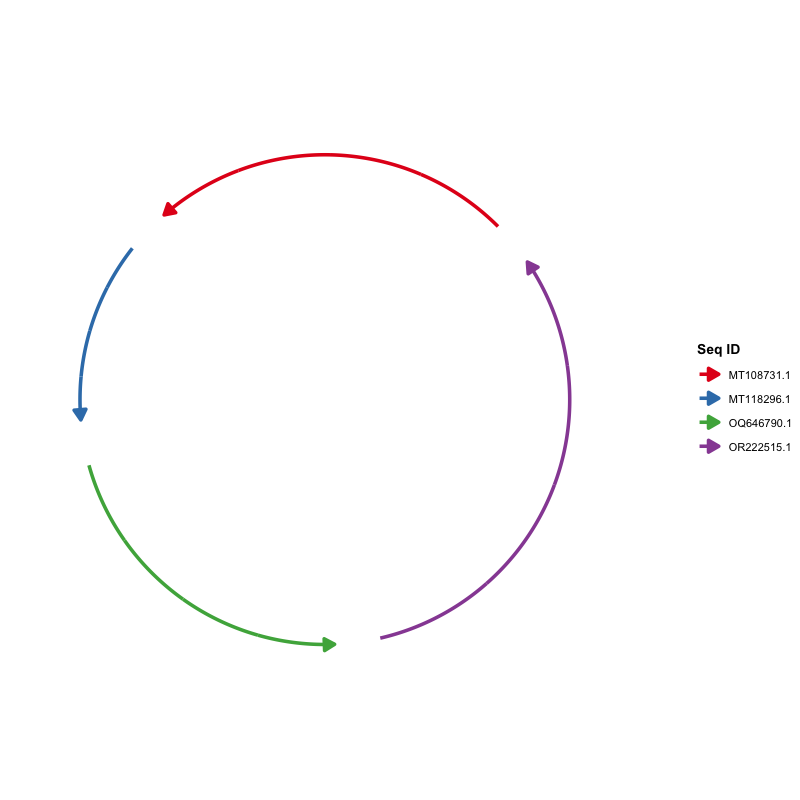
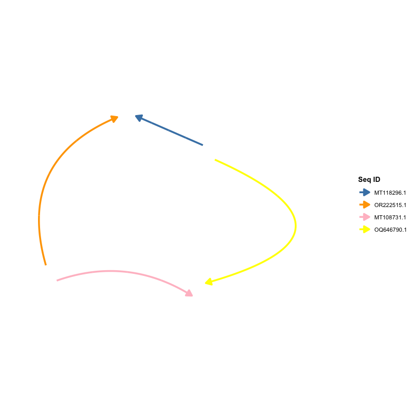
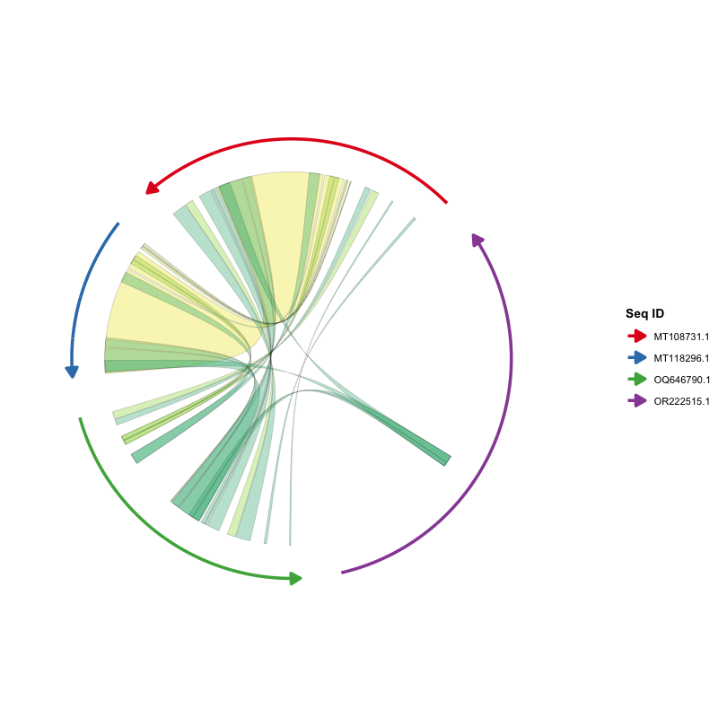
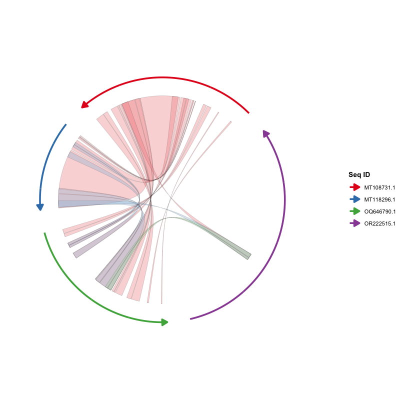
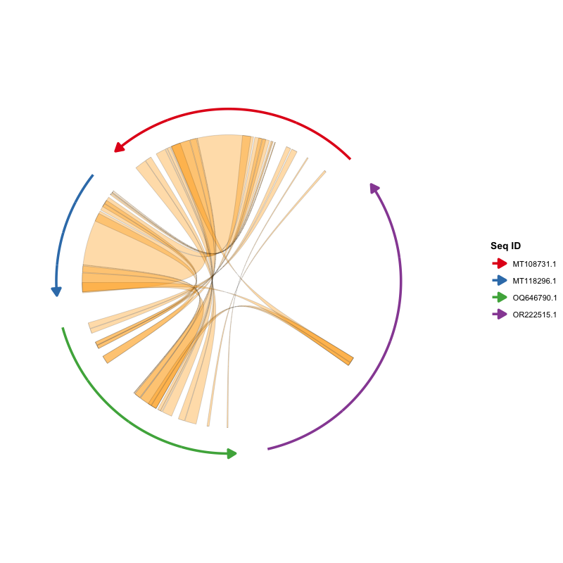
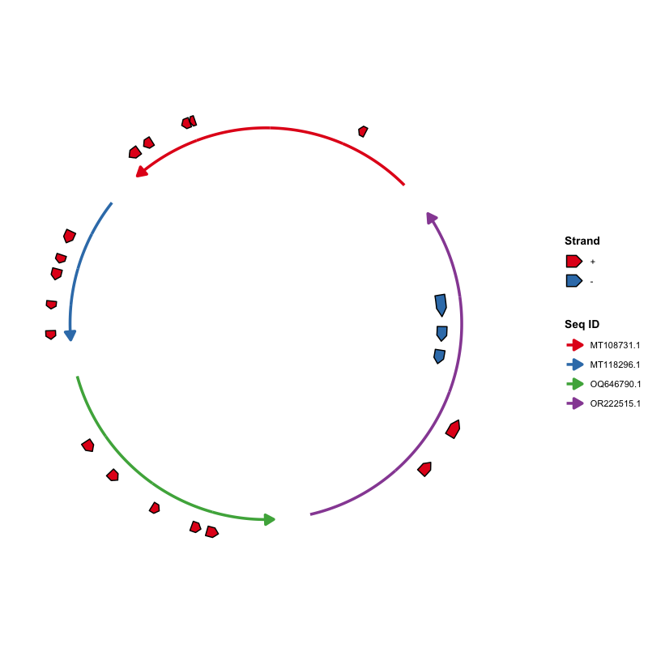
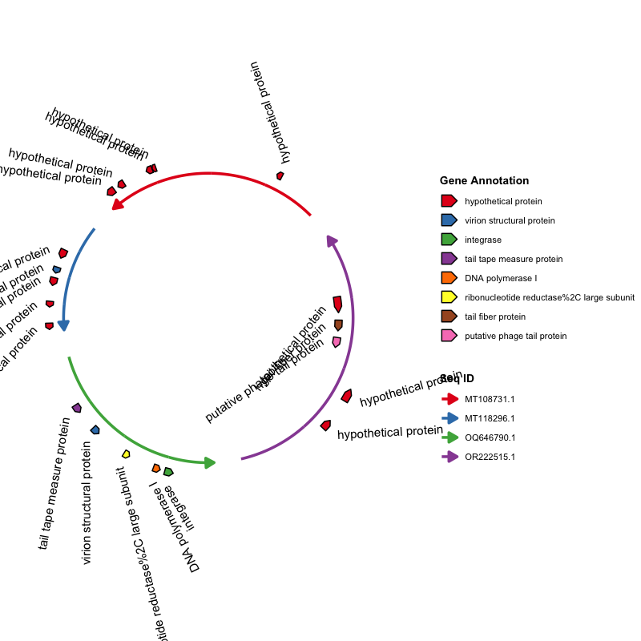
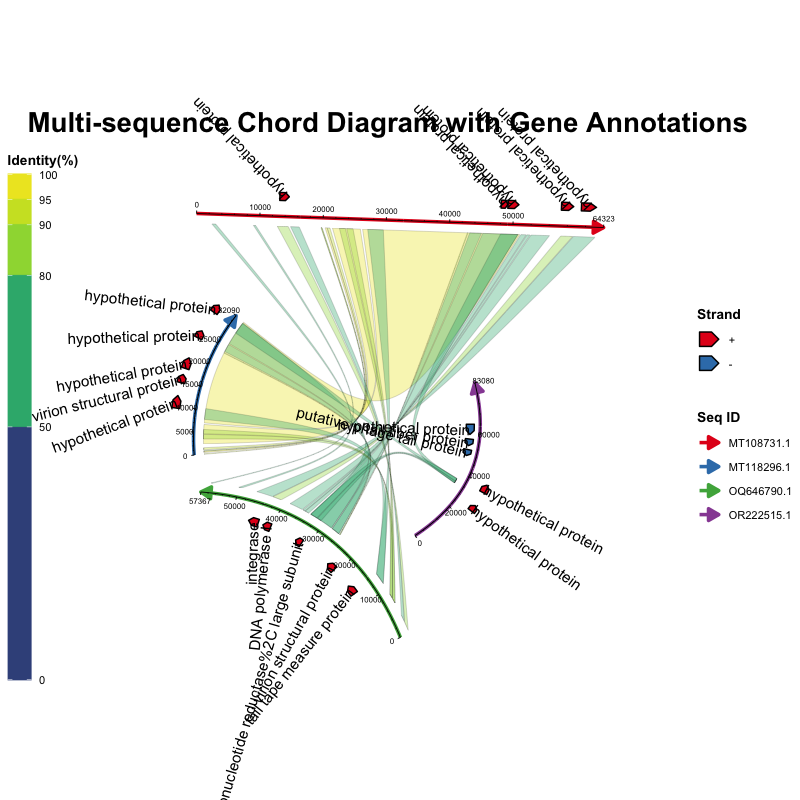

🌐 语言切换: 【[现代汉语（Han）](README-Hans.md) | [英文（English）](README.md)】

# ggchord：多序列比对弦图可视化工具

## 概述
`ggchord` 是一个基于 `ggplot2` 的 R 语言包，采用分层图形语法将多序列比对结果可视化为直观的弦图。v0.4.0 实现了布局参数从 `ggchord()` 向各 `geom_*` 图层的下沉，靠近 `ggplot2` 的设计哲学——每个图层管自己的样式。v0.5.0 移除了 `ggnewscale`/`RColorBrewer` 依赖并新增连接带轮廓定制。最新 v0.6.0 使绘图对象完全自包含（布局在构建时计算），支持 `ggsave()`/`ggplot_build()`，加强数据校验并加入 CI。

- 每条序列以圆弧呈现，按比例映射长度。
- 彩色连接带（ribbon）表示序列间的比对区域，支持按相似度或来源着色。
- 基因注释以箭头形式叠加，支持按链方向或功能类别着色。
- 配备可定制的坐标轴，精准标注序列位置与长度。
- 布局参数可分散到对应 `geom_*` 图层中指定，也可省略使用默认值。

适用于比较基因组学、泛基因组分析、噬菌体-宿主序列关系等研究。

## 主要功能
- **真正的 ggplot2 分层风格**：`ggchord()` 仅接收数据和全局参数，各 `geom_*` 接收自己的布局参数，像 `ggplot2` 一样自然。
- **延迟计算模型**：布局在绘图构建时（`print()`、`ggsave()` 或 `ggplot_build()`）计算，因此 `geom` 中指定的参数和之前叠加的参数都会在渲染时汇总生效。
- **多序列支持**：同时展示 2 条及以上序列的比对关系。
- **序列级定制**：自定义序列顺序、方向、间隙、半径与曲率——参数放在 `geom_seq()`。
- **灵活的连接带样式**：3 种配色方案，支持贝塞尔曲线控制点——参数放在 `geom_ribbon()`。
- **基因箭头图层**：按链方向或注释类别着色，支持标签——参数放在 `geom_gene()`。
- **精细化坐标轴**：主/次刻度、标签大小与方向——参数放在 `geom_axis()`。

## 安装
### 依赖环境
- R (≥ 3.6.0)
- ggplot2 (≥ 3.3.0)

```r
install.packages("ggplot2")
```

### 如何安装 ggchord？

从 CRAN 安装稳定版本：

```r
install.packages("ggchord")
```

从 GitHub 安装开发版本：

```r
devtools::install_github("DangJem/ggchord")
```

## 快速开始

### 分层构建弦图

```r
library(ggchord)

# 加载内置示例数据
data(seq_data_example)
data(ribbon_data_example)
data(gene_data_example)

# 最简单用法：全部默认参数
p <- ggchord(
  seq_data = seq_data_example,
  ribbon_data = ribbon_data_example,
  gene_data = gene_data_example
) +
  geom_seq() +
  geom_ribbon() +
  geom_gene() +
  geom_axis()

print(p)
```

### 参数下沉到图层（v0.4.0 新特性）

```r
# 类似 ggplot2 的风格：谁的数据，谁的参数就放在谁那里
ggchord(seq_data_example, ribbon_data_example, gene_data_example,
        title = "精细参数控制", rotation = 30) +
  geom_seq(
    seq_radius = c(3, 2, 2, 1),
    seq_curvature = c(0, 1, -1, 1.5),
    seq_orientation = c(-1, -1, -1, 1)
  ) +
  geom_ribbon(
    ribbon_color_scheme = "pident",
    ribbon_gap = 0.1
  ) +
  geom_gene(
    gene_offset = list(
      c("+" = 0.2, "-" = -0.2),
      c("+" = 0.2, "-" = -0.2),
      c("+" = 0.2, "-" = 0),
      c("+" = 0.2, "-" = 0.1)
    ),
    gene_width = 0.08,
    gene_label_show = TRUE,
    gene_label_rotation = list(
      c("+" = 45, "-" = -45),
      c("+" = 0.2, "-" = -0.2),
      c("+" = 0.2, "-" = 0),
      c("+" = 0.2, "-" = 0.1)
    )
  ) +
  geom_axis(
    axis_label_orientation = c(0, 45, 80, 130),
    axis_gap = 0,
    axis_tick_major_length = 0.03,
    axis_label_size = 2
  )
```

> 所有参数均有合理默认值。你可以只写 `geom_seq()` 而不传任何参数，也可以像上面这样精细控制每层的每一个细节。

---

## 使用说明

### 前期数据准备
需准备三类输入数据：

#### 【必须】序列信息数据（`seq_data`）
描述待绘制序列的数据框，必须包含以下列：

| 列名 | 类型 | 含义 |
| --- | --- | --- |
| `seq_id` | 字符 | 序列唯一标识 |
| `length` | 整数 | 序列长度（正数） |

示例：
```r
seq_data <- read.delim("seq_track.tsv", sep = "\t", stringsAsFactors = FALSE)
```
其中 `seq_track.tsv` 格式如下：

| seq_id | length |
| --- | --- |
| MT108731.1 | 64323 |
| MT118296.1 | 32090 |
| OQ646790.1 | 57367 |
| OR222515.1 | 83080 |

从 FASTA 自动生成：
```bash
seqkit fx2tab -nil *fna | sed '1i seq_id\tlength' > seq_track.tsv
```

#### 【可选】比对数据（`ribbon_data`）
逐条记录两条序列之间一个比对区间的数据框，必须包含以下列（列名沿用常见比对工具输出约定，如 BLAST）：

| 列名 | 类型 | 含义 |
| --- | --- | --- |
| `qaccver` | 字符 | 查询序列 ID |
| `saccver` | 字符 | 目标序列 ID |
| `length` | 整数 | 比对长度（bp） |
| `pident` | 数值 | 相似度百分比（0-100） |
| `qstart` | 整数 | 比对区间在查询序列上的起始位置 |
| `qend` | 整数 | 比对区间在查询序列上的结束位置 |
| `sstart` | 整数 | 比对区间在目标序列上的起始位置 |
| `send` | 整数 | 比对区间在目标序列上的结束位置 |

示例数据行：

| qaccver | saccver | length | pident | qstart | qend | sstart | send |
| --- | --- | --- | --- | --- | --- | --- | --- |
| MT108731.1 | MT118296.1 | 24856 | 98.612 | 26298 | 51139 | 7121 | 31959 |
| MT108731.1 | MT118296.1 | 4412 | 97.031 | 21513 | 25922 | 2365 | 6772 |
| MT108731.1 | MT118296.1 | 464 | 94.181 | 20691 | 21146 | 1032 | 1495 |

例如，批量 BLAST 的输出可直接解析为该表格：

```bash
seqs=("MT108731.1" "MT118296.1" "OQ646790.1" "OR222515.1")
ext="fna"
for ((i=0; i<${#seqs[@]}-1; i++)); do
  for ((j=i+1; j<${#seqs[@]}; j++)); do
    blastn \
      -outfmt '7 qaccver saccver pident length mismatch gapopen qstart qend sstart send evalue bitscore qcovs qlen slen sstrand stitle' \
      -query "${seqs[$i]}.${ext}" \
      -subject "${seqs[$j]}.${ext}" \
      -out "${seqs[$i]}__${seqs[$j]}.o7"
  done
done
```

#### 【可选】基因数据（`gene_data`）
在序列上标注基因（或其他特征）的数据框，必须包含以下列：

| 列名 | 类型 | 含义 |
| --- | --- | --- |
| `seq_id` | 字符 | 基因所属序列 ID |
| `start` | 整数 | 基因起始位置 |
| `end` | 整数 | 基因结束位置 |
| `strand` | 字符 | 链方向（`+` 或 `-`） |
| `anno` | 字符 | 基因注释 / 功能类别 |

示例数据行：

| seq_id | start | end | strand | anno |
| --- | --- | --- | --- | --- |
| MT108731.1 | 60709 | 63087 | + | hypothetical protein |
| MT118296.1 | 14628 | 16301 | + | virion structural protein |
| OQ646790.1 | 43765 | 46140 | + | integrase |
| OQ646790.1 | 13194 | 15551 | + | tail tape measure protein |

例如，可由 GFF3 文件转换得到：

```r
library(tidyverse)
gff3FilesPath <- list.files(path = ".", pattern = "*.gff3")
gff3Table <- map_df(gff3FilesPath, ~read_tsv(.x, show_col_types = F, comment = "#",
  col_names = F) %>% set_names(c("seq_id", "source", "type", "start", "end",
  "score", "strand", "phase", "attributes")))
geneTrackTable <- gff3Table %>%
  filter(type == "CDS") %>%
  mutate(anno = str_extract(attributes, "(?<=product=)[^;]+(?=;)")) %>%
  select(seq_id, start, end, strand, anno)
write_tsv(geneTrackTable, "gene_track.tsv")
```

---

## 使用示例

### 数据读取
```r
seq_data <- read.delim("seq_track.tsv", sep = "\t", stringsAsFactors = FALSE)

read_blast <- function(file) {
  df <- read.delim(file, sep = "\t", header = FALSE,
                   stringsAsFactors = FALSE, comment.char = "#")
  colnames(df) <- c("qaccver", "saccver", "pident", "length", "mismatches",
                    "gapopen", "qstart", "qend", "sstart", "send",
                    "evalue", "bitscore", "qcovs", "qlen", "slen",
                    "sstrand", "stitle")
  df
}
blast_files <- list.files(path = ".", pattern = "\\.o7$", full.names = TRUE)
all_blast <- do.call(rbind, lapply(blast_files, read_blast))
ribbon_data <- subset(all_blast, length >= 100)

gene_data <- read.delim("gene_track.tsv", sep = "\t",
  stringsAsFactors = FALSE) |>
  dplyr::slice_max(order_by = end - start, n = 5, by = seq_id)
```

### 仅序列数据

```r
# 默认：序列按 seq_data 顺序逆时针排列
ggchord(seq_data = seq_data) + geom_seq()
```



```r
# 自定义序列参数
ggchord(seq_data = seq_data) +
  geom_seq(
    seq_order = c("MT118296.1", "OR222515.1", "MT108731.1", "OQ646790.1"),
    seq_orientation = c(1, -1, 1, -1),
    seq_curvature = c(0, 2, -2, 6),
    seq_colors = c("steelblue", "orange", "pink", "yellow")
  )
```



### 加入比对数据

```r
# 默认：按相似度（pident）着色
ggchord(seq_data = seq_data, ribbon_data = ribbon_data) +
  geom_seq() + geom_ribbon()
```



```r
# 按查询序列着色
ggchord(seq_data = seq_data, ribbon_data = ribbon_data) +
  geom_seq() +
  geom_ribbon(ribbon_color_scheme = "query")
```



```r
# 单色模式
ggchord(seq_data = seq_data, ribbon_data = ribbon_data) +
  geom_seq() +
  geom_ribbon(ribbon_color_scheme = "single", ribbon_colors = "orange")
```



### 加入基因注释

```r
# 按链方向着色
ggchord(seq_data = seq_data, gene_data = gene_data) +
  geom_seq() + geom_gene()
```



```r
# 按注释类别着色 + 显示标签
ggchord(seq_data = seq_data, gene_data = gene_data) +
  geom_seq() +
  geom_gene(
    gene_color_scheme = "manual",
    gene_label_show = TRUE,
    gene_label_rotation = 45,
    gene_label_radial_offset = 0.1
  )
```



### 综合示例

```r
# 全默认组合
ggchord(seq_data, ribbon_data, gene_data) +
  geom_seq() + geom_ribbon() + geom_gene() + geom_axis()
```


```r
# v0.4.0 精细参数控制——所有布局参数分布在对应的 geom 中
ggchord(
  seq_data = seq_data,
  ribbon_data = ribbon_data,
  gene_data = gene_data,
  title = "Multi-sequence Chord Diagram with Gene Annotations",
  rotation = 45
) +
  geom_seq(
    seq_radius = c(3, 2, 2, 1),
    seq_orientation = c(-1, -1, -1, 1),
    seq_curvature = c(0, 1, -1, 1.5),
    seq_gap = 0.03
  ) +
  geom_ribbon(
    ribbon_color_scheme = "pident",
    ribbon_gap = 0.1
  ) +
  geom_gene(
    gene_offset = list(
      c("+" = 0.2, "-" = -0.2),
      c("+" = 0.2, "-" = -0.2),
      c("+" = 0.2, "-" = 0),
      c("+" = 0.2, "-" = 0.1)
    ),
    gene_width = 0.08,
    gene_label_show = TRUE,
    gene_label_rotation = list(
      c("+" = 45, "-" = -45),
      c("+" = 0.2, "-" = -0.2),
      c("+" = 0.2, "-" = 0),
      c("+" = 0.2, "-" = 0.1)
    )
  ) +
  geom_axis(
    axis_gap = 0,
    axis_tick_major_length = 0.03,
    axis_label_size = 2,
    axis_label_orientation = c(0, 45, 80, 130)
  )
```



> 序列级参数（`seq_radius`、`seq_gap` 等）均支持单值、无命名向量、命名向量三种格式。基因级参数额外支持按链（`+`/`-`）区分的列表格式。

---

## 图层参考

| 图层 | 函数 | 描述 |
| --- | --- | --- |
| 序列弧线 | `geom_seq()` | 绘制每条序列的弧线（或直线），带方向箭头 |
| 比对连接带 | `geom_ribbon()` | 绘制比对结果的彩色 ribbon |
| 基因箭头 | `geom_gene()` | 绘制基因注释的箭头多边形和标签 |
| 坐标轴 | `geom_axis()` | 绘制轴线、主/次刻度线和刻度标签 |

---

## 参数详情

### ggchord() 参数

| 参数 | 类型 | 默认值 | 描述 |
| --- | --- | --- | --- |
| `seq_data` | data.frame | - | 序列信息，必须包含 `seq_id`、`length` |
| `ribbon_data` | data.frame | NULL | 比对结果（如 BLAST 输出） |
| `gene_data` | data.frame | NULL | 基因注释数据 |
| `title` | 字符 | NULL | 图形主标题 |
| `rotation` | 数值 | 45 | 全局旋转角度（度） |
| `panel_margin` | 数值/列表 | 0 | 面板边距 |
| `show_legend` | 逻辑值 | TRUE | 是否显示图例 |
| `debug` | 逻辑值 | FALSE | 是否输出调试信息 |

### geom_seq() 参数

| 参数 | 类型 | 默认值 | 描述 |
| --- | --- | --- | --- |
| `seq_order` | 字符向量 | NULL | 序列绘制顺序 |
| `seq_labels` | 字符向量 | NULL | 序列标签 |
| `seq_orientation` | 数值 (1/-1) | 1 | 序列方向 |
| `seq_gap` | 数值 [0, 0.5) | 0.03 | 序列间空白比例 |
| `seq_radius` | 数值 (> 0) | 1.0 | 序列弧线半径 |
| `seq_curvature` | 数值 | 1.0 | 曲率：0=直线, 1=标准弧, >1=更弯 |
| `seq_colors` | 颜色向量 | Set1 | 序列弧线颜色 |
| `linewidth` | 数值 | 1.2 | 弧线宽度 |
| `show_legend` | 逻辑值 | TRUE | 是否显示图例 |

### geom_ribbon() 参数

| 参数 | 类型 | 默认值 | 描述 |
| --- | --- | --- | --- |
| `ribbon_color_scheme` | 字符 | "pident" | 配色方案：`"pident"`、`"query"`、`"single"` |
| `ribbon_colors` | 颜色向量 | 自动 | 连接带颜色参数 |
| `ribbon_alpha` | 数值 (0-1) | 0.35 | 连接带透明度 |
| `ribbon_ctrl_point` | 向量/列表 | c(0,0) | 贝塞尔曲线控制点 |
| `ribbon_gap` | 数值/向量 | 0.15 | 序列与连接带的径向间距 |
| `alpha` | 数值 | 0.35 | 透明度（可覆盖 ribbon_alpha） |
| `ribbon_outline_color` | 字符 | "black" | 连接带轮廓（边框）颜色 |
| `ribbon_outline_width` | 数值 | 0.05 | 连接带轮廓线宽 |
| `ribbon_outline_linetype` | 数值/字符 | 1 | 连接带轮廓线型（1 = 实线） |
| `show_legend` | 逻辑值 | TRUE | 是否显示图例 |

### geom_gene() 参数

| 参数 | 类型 | 默认值 | 描述 |
| --- | --- | --- | --- |
| `gene_offset` | 数值/向量/列表 | 0.1 | 基因箭头径向偏移 |
| `gene_width` | 数值/向量/列表 | 0.05 | 基因箭头宽度 |
| `gene_color_scheme` | 字符 | "strand" | 配色方案：`"strand"` 或 `"manual"` |
| `gene_colors` | 颜色向量 | 自动 | 基因箭头填充色 |
| `gene_order` | 字符向量 | NULL | 基因在图例中的显示顺序 |
| `gene_label_show` | 逻辑值 | FALSE | 是否显示基因标签 |
| `gene_label_size` | 数值 | 2.5 | 标签字号 |
| `gene_label_rotation` | 数值/向量/列表 | 0 | 标签旋转角度 |
| `gene_label_radial_offset` | 数值/向量/列表 | 0 | 标签径向偏移 |
| `gene_label_circum_offset` | 数值/向量/列表 | 0 | 标签周向偏移比例 |
| `gene_label_circum_limit` | 逻辑值/向量/列表 | TRUE | 是否限制周向偏移 |
| `show_legend` | 逻辑值 | TRUE | 是否显示图例 |
| `show_label` | 逻辑值 | NULL | 覆盖 gene_label_show |
| `label_size` | 数值 | NULL | 覆盖 gene_label_size |

### geom_axis() 参数

| 参数 | 类型 | 默认值 | 描述 |
| --- | --- | --- | --- |
| `show_axis` | 逻辑值 | TRUE | 是否显示坐标轴 |
| `axis_gap` | 数值/向量 | 0.04 | 序列与坐标轴的径向间距 |
| `axis_tick_major_number` | 整数/向量 | 5 | 主刻度数量 |
| `axis_tick_major_length` | 数值/向量 | 0.02 | 主刻度长度比例 |
| `axis_tick_minor_number` | 整数/向量 | 4 | 次刻度数量 |
| `axis_tick_minor_length` | 数值/向量 | 0.01 | 次刻度长度比例 |
| `axis_label_size` | 数值/向量 | 3 | 刻度标签字号 |
| `axis_label_offset` | 数值/向量 | 1.5 | 标签偏移比例 |
| `axis_label_orientation` | 字符/数值/向量 | "horizontal" | 标签方向 |
| `show_legend` | 逻辑值 | FALSE | 是否显示图例 |

---

## 图形解读
- **序列弧线**：每条彩色弧线代表一条序列，长度按比例映射，箭头指示方向。
- **连接带**：连接不同序列的彩色区域，代表比对区间。
- **基因箭头**：标注在序列上的箭头多边形，可选配文字标签。
- **坐标轴**：每条序列外侧的刻度线与数字，标注序列位置。

---

## 版本更新记录
### v0.6.0（最新）
- **绘图对象自包含**：数据与参数直接存储在绘图对象上，多个图可并存，且对象可经 `saveRDS()`/`readRDS()` 保存与恢复。
- **构建时布局**：布局改由 `ggplot_build()` 计算（而非 `print()`），因此 `print()`、`ggsave()` 与 `ggplot_build()` 均可用；渲染不再修改用户绘图对象。
- **数据校验**：`ggchord()` 会对越界或反向的比对/基因坐标、未知序列 ID 给出警告。
- **性能**：布局坐标映射改用二分查找，替代线性扫描。
- **依赖声明**：与实现一致地声明 `ggplot2 (>= 4.0.0)` 与 `R (>= 4.1.0)`。
- **CI**：新增 GitHub Actions `R CMD check` 工作流（macOS / Windows / Linux）。

### v0.5.0
- **连接带轮廓定制**：`geom_ribbon()` 新增 `ribbon_outline_color`（默认 `"black"`）、`ribbon_outline_width`（默认 `0.05`）与 `ribbon_outline_linetype`（默认 `1`，实线）。
- **移除依赖**：去掉 `ggnewscale`（连接带与基因 fill scale 改为内部机制分离）与 `RColorBrewer`（Set1 调色板内置）。
- **Bug 修复**：连接带 fill scale 被基因 scale 覆盖；`ribbon_alpha` 透明度渲染错误；`geom_axis(show_axis = FALSE)` 报错；混合 `axis_label_orientation` 向量报错；少于 3 项时 `brewer.pal()` 警告；`geom_gene()` 先于 `geom_ribbon()` 报错；仅含 axis 的绘图；S3 方法注册。
- **文档**：注释与提示信息英文化；新增函数帮助页；数据准备列含义表与示例数据；渲染示例图；弱化 BLAST 定位；vignette 按分层 API 重写。

### v0.4.0
- **参数下沉**：布局参数从 `ggchord()` 移至各 `geom_*` 图层。`ggchord()` 仅保留数据校验和全局样式参数（`title`、`rotation`、`panel_margin`、`show_legend`、`debug`）。
- **延迟计算模型**：坐标布局在 `print()` 阶段计算，各图层指定的参数在渲染时汇总。
- **自定义 `print.ggchord()` 方法**：合并所有参数 → 计算布局 → 注入各 layer 数据 → 渲染。
- **新增 15 个单元测试**。

### v0.3.0
- 分层 API 重构：从单体函数拆分为 `ggchord() + geom_seq() + geom_ribbon() + geom_gene() + geom_axis()`。
- 自定义 `+.ggchord` 方法，支持图层列表自动展平。
- 轻量 `coord_chord()` 坐标系统。

### v0.2.0
- 高级弧线和直线模式优化，增强曲线拟合。
- 精确的曲率和间隙控制。
- 增强的颜色定制。

### v0.1.0
- 分离管理序列、比对与基因数据。
- 序列方向控制、自定义顺序、间隙与半径调整。
- 可定制坐标轴。连接带支持 3 种配色方案。

### v0.0.2
- 多序列展示，弧线/直线模式切换。

### v0.0.1
- 初始版本，双序列 BLAST 比对弦图。

---

## 贡献与反馈
欢迎提交 issue 报告 bug 或建议新功能，也可通过 Pull Request 参与开发。

## 许可证
本项目采用 MIT 许可证，详情见 [LICENSE](LICENSE) 文件。
