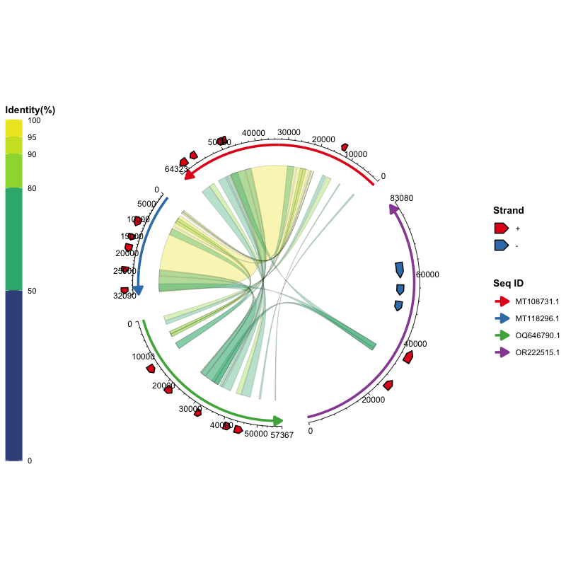

🌐 Language Switch: 【[现代汉语（Hans）](README-Hans.md) | [English](README.md)】

# ggchord: Layered Multi-Sequence Chord Diagrams for ggplot2

## Overview

`ggchord` is an R package built on `ggplot2` that draws **chord diagrams for
multi-sequence data** using the layered grammar of graphics. Instead of a single
monolithic function, you build a plot by stacking layers — `ggchord()` supplies
the data and global options, and each `geom_*` layer is responsible for one
kind of element (sequence arcs, alignment ribbons, gene annotations, axes,
labels). Every layer has sensible defaults, so a complete diagram can be drawn
in one line, and every layer can be fine-tuned independently when you need more
control.

It is a general tool for comparing sequences, gene neighbourhoods, phage–host
relationships, pangenome blocks, synteny, and more — you only need three tidy
data frames.

## Key Features

- **True `ggplot2` layered style** — data and global options live in
  `ggchord()`; each `geom_*` layer manages its own layout parameters.
- **Everything has defaults** — `ggchord(data) + geom_seq() + geom_ribbon() +
  geom_gene() + geom_axis()` already produces a complete diagram.
- **Multi-sequence support** — two, three, four or more sequences in one plot.
- **Flexible parameters** — per-sequence and per-strand values using single
  values, vectors, named vectors, and lists.
- **Full ggplot2 integration** — `theme()`, `scale_*()`, `ggsave()`,
  `ggplot_build()`, and `plotly::ggplotly()` all work.

## Installation

`ggchord` requires R (≥ 4.1.0) and `ggplot2` (≥ 4.0.0).

```r
install.packages("ggplot2")   # if needed
```

From CRAN:

```r
install.packages("ggchord")
```

From GitHub (development version):

```r
devtools::install_github("DangJem/ggchord")
```

## Quick Start

The package ships with three example data sets, so you can run the code below
as-is:

```r
library(ggchord)

# Load the built-in example data
data(seq_data_example)
data(ribbon_data_example)
data(gene_data_example)

# Stack the layers like you would in ggplot2
ggchord(
  seq_data     = seq_data_example,
  ribbon_data  = ribbon_data_example,
  gene_data    = gene_data_example
) +
  geom_seq() +      # sequence arcs
  geom_ribbon() +   # alignment ribbons
  geom_gene() +     # gene annotations
  geom_axis()       # position axes
```



That is the whole idea: **data in `ggchord()`, styling in the layers**.

## Where to go next

| Need | Resource |
| --- | --- |
| Full walkthrough: data preparation, import, validation, cleaning, examples and flexible parameter formats | [**ggchord tutorial**](https://dangjem.github.io/ggchord/articles/ggchord_vignette.html) ([source](vignettes/ggchord_vignette.Rmd)) |
| 汉语完整使用指南 | [**ggchord 汉语指南**](https://dangjem.github.io/ggchord/articles/ggchord_guide_hans.html) ([source](vignettes/ggchord_guide_hans.Rmd)) |
| Complete function and parameter reference | [**Function reference**](https://dangjem.github.io/ggchord/reference/index.html) |
| Version history | [**NEWS.md**](NEWS.md) |

## Contributions & Feedback

Bug reports and feature requests are welcome via
[GitHub issues](https://github.com/DangJem/ggchord/issues). Pull requests are
also appreciated.

## License

This project is licensed under the MIT License — see the
[LICENSE](LICENSE) file for details.
