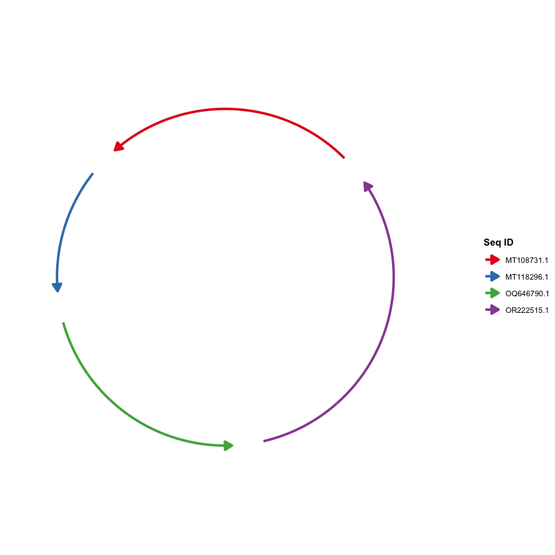

# ggchord 中文使用指南

``` r

library(ggchord)
library(ggplot2)

data(seq_data_example)
data(ribbon_data_example)
data(gene_data_example)
```

本教程完整介绍 `ggchord` 的工作流程：准备输入数据、在 R 中导入文件、
校验与清理数据，以及逐层构建图形。

## 1. 前期数据准备

包需要三类输入数据，均为普通数据框。

### 【必须】序列信息数据（`seq_data`）

| 列名     | 类型 | 说明                   |
|----------|------|------------------------|
| `seq_id` | 字符 | 序列唯一标识           |
| `length` | 整数 | 序列长度（必须为正数） |

示例：

| seq_id     | length |
|------------|--------|
| MT108731.1 | 64323  |
| MT118296.1 | 32090  |
| OQ646790.1 | 57367  |
| OR222515.1 | 83080  |

从 FASTA 文件生成该表格的常见方法：

``` bash
seqkit fx2tab -nil examples/fasta/*.fna | sed '1i seq_id\tlength' > examples/seq_track.tsv
```

### 【可选】比对数据（`ribbon_data`）

每行表示两条序列之间的一个比对片段（列名遵循常见比对工具的输出约定）：

| 列名      | 类型 | 说明                  |
|-----------|------|-----------------------|
| `qaccver` | 字符 | 查询序列 ID           |
| `saccver` | 字符 | 目标序列 ID           |
| `length`  | 整数 | 比对长度（bp）        |
| `pident`  | 数值 | 相似度百分比（0–100） |
| `qstart`  | 整数 | 查询序列上的起始位置  |
| `qend`    | 整数 | 查询序列上的终止位置  |
| `sstart`  | 整数 | 目标序列上的起始位置  |
| `send`    | 整数 | 目标序列上的终止位置  |

示例行：

| qaccver    | saccver    | length | pident | qstart | qend  | sstart | send  |
|------------|------------|--------|--------|--------|-------|--------|-------|
| MT108731.1 | MT118296.1 | 24856  | 98.612 | 26298  | 51139 | 7121   | 31959 |
| MT108731.1 | MT118296.1 | 4412   | 97.031 | 21513  | 25922 | 2365   | 6772  |
| MT108731.1 | MT118296.1 | 464    | 94.181 | 20691  | 21146 | 1032   | 1495  |

例如，BLAST 的 `-outfmt 7` 标准输出可以直接解析为该表格：

``` bash
seqs=("MT108731.1" "MT118296.1" "OQ646790.1" "OR222515.1")
ext="fna"
for ((i=0; i<${#seqs[@]}-1; i++)); do
  for ((j=i+1; j<${#seqs[@]}; j++)); do
    blastn \
      -outfmt '7 qaccver saccver pident length mismatch gapopen qstart qend sstart send evalue bitscore qcovs qlen slen sstrand stitle' \
      -query "examples/fasta/${seqs[$i]}.${ext}" \
      -subject "examples/fasta/${seqs[$j]}.${ext}" \
      -out "examples/blastn/${seqs[$i]}__${seqs[$j]}.o7"
  done
done
```

### 【可选】基因数据（`gene_data`）

每行表示一条序列上的一个基因（或其他特征）：

| 列名     | 类型 | 说明                 |
|----------|------|----------------------|
| `seq_id` | 字符 | 基因所属序列 ID      |
| `start`  | 整数 | 基因起始位置         |
| `end`    | 整数 | 基因终止位置         |
| `strand` | 字符 | 链方向（`+` 或 `-`） |
| `anno`   | 字符 | 基因注释 / 功能类别  |

示例行：

| seq_id     | start | end   | strand | anno                      |
|------------|-------|-------|--------|---------------------------|
| MT108731.1 | 60709 | 63087 | \+     | hypothetical protein      |
| MT118296.1 | 14628 | 16301 | \+     | virion structural protein |
| OQ646790.1 | 43765 | 46140 | \+     | integrase                 |
| OQ646790.1 | 13194 | 15551 | \+     | tail tape measure protein |

例如，可由 GFF3 文件转换得到：

``` r

library(tidyverse)
gff3FilesPath <- list.files(path = "examples/gff3", pattern = "\\.gff3$", full.names = TRUE)
gff3Table <- map_df(gff3FilesPath, ~read_tsv(.x, show_col_types = F, comment = "#",
  col_names = F) %>% set_names(c("seq_id", "source", "type", "start", "end",
  "score", "strand", "phase", "attributes")))
geneTrackTable <- gff3Table %>%
  filter(type == "CDS") %>%
  mutate(anno = str_extract(attributes, "(?<=product=)[^;]+(?=;)")) %>%
  select(seq_id, start, end, strand, anno)
write_tsv(geneTrackTable, "examples/gene_track.tsv")
```

## 2. 在 R 中导入 FASTA / BLAST / GFF3 数据

外部命令行工具（BLAST、seqkit 等）通常用于*准备*数据，但它们产出的文件
也可以直接用包内置的导入助手在 R 中读取，从而把「在 R 外准备数据」与
「在 R 中导入并绘图」两个步骤清晰分开：

``` r

library(ggchord)

# FASTA -> seq_data（读取并合并全部示例 FASTA 文件）
seq_data <- read_fasta_lengths(files = "examples/fasta/*.fna")

# BLAST -outfmt 6/7 表格输出 -> ribbon_data（12 或 17 列自动识别）
ribbon_data <- read_blast(files = "examples/blastn/*.o7")

# GFF3 -> gene_data（默认取 CDS；anno 从 product/Name/... 属性提取）
gene_data <- read_gff3(files = "examples/gff3/*.gff3")

ggchord(seq_data, ribbon_data, gene_data) +
  geom_seq() + geom_ribbon() + geom_gene()
```

[`read_blast()`](https://dangjem.github.io/ggchord/reference/read_blast.md)
保留有用的额外列（`evalue`、`bitscore`、`qcovs`、`qlen`、
`slen`、`sstrand`、`stitle`）；[`read_gff3()`](https://dangjem.github.io/ggchord/reference/read_gff3.md)
保留 `type`、`source`、
`score`、`phase`、`attributes`；[`read_fasta_lengths()`](https://dangjem.github.io/ggchord/reference/read_fasta_lengths.md)
可通过 `header_delim = "|"` 拆分 NCBI 风格标题。

## 3. 数据校验与清理

绘图前用
[`validate_ggchord_data()`](https://dangjem.github.io/ggchord/reference/validate_ggchord_data.md)
发现问题（缺列、NA/Inf、重复 ID、 未知序列 ID、越界坐标、反向区间、非法
strand、重复与高度重叠区块）， 并报告每个问题对应的原始行号：

``` r

data(seq_data_example)
data(ribbon_data_example)
data(gene_data_example)

res <- validate_ggchord_data(seq_data_example, ribbon_data_example,
                             gene_data_example)

res$valid          # 数据是否可以安全绘图
print(res)         # 人类可读的报告
summary(res)       # 按类别统计
res$errors         # 严重问题（table、category、row、column、message）
res$warnings       # 非严重问题（列同 errors）
res$invalid_rows   # 每个问题类别对应的原始行号
res$cleanable      # 可自动修复的问题及建议动作
as.data.frame(res) # 扁平表格，含 severity 列

# 也可直接对严重问题报错：
validate_ggchord_data(seq_data_example, ribbon_data_example,
                      gene_data_example, strict = TRUE)
```

[`clean_ggchord_data()`](https://dangjem.github.io/ggchord/reference/clean_ggchord_data.md)
用明确、保守的策略修复可修复的问题，并逐条记录
改动（原始行号、原因、原值/新值、处理方式），且**不会修改你传入的数据**：

``` r

out <- clean_ggchord_data(
  seq_data_example, ribbon_data_example, gene_data_example,
  unknown_id        = "drop",   # 删除引用未知序列的行
  out_of_range      = "clip",   # 将坐标裁剪到 [1, 序列长度]
  reversed_interval = "sort",   # 排序 start > end（原始方向会记录在报告中）
  invalid_pident    = "clip",   # 将 pident 限制到 [0, 100]
  empty_annotation  = "replace" # 用 "unannotated" 填充缺失的 anno
)

out                  # print() 显示清洗后的表维度与处理报告概览
head(out$report)     # 每次改动一行：table/row/column/reason/...
p <- ggchord(out$seq_data, out$ribbon_data, out$gene_data) +
  geom_seq() + geom_ribbon() + geom_gene()
```

[`ggchord()`](https://dangjem.github.io/ggchord/reference/ggchord.md)
会自动执行该校验，并在数据有问题时只发出**一条汇总警告**
（绝不会逐行警告）。需要立即停止则用 `validate = "error"`，超大数据可用
`validate = "none"` 跳过诊断。完整报告缓存在绘图对象上：
`p$ggchord$validation`。

## 4. Ribbon 筛选、去重与合并

比对表过大或冗余时，先在绘图前整理：

``` r

data(ribbon_data_example)

# 只保留高质量比对并按一致性排序
kept <- filter_ggchord_ribbons(
  ribbon_data_example,
  min_pident  = 90,
  drop_self_links = TRUE,
  sort_by     = c("pident", "-evalue")
)
ribbon_data_example <- kept$data
kept$report  # 删除/保留的数量与原因

# 去除完全重复、坐标近似重复或高度重叠的区块
dedup <- deduplicate_ggchord_ribbons(ribbon_data_example, by = "exact",
                                     keep = "best_pident")

# 合并同一序列对的相邻区块（pident 按比对长度加权）
merged <- merge_ggchord_ribbons(dedup$data, max_gap = 0)
ribbon_data_example <- merged$data
merged$report  # output_row -> from_rows 追溯
```

三个助手都会保留额外列与原始列顺序，并把原始行号附加为返回数据的
`source_rows` 属性，结果始终可以追溯到输入行。

## 5. 由浅入深示例

以下示例均使用上面已加载的内置数据，可以直接复制运行。关键结果统一使用与英文教程相同的共享示例图片。

### 第 1 步：绘制序列弧线

最简单的图形只需要 `seq_data`：

``` r

ggchord(seq_data = seq_data_example) + geom_seq()
```



默认参数下的序列弦图。

自定义序列布局——顺序、方向、曲率与颜色都属于
[`geom_seq()`](https://dangjem.github.io/ggchord/reference/geom_seq.md)：

``` r

ggchord(seq_data = seq_data_example) +
  geom_seq(
    seq_order      = c("MT118296.1", "OR222515.1", "MT108731.1", "OQ646790.1"),
    seq_orientation = c(1, -1, 1, -1),
    seq_curvature   = c(0, 2, -2, 6),
    seq_colors      = c("steelblue", "orange", "pink", "yellow")
  )
```

### 第 2 步：加入比对连接带

添加 `ribbon_data`
并绘制连接带。默认按相似度百分比着色（`ribbon_color_scheme = "pident"`）：

``` r

ggchord(seq_data_example, ribbon_data_example) +
  geom_seq() + geom_ribbon()
```


按相似度着色的连接带。

其他配色方案：

``` r

# 按查询序列着色
ggchord(seq_data_example, ribbon_data_example) +
  geom_seq() + geom_ribbon(ribbon_color_scheme = "query")
```

``` r

# 按目标序列着色
ggchord(seq_data_example, ribbon_data_example) +
  geom_seq() + geom_ribbon(ribbon_color_scheme = "subject")
```

``` r

# 全部连接带使用单一颜色
ggchord(seq_data_example, ribbon_data_example) +
  geom_seq() +
  geom_ribbon(ribbon_color_scheme = "single", ribbon_colors = "orange")
```

### 第 3 步：加入基因注释与标签

添加 `gene_data` 并将基因绘制为箭头。默认按链方向（`+` / `-`）着色：

``` r

ggchord(seq_data_example, gene_data = gene_data_example) +
  geom_seq() + geom_gene()
```

按注释类别着色，并用
[`geom_gene_label()`](https://dangjem.github.io/ggchord/reference/geom_gene_label.md)
添加标签：

``` r

ggchord(seq_data_example, gene_data = gene_data_example) +
  geom_seq() +
  geom_gene(gene_color_scheme = "manual") +
  geom_gene_label(
    gene_label_rotation = 45,
    gene_label_radial_offset = 0.1
  )
```

当注释较长或基因较密集时，标签容易重叠。[`geom_gene_label_repel()`](https://dangjem.github.io/ggchord/reference/geom_gene_label_repel.md)
采用类似 ggrepel 的力导向布局将标签推开，并用引导线连接对应的基因：

``` r

ggchord(seq_data_example, gene_data = gene_data_example) +
  geom_seq() +
  geom_gene() +
  geom_gene_label_repel(
    gene_label_wrap = 15,
    max_overlaps = 5
  )
```


带引导线的防重叠基因标签。

如需全部横向文字和 L 形引导线，可设置
`gene_label_orientation = "horizontal"` 与
`gene_label_segment = "elbow"`：

``` r

ggchord(seq_data_example, gene_data = gene_data_example) +
  geom_seq() +
  geom_gene() +
  geom_gene_label_repel(
    gene_label_orientation = "horizontal",
    gene_label_segment = "elbow",
    gene_label_wrap = 0
  )
```

当连接带填满弦图内部时，内侧标签可能压到连接带。设置
`gene_label_side = "outside"` 可将这些标签移到弧线外侧：

``` r

ggchord(seq_data_example, ribbon_data_example, gene_data_example) +
  geom_seq() +
  geom_ribbon() +
  geom_gene() +
  geom_gene_label_repel(
    gene_label_orientation = "horizontal",
    gene_label_segment = "elbow",
    gene_label_side = "outside",
    gene_label_wrap = 0
  )
```

### 第 4 步：加入坐标轴与序列标签

坐标轴用主/次刻度标注序列位置。[`geom_seq_label()`](https://dangjem.github.io/ggchord/reference/geom_seq_label.md)
在弧线周围放置序列名称：

``` r

ggchord(seq_data_example) +
  geom_seq() +
  geom_axis(
    axis_tick_major_length = 0.03,
    axis_tick_minor_length = 0.015,
    axis_label_size = 2.5
  ) +
  geom_seq_label(seq_label_radius = 1.2)
```


坐标轴与序列标签。

序列标签也可以保持水平：

``` r

ggchord(seq_data_example, rotation = 30) +
  geom_seq() +
  geom_seq_label(
    seq_label_radius = 1.15,
    seq_label_orientation = "horizontal",
    seq_label_size = 3.5,
    colour = "#2563EB"
  )
```

### 第 5 步：双序列比较

可以绘制任意子集。保留两条序列及其对应的连接带与基因：

``` r

seq2 <- seq_data_example[seq_data_example$seq_id %in%
                           c("MT108731.1", "MT118296.1"), ]
ribbon2 <- ribbon_data_example[
  ribbon_data_example$qaccver %in% seq2$seq_id &
    ribbon_data_example$saccver %in% seq2$seq_id, ]
gene2 <- gene_data_example[gene_data_example$seq_id %in% seq2$seq_id, ]

ggchord(seq2, ribbon2, gene2) +
  geom_seq() + geom_ribbon() + geom_gene() + geom_axis()
```

### 第 6 步：三序列比较

同样的思路适用于三条序列：

``` r

seq3 <- seq_data_example[seq_data_example$seq_id %in%
                           c("MT108731.1", "MT118296.1", "OQ646790.1"), ]
ribbon3 <- ribbon_data_example[
  ribbon_data_example$qaccver %in% seq3$seq_id &
    ribbon_data_example$saccver %in% seq3$seq_id, ]
gene3 <- gene_data_example[gene_data_example$seq_id %in% seq3$seq_id, ]

ggchord(seq3, ribbon3, gene3) +
  geom_seq() + geom_ribbon() + geom_gene() + geom_axis()
```

### 第 7 步：用 `+` 添加主题与 scale

ggchord 图形是真正的 ggplot2
对象，[`theme()`](https://ggplot2.tidyverse.org/reference/theme.html) 与
`scale_*()` 可以像在 ggplot2 中一样使用：

``` r

ggchord(seq_data_example, ribbon_data_example, gene_data_example) +
  geom_seq() + geom_ribbon() + geom_gene() + geom_axis() +
  theme(panel.background = element_rect(fill = "grey95")) +
  scale_color_manual(
    values = c("MT108731.1" = "#E41A1C",
               "MT118296.1" = "#377EB8",
               "OQ646790.1" = "#4DAF4A",
               "OR222515.1" = "#984EA3")
  )
```

**图例摆放**。默认情况下各图层的图例独立摆放。若将 `legend_position`
设为 `NULL`，该图例将遵循
`theme(legend.position = ...)`，从而可以把所有图例放在一起：

``` r

ggchord(seq_data_example, ribbon_data_example, gene_data_example) +
  geom_seq(legend_position = NULL) +
  geom_ribbon(legend_position = NULL) +
  geom_gene(legend_position = NULL) +
  geom_axis() +
  theme(legend.position = "bottom", legend.box = "horizontal")
```


通过 theme() 将所有图例放在底部。

### 第 8 步：组合所有图层并精细控制

每个图层都可以接收精细参数。下图把 ggchord 的特色功能全部组合在一起：

``` r

ggchord(
  seq_data     = seq_data_example,
  ribbon_data  = ribbon_data_example,
  gene_data    = gene_data_example,
  title        = "ggchord",
  rotation     = 45,
  panel_margin = list(t = 1.5, r = 0.6, b = 0.6, l = 0.6)
) +
  labs(subtitle = "Layered multi-sequence chord diagrams for ggplot2") +
  geom_seq(
    seq_radius      = c(3.3, 2.5, 1.8, 1.25),
    seq_orientation = c(-1, -1, 1, -1),
    seq_curvature   = c(0.8, 1, 1.4, 1),
    seq_gap         = 0.035,
    seq_colors      = c(
      "MT108731.1" = "#E76F51",
      "MT118296.1" = "#264653",
      "OQ646790.1" = "#2A9D8F",
      "OR222515.1" = "#D9A62E"
    ),
    linewidth = 1.6
  ) +
  geom_ribbon(
    ribbon_color_scheme = "pident",
    ribbon_gap = 0.12,
    ribbon_alpha = 0.45,
    ribbon_outline_color = "#FBF9F6",
    ribbon_outline_width = 0.03
  ) +
  geom_gene(
    gene_offset = 0.1,
    gene_width = 0.06,
    gene_colors = c("+" = "#4C6EF5", "-" = "#F06595")
  ) +
  geom_gene_label_repel(
    gene_label_orientation = "horizontal",
    gene_label_segment = "elbow",
    gene_label_side = "outside",
    gene_label_wrap = 0,
    gene_label_size = 2,
    seed = 42
  ) +
  geom_seq_label(
    seq_label_radius = 1,
    seq_label_hjust = -.2,
    seq_label_size = 3.4,
    colour = "#52525B"
  ) +
  geom_axis(
    axis_gap = 0.07,
    axis_tick_major_number = 4,
    axis_tick_major_length = 0.025,
    axis_tick_minor_number = 4,
    axis_tick_minor_length = 0.012,
    axis_label_size = 1.8
  ) +
  theme(
    plot.background  = element_rect(fill = "#FBF9F6", colour = NA),
    panel.background = element_rect(fill = "#FBF9F6", colour = NA),
    plot.title       = element_text(
      size = 26, face = "bold", colour = "#1F2937",
      hjust = 0.5, margin = margin(t = 10, b = 2)
    ),
    plot.subtitle = element_text(
      size = 12, colour = "#6B7280",
      hjust = 0.5, margin = margin(b = 12)
    ),
    legend.position = "right",
    legend.title    = element_text(size = 9, face = "bold", colour = "#374151"),
    legend.text     = element_text(size = 8, colour = "#4B5563"),
    legend.key.size = unit(0.7, "cm")
  )
```


精细控制下的完整弦图。

## 6. 灵活的参数格式

序列级参数（`seq_radius`、`seq_gap`、`axis_label_size`
等）支持**单值、无名向量、按序列 ID
命名的向量/列表、按序列顺序命名的列表（`"1"`、`"2"`…）或无名列表**。基因级参数（`gene_label_rotation`、`gene_offset`
等）还额外支持按链方向（`+`/`-`）指定。以下写法均合法：

``` r

# 1. 全部使用同一个值
gene_label_rotation = 20

# 2. 每条序列按链方向分别指定
gene_label_rotation = c("+" = -15, "-" = -45)

# 3. 按序列 ID 名称指定
gene_label_rotation = list(
  "MT118296.1" = c("+" = -15, "-" = -45),
  "OR222515.1" = c("+" = 30, "-" = -30),
  "MT108731.1" = c("+" = 15, "-" = -15),
  "OQ646790.1" = c("+" = 0,  "-" = 0)
)

# 4. 按序列顺序指定（"1" 表示第一条序列）
gene_label_rotation = list(
  "1" = c("+" = -15, "-" = -45),
  "2" = c("+" = 30, "-" = -30),
  "3" = c("+" = 15, "-" = -15),
  "4" = c("+" = 0,  "-" = 0)
)

# 5. 无名列表：按序列顺序（与 #4 等价）
gene_label_rotation = list(
  c("+" = -15, "-" = -45),
  c("+" = 30, "-" = -30),
  c("+" = 15, "-" = -15),
  c("+" = 0,  "-" = 0)
)

# 6. 长度为一的列表会循环应用到每条序列
gene_label_rotation = list(20)
```

## 7. 图层参考

| 图层 | 函数 | 说明 |
|----|----|----|
| 序列弧线 | [`geom_seq()`](https://dangjem.github.io/ggchord/reference/geom_seq.md) | 为每条序列绘制弧线（或直线），含方向箭头 |
| 比对连接带 | [`geom_ribbon()`](https://dangjem.github.io/ggchord/reference/geom_ribbon.md) | 根据比对结果绘制彩色连接带 |
| 基因箭头 | [`geom_gene()`](https://dangjem.github.io/ggchord/reference/geom_gene.md) | 绘制基因/特征箭头多边形 |
| 基因标签 | [`geom_gene_label()`](https://dangjem.github.io/ggchord/reference/geom_gene_label.md) | 在固定位置绘制基因标签 |
| 防重叠基因标签 | [`geom_gene_label_repel()`](https://dangjem.github.io/ggchord/reference/geom_gene_label_repel.md) | 类 ggrepel 标签：带引导线、支持换行与重叠隐藏 |
| 坐标轴 | [`geom_axis()`](https://dangjem.github.io/ggchord/reference/geom_axis.md) | 绘制坐标轴线、主/次刻度与刻度标签 |
| 序列标签 | [`geom_seq_label()`](https://dangjem.github.io/ggchord/reference/geom_seq_label.md) | 在弧线内侧/外侧放置序列名称 |

## 8. 参数详情

### ggchord() 参数

| 参数           | 类型         | 默认值 | 说明                                  |
|----------------|--------------|--------|---------------------------------------|
| `seq_data`     | data.frame   | \-     | 序列信息；必须包含 `seq_id`、`length` |
| `ribbon_data`  | data.frame   | NULL   | 比对结果                              |
| `gene_data`    | data.frame   | NULL   | 基因注释数据                          |
| `title`        | character    | NULL   | 图形标题                              |
| `rotation`     | numeric      | 45     | 全局旋转角度（度）                    |
| `panel_margin` | numeric/list | 0      | 面板边距                              |
| `show_legend`  | logical      | TRUE   | 是否显示图例                          |
| `debug`        | logical      | FALSE  | 是否输出调试信息                      |

### geom_seq() 参数

| 参数 | 类型 | 默认值 | 说明 |
|----|----|----|----|
| `seq_order` | 字符向量 | NULL | 序列绘制顺序 |
| `seq_labels` | 字符向量 | NULL | 序列标签 |
| `seq_orientation` | 数值 (1/-1) | 1 | 序列方向 |
| `seq_gap` | 数值 \[0, 0.5) | 0.03 | 序列之间的间隔比例 |
| `seq_radius` | 数值 (\> 0) | 1.0 | 序列弧线半径 |
| `seq_curvature` | 数值 | 1.0 | 曲率：0=直线，1=标准，\>1=更弯曲 |
| `seq_colors` | 颜色向量 | Set1 | 序列弧线颜色 |
| `linewidth` | 数值 | 1.2 | 弧线宽度 |
| `show_legend` | logical | TRUE | 是否显示 Seq ID 图例 |
| `legend_position` | 字符 | “right” | Seq ID 图例位置：`"left"`、`"right"`、`"top"`、`"bottom"` 或 `"inside"`（`NULL` = 遵循 `theme(legend.position = ...)`） |

### geom_seq_label() 参数

| 参数 | 类型 | 默认值 | 说明 |
|----|----|----|----|
| `seq_label_radius` | 数值/向量 | 1.15 | 标签径向位置（弧线半径的倍数：1 = 在弧线上，\> 1 = 外侧，\< 1 = 内侧） |
| `seq_label_rotation` | 数值/向量 | 0 | 标签额外旋转角度（度）；水平模式下忽略 |
| `seq_label_size` | 数值/向量 | 3 | 标签字号 |
| `seq_labels` | 字符向量 | NULL | 覆盖标签文本（默认使用 [`geom_seq()`](https://dangjem.github.io/ggchord/reference/geom_seq.md) 中的序列标签） |
| `seq_label_orientation` | 字符 | “arc” | 标签文字方向：`"arc"`（沿弧线旋转并保持可读）或 `"horizontal"`（全部水平） |
| `seq_label_hjust` | 数值/向量 | NULL (0.5) | 水平对齐方式；水平模式下自动设为文字远离圆心 |
| `seq_label_vjust` | 数值/向量 | NULL (0.5) | 垂直对齐方式 |
| `check_overlap` | logical | FALSE | 跳过会与已有标签重叠的标签 |
| `show_legend` | logical | FALSE | 是否显示图例 |

### geom_ribbon() 参数

| 参数 | 类型 | 默认值 | 说明 |
|----|----|----|----|
| `ribbon_color_scheme` | 字符 | “pident” | 配色方案：`"pident"`、`"query"`、`"subject"`、`"single"` |
| `ribbon_colors` | 颜色向量 | 自动 | 连接带颜色参数 |
| `ribbon_alpha` | 数值 (0-1) | 0.35 | 连接带透明度 |
| `ribbon_ctrl_point` | 向量/列表 | c(0, 0) | 贝塞尔控制点 |
| `ribbon_gap` | 数值/向量 | 0.15 | 序列与连接带之间的径向间距 |
| `ribbon_outline_color` | 字符 | “black” | 连接带轮廓（边框）颜色 |
| `ribbon_outline_width` | 数值 | 0.05 | 连接带轮廓线宽 |
| `ribbon_outline_linetype` | 数值/字符 | 1 | 连接带轮廓线型（1 = 实线） |
| `show_legend` | logical | TRUE | 是否显示 Identity(%) 图例 |
| `legend_position` | 字符 | “left” | Identity(%) 色条位置：`"left"`、`"right"`、`"top"`、`"bottom"` 或 `"inside"`（`NULL` = 遵循 `theme(legend.position = ...)`） |
| `legend_key_length` | unit/数值 | NULL | Identity(%) 色条的长度（竖直时指高度、水平时指宽度）；数值按厘米计，如 `legend_key_length = 5` 或 `unit(5, "cm")` |

### geom_gene() 参数

| 参数 | 类型 | 默认值 | 说明 |
|----|----|----|----|
| `gene_offset` | 数值/向量/列表 | 0.1 | 基因箭头的径向偏移 |
| `gene_width` | 数值/向量/列表 | 0.05 | 基因箭头宽度 |
| `gene_color_scheme` | 字符 | “strand” | 配色方案：`"strand"` 或 `"manual"` |
| `gene_colors` | 颜色向量 | 自动 | 基因箭头填充颜色 |
| `gene_order` | 字符向量 | NULL | 基因在图例中的显示顺序 |
| `show_legend` | logical | TRUE | 是否显示链/基因图例 |
| `legend_position` | 字符 | “right” | 链/基因图例位置：`"left"`、`"right"`、`"top"`、`"bottom"` 或 `"inside"`（`NULL` = 遵循 `theme(legend.position = ...)`） |

### geom_gene_label() 参数

| 参数 | 类型 | 默认值 | 说明 |
|----|----|----|----|
| `gene_label_size` | 数值 | 2.5 | 标签字号 |
| `gene_label_rotation` | 数值/向量/列表 | 0 | 标签旋转角度 |
| `gene_label_radial_offset` | 数值/向量/列表 | 0 | 标签径向偏移 |
| `gene_label_circum_offset` | 数值/向量/列表 | 0 | 环向偏移 |
| `gene_label_circum_limit` | logical/向量/列表 | TRUE | 是否限制环向偏移 |
| `gene_label_wrap` | 数值 | NULL | 长注释按该字符数换行（如 15） |
| `show_legend` | logical | FALSE | 是否显示图例 |

### geom_gene_label_repel() 参数

包含
[`geom_gene_label()`](https://dangjem.github.io/ggchord/reference/geom_gene_label.md)
的全部参数，另加：

| 参数 | 类型 | 默认值 | 说明 |
|----|----|----|----|
| `max_overlaps` | 数值 | Inf | 防重叠后仍与其他标签重叠过多的标签将被隐藏 |
| `box_padding` | 数值 | 0.25 | 标签框额外内边距（数据单位） |
| `point_padding` | 数值 | 0.1 | 锚点额外内边距（数据单位） |
| `min_segment_length` | 数值 | 0.05 | 移动距离小于该值的标签不画引导线 |
| `force` | 数值 | 1 | 排斥力强度 |
| `seed` | 数值 | 123 | 随机种子（保证可复现） |
| `gene_label_orientation` | 字符 | “arc” | 标签文字方向：`"arc"`（沿弧线旋转）或 `"horizontal"`（水平） |
| `gene_label_segment` | 字符 | “line” | 引导线样式：`"line"`（直线）或 `"elbow"`（L 形） |
| `gene_label_side` | 字符 | “auto” | 标签位于弧线哪一侧：`"auto"`（按链向）、`"outside"`（外侧，避开 ribbon 重叠）或 `"inside"`（内侧） |
| `gene_label_segment_linetype` | 字符/数值 | “auto” | 引导线线型；`"auto"` 为实线，被移到弧线另一侧的标签引导线自动变为虚线；也可指定任意 ggplot2 线型 |

### geom_axis() 参数

| 参数 | 类型 | 默认值 | 说明 |
|----|----|----|----|
| `show_axis` | logical | TRUE | 是否显示坐标轴 |
| `axis_gap` | 数值/向量 | 0.05 | 与序列的径向间距 |
| `axis_tick_major_number` | 整数/向量 | 3 | 主刻度数量 |
| `axis_tick_major_length` | 数值/向量 | 0.02 | 主刻度长度比例 |
| `axis_tick_minor_number` | 整数/向量 | 4 | 次刻度数量 |
| `axis_tick_minor_length` | 数值/向量 | 0.01 | 次刻度长度比例 |
| `axis_label_size` | 数值/向量 | 3 | 刻度标签字号 |
| `axis_label_offset` | 数值/向量 | 2 | 标签偏移比例 |
| `axis_label_orientation` | 字符/数值/向量 | “parallel” | 标签方向：`"parallel"`（平行于坐标轴）、`"perpendicular"`（垂直于坐标轴）、`"horizontal"`（水平），或逆时针角度数值（如 `45`、`90`、`c(0, 45, 80, 130)`）；向量/命名向量可分别为每条序列指定 |
| `axis_label_hide_overlaps` | logical | FALSE | 自动隐藏与绘图内容或其他标签重叠的坐标轴标签 |
| `show_legend` | logical | FALSE | 是否显示图例 |

## 9. 图形解读

- **序列弧线**——每条彩色弧线代表一条序列，长度按比例映射，箭头表示方向。
- **连接带**——连接序列之间的彩色区域代表比对/同源区间；默认颜色编码相似度、查询或目标序列。
- **基因箭头**——绘制在序列上的箭头多边形；颜色编码链方向或功能类别，可选标签。
- **坐标轴**——每条弧线外侧的刻度与数字标注序列位置。

## 延伸阅读

- [函数参考](https://dangjem.github.io/ggchord/reference/index.html)
- [版本更新记录（NEWS）](https://dangjem.github.io/ggchord/news/index.html)
- [包主页](https://dangjem.github.io/ggchord/)
