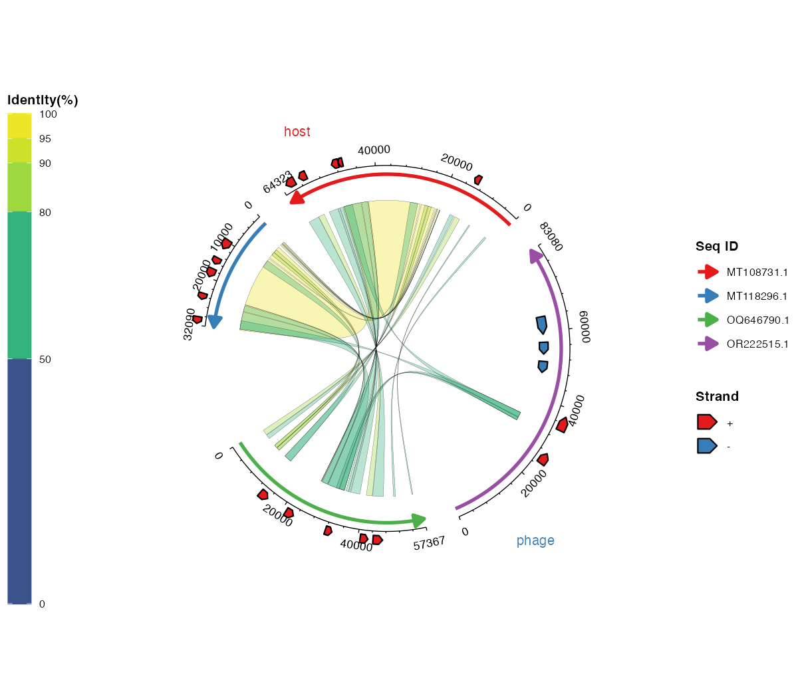
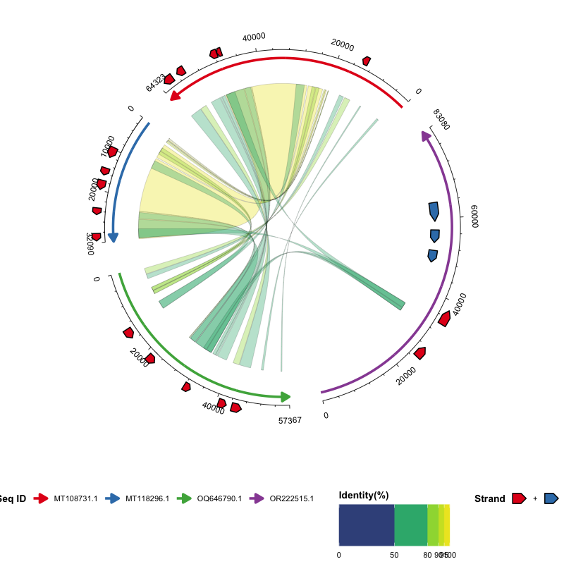

# ggchord 中文使用指南

``` r

library(ggchord)
library(ggplot2)

data(seq_data_example)
data(ribbon_data_example)
data(gene_data_example)
```

本教程完整介绍 `ggchord` 的工作流程：准备输入数据、在 R 中导入文件、
校验与清理数据，以及逐层构建图形。

## 1. 前期数据准备

包需要三类输入数据，均为普通数据框。

### 【必须】序列信息数据（`seq_data`）

| 列名     | 类型 | 说明                   |
|----------|------|------------------------|
| `seq_id` | 字符 | 序列唯一标识           |
| `length` | 整数 | 序列长度（必须为正数） |

示例：

| seq_id     | length |
|------------|--------|
| MT108731.1 | 64323  |
| MT118296.1 | 32090  |
| OQ646790.1 | 57367  |
| OR222515.1 | 83080  |

从 FASTA 文件生成该表格的常见方法：

``` bash
seqkit fx2tab -nil examples/fasta/*.fna | sed '1i seq_id\tlength' > examples/seq_track.tsv
```

### 【可选】比对数据（`ribbon_data`）

每行表示两条序列之间的一个比对片段（列名遵循常见比对工具的输出约定）：

| 列名      | 类型 | 说明                  |
|-----------|------|-----------------------|
| `qaccver` | 字符 | 查询序列 ID           |
| `saccver` | 字符 | 目标序列 ID           |
| `length`  | 整数 | 比对长度（bp）        |
| `pident`  | 数值 | 相似度百分比（0–100） |
| `qstart`  | 整数 | 查询序列上的起始位置  |
| `qend`    | 整数 | 查询序列上的终止位置  |
| `sstart`  | 整数 | 目标序列上的起始位置  |
| `send`    | 整数 | 目标序列上的终止位置  |

示例行：

| qaccver    | saccver    | length | pident | qstart | qend  | sstart | send  |
|------------|------------|--------|--------|--------|-------|--------|-------|
| MT108731.1 | MT118296.1 | 24856  | 98.612 | 26298  | 51139 | 7121   | 31959 |
| MT108731.1 | MT118296.1 | 4412   | 97.031 | 21513  | 25922 | 2365   | 6772  |
| MT108731.1 | MT118296.1 | 464    | 94.181 | 20691  | 21146 | 1032   | 1495  |

例如，BLAST 的 `-outfmt 7` 标准输出可以直接解析为该表格：

``` bash
seqs=("MT108731.1" "MT118296.1" "OQ646790.1" "OR222515.1")
ext="fna"
for ((i=0; i<${#seqs[@]}-1; i++)); do
  for ((j=i+1; j<${#seqs[@]}; j++)); do
    blastn \
      -outfmt '7 qaccver saccver pident length mismatch gapopen qstart qend sstart send evalue bitscore qcovs qlen slen sstrand stitle' \
      -query "examples/fasta/${seqs[$i]}.${ext}" \
      -subject "examples/fasta/${seqs[$j]}.${ext}" \
      -out "examples/blastn/${seqs[$i]}__${seqs[$j]}.o7"
  done
done
```

### 【可选】基因数据（`gene_data`）

每行表示一条序列上的一个基因（或其他特征）：

| 列名     | 类型 | 说明                 |
|----------|------|----------------------|
| `seq_id` | 字符 | 基因所属序列 ID      |
| `start`  | 整数 | 基因起始位置         |
| `end`    | 整数 | 基因终止位置         |
| `strand` | 字符 | 链方向（`+` 或 `-`） |
| `anno`   | 字符 | 基因注释 / 功能类别  |

示例行：

| seq_id     | start | end   | strand | anno                      |
|------------|-------|-------|--------|---------------------------|
| MT108731.1 | 60709 | 63087 | \+     | hypothetical protein      |
| MT118296.1 | 14628 | 16301 | \+     | virion structural protein |
| OQ646790.1 | 43765 | 46140 | \+     | integrase                 |
| OQ646790.1 | 13194 | 15551 | \+     | tail tape measure protein |

例如，可由 GFF3 文件转换得到：

``` r

library(tidyverse)
gff3FilesPath <- list.files(path = "examples/gff3", pattern = "\\.gff3$", full.names = TRUE)
gff3Table <- map_df(gff3FilesPath, ~read_tsv(.x, show_col_types = F, comment = "#",
  col_names = F) %>% set_names(c("seq_id", "source", "type", "start", "end",
  "score", "strand", "phase", "attributes")))
geneTrackTable <- gff3Table %>%
  filter(type == "CDS") %>%
  mutate(anno = str_extract(attributes, "(?<=product=)[^;]+(?=;)")) %>%
  select(seq_id, start, end, strand, anno)
write_tsv(geneTrackTable, "examples/gene_track.tsv")
```

## 2. 在 R 中导入 FASTA / BLAST / GFF3 数据

外部命令行工具（BLAST、seqkit 等）通常用于*准备*数据，但它们产出的文件
也可以直接用包内置的导入助手在 R 中读取，从而把「在 R 外准备数据」与
「在 R 中导入并绘图」两个步骤清晰分开：

``` r

library(ggchord)

# FASTA -> seq_data（读取并合并全部示例 FASTA 文件）
seq_data <- invisible(read_fasta_lengths(files = "examples/fasta/*.fna"))

# BLAST -outfmt 6/7 表格输出 -> ribbon_data（12 或 17 列自动识别）
ribbon_data <- invisible(read_blast(files = "examples/blastn/*.o7"))

# GFF3 -> gene_data（默认取 CDS；anno 从 product/Name/... 属性提取）
gene_data <- invisible(read_gff3(files = "examples/gff3/*.gff3"))

ggchord(seq_data, ribbon_data, gene_data) +
  geom_seq() + geom_ribbon() + geom_gene()
```

[`read_blast()`](https://dangjem.github.io/ggchord/reference/read_blast.md)
保留有用的额外列（`evalue`、`bitscore`、`qcovs`、`qlen`、
`slen`、`sstrand`、`stitle`）；[`read_gff3()`](https://dangjem.github.io/ggchord/reference/read_gff3.md)
保留 `type`、`source`、
`score`、`phase`、`attributes`；[`read_fasta_lengths()`](https://dangjem.github.io/ggchord/reference/read_fasta_lengths.md)
可通过 `header_delim = "|"` 拆分 NCBI 风格标题。

## 3. 使用教程：从数据到弦图

本节把准备好的数据逐步变成完整弦图。每一步都给出简短示例与对应图片。

### 3.1 校验并清理数据

``` r

data(seq_data_example)
data(ribbon_data_example)
data(gene_data_example)

validate_ggchord_data(seq_data_example, ribbon_data_example, gene_data_example)

clean_ggchord_data(seq_data_example, ribbon_data_example, gene_data_example,
                   unknown_id = "drop", out_of_range = "clip",
                   reversed_interval = "sort", invalid_pident = "clip")
```

[`ggchord()`](https://dangjem.github.io/ggchord/reference/ggchord.md)
默认也会执行校验（`validate = "warn"`）。用 `"error"`
可在严重问题时停止，用 `"none"` 可跳过诊断以处理大数据。

### 3.2 筛选并合并 Ribbon

``` r

kept <- filter_ggchord_ribbons(ribbon_data_example, min_pident = 90,
                               drop_self_links = TRUE,
                               sort_by = "pident")
dedup <- deduplicate_ggchord_ribbons(kept$data, by = "exact",
                                     keep = "best_pident")
merged <- merge_ggchord_ribbons(dedup$data, max_gap = 0)
```

返回的 `$data` 可直接传入
[`ggchord()`](https://dangjem.github.io/ggchord/reference/ggchord.md)。

### 3.3 从序列弧线开始

``` r

ggchord(seq_data_example) +
  geom_seq()
```


序列弧线。

### 3.4 加入比对连接带

``` r

ggchord(seq_data_example, ribbon_data_example) +
  geom_seq() + geom_ribbon()
```


按相似度着色的连接带。

### 3.5 加入基因与标签

``` r

ggchord(seq_data_example, gene_data = gene_data_example) +
  geom_seq() + geom_gene() + geom_gene_label_repel()
```


带防重叠标签的基因箭头。

### 3.6 加入坐标轴与序列标签

``` r

ggchord(seq_data_example) +
  geom_seq() + geom_axis() + geom_seq_label()
```


坐标轴与序列标签。

### 3.7 对序列分组

``` r

seq_grouped <- transform(seq_data_example,
                         seq_group = c("host", "host", "phage", "phage"))

ggchord(seq_grouped, ribbon_data_example, gene_data_example) +
  geom_seq(seq_group = "seq_group",
           seq_group_colors = c(host = "#E41A1C", phage = "#377EB8")) +
  geom_ribbon() + geom_gene()
```



带组间空隙和组标签的分组序列。

### 3.8 映射数值列与 Ribbon 方向

``` r

rb_scored <- transform(ribbon_data_example,
                       bitscore = seq_len(nrow(ribbon_data_example)) * 10)

ggchord(seq_data_example, rb_scored) +
  geom_seq() +
  geom_ribbon(ribbon_color_by = "bitscore",
              ribbon_alpha_by = "bitscore",
              ribbon_direction = "linetype")
```


连续填充、透明度与方向映射。

### 3.9 高亮区间与连接带

``` r

regions <- data.frame(seq_id = "MT108731.1",
                      start = 1000, end = 4000, color = "orange")

ggchord(seq_data_example, ribbon_data_example) +
  geom_seq() + geom_ribbon() +
  geom_seq_region(regions = regions) +
  geom_ribbon_highlight(ribbon_ids = 1)
```


序列区间与连接带高亮。

### 3.10 绘制通用 feature

``` r

features <- data.frame(seq_id = c("MT108731.1", "MT118296.1"),
                       start = c(1000, 500), end = c(4000, 2000),
                       strand = c("+", "-"), type = c("CDS", "tRNA"))

ggchord(seq_data_example, ribbon_data_example) +
  geom_seq() + geom_ribbon() + geom_feature(features)
```


用 geom_feature() 绘制的通用 feature。

### 3.11 应用主题与 scale

``` r

ggchord(seq_data_example, ribbon_data_example, gene_data_example) +
  geom_seq() + geom_ribbon() + geom_gene() + geom_axis() +
  scale_color_manual(values = c("MT108731.1" = "#E41A1C",
                                "MT118296.1" = "#377EB8",
                                "OQ646790.1" = "#4DAF4A",
                                "OR222515.1" = "#984EA3")) +
  theme(panel.background = element_rect(fill = "grey95"),
        legend.position = "bottom", legend.box = "horizontal")
```



统一图例的主题化图形。

### 3.12 发表级精细控制

``` r

ggchord(seq_data_example, ribbon_data_example, gene_data_example,
        title = "ggchord") +
  geom_seq(seq_radius = c(3.3, 2.5, 1.8, 1.25),
           seq_orientation = c(-1, -1, 1, -1),
           seq_colors = c("MT108731.1" = "#E76F51",
                          "MT118296.1" = "#264653",
                          "OQ646790.1" = "#2A9D8F",
                          "OR222515.1" = "#D9A62E")) +
  geom_ribbon(ribbon_alpha = 0.45) +
  geom_gene() +
  geom_gene_label_repel(gene_label_size = 2, seed = 42) +
  geom_seq_label() +
  geom_axis() +
  theme(plot.background = element_rect(fill = "#FBF9F6", colour = NA),
        panel.background = element_rect(fill = "#FBF9F6", colour = NA))
```


精细控制下的完整弦图。

## 6. 灵活的参数格式

序列级参数（`seq_radius`、`seq_gap`、`axis_label_size`
等）支持**单值、无名向量、按序列 ID
命名的向量/列表、按序列顺序命名的列表（`"1"`、`"2"`…）或无名列表**。基因级参数（`gene_label_rotation`、`gene_offset`
等）还额外支持按链方向（`+`/`-`）指定。以下写法均合法：

``` r

# 1. 全部使用同一个值
gene_label_rotation = 20

# 2. 每条序列按链方向分别指定
gene_label_rotation = c("+" = -15, "-" = -45)

# 3. 按序列 ID 名称指定
gene_label_rotation = list(
  "MT118296.1" = c("+" = -15, "-" = -45),
  "OR222515.1" = c("+" = 30, "-" = -30),
  "MT108731.1" = c("+" = 15, "-" = -15),
  "OQ646790.1" = c("+" = 0,  "-" = 0)
)

# 4. 按序列顺序指定（"1" 表示第一条序列）
gene_label_rotation = list(
  "1" = c("+" = -15, "-" = -45),
  "2" = c("+" = 30, "-" = -30),
  "3" = c("+" = 15, "-" = -15),
  "4" = c("+" = 0,  "-" = 0)
)

# 5. 无名列表：按序列顺序（与 #4 等价）
gene_label_rotation = list(
  c("+" = -15, "-" = -45),
  c("+" = 30, "-" = -30),
  c("+" = 15, "-" = -15),
  c("+" = 0,  "-" = 0)
)

# 6. 长度为一的列表会循环应用到每条序列
gene_label_rotation = list(20)
```

## 7. 图层参考

| 图层 | 函数 | 说明 |
|----|----|----|
| 序列弧线 | [`geom_seq()`](https://dangjem.github.io/ggchord/reference/geom_seq.md) | 为每条序列绘制弧线（或直线），含方向箭头 |
| 比对连接带 | [`geom_ribbon()`](https://dangjem.github.io/ggchord/reference/geom_ribbon.md) | 根据比对结果绘制彩色连接带 |
| 基因箭头 | [`geom_gene()`](https://dangjem.github.io/ggchord/reference/geom_gene.md) | 绘制基因/特征箭头多边形 |
| 基因标签 | [`geom_gene_label()`](https://dangjem.github.io/ggchord/reference/geom_gene_label.md) | 在固定位置绘制基因标签 |
| 防重叠基因标签 | [`geom_gene_label_repel()`](https://dangjem.github.io/ggchord/reference/geom_gene_label_repel.md) | 类 ggrepel 标签：带引导线、支持换行与重叠隐藏 |
| 坐标轴 | [`geom_axis()`](https://dangjem.github.io/ggchord/reference/geom_axis.md) | 绘制坐标轴线、主/次刻度与刻度标签 |
| 序列标签 | [`geom_seq_label()`](https://dangjem.github.io/ggchord/reference/geom_seq_label.md) | 在弧线内侧/外侧放置序列名称 |

## 8. 图形解读

- **序列弧线**——每条彩色弧线代表一条序列，长度按比例映射，箭头表示方向。
- **连接带**——连接序列之间的彩色区域代表比对/同源区间；默认颜色编码相似度、查询或目标序列。
- **基因箭头**——绘制在序列上的箭头多边形；颜色编码链方向或功能类别，可选标签。
- **坐标轴**——每条弧线外侧的刻度与数字标注序列位置。

## 延伸阅读

- [函数参考](https://dangjem.github.io/ggchord/reference/index.html)
- [版本更新记录（NEWS）](https://dangjem.github.io/ggchord/news/index.html)
- [包主页](https://dangjem.github.io/ggchord/)
