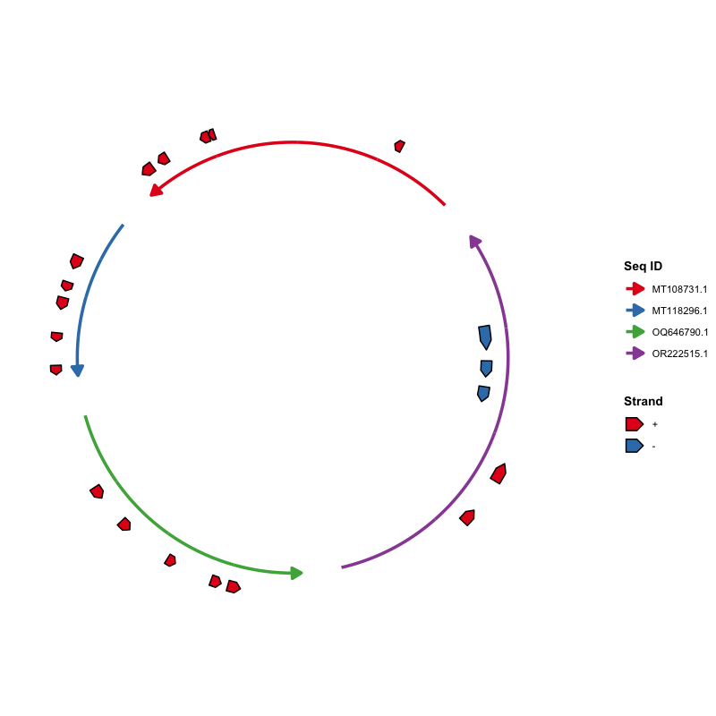
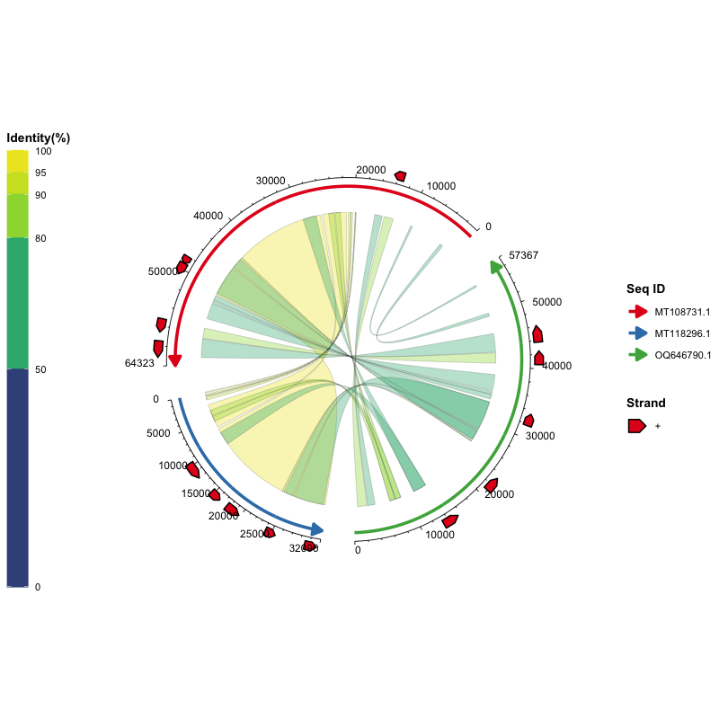

# ggchord: Layered Multi-Sequence Chord Diagrams for ggplot2

## Overview

`ggchord` is an R package built on `ggplot2` that draws **chord diagrams
for multi-sequence data** using the layered grammar of graphics. Instead
of a single monolithic function, you build a plot by stacking layers —
[`ggchord()`](https://dangjem.github.io/ggchord/reference/ggchord.md)
supplies the data and global options, and each `geom_*` layer is
responsible for one kind of element (sequence arcs, alignment ribbons,
gene annotations, axes, labels). Every layer has sensible defaults, so a
complete diagram can be drawn in one line, and every layer can be
fine-tuned independently when you need more control.

- Each sequence is drawn as an arc whose length is proportional to its
  length.
- Ribbons connect homologous/aligning regions between sequences.
- Genes (or other features) are drawn as arrow polygons along the arcs.
- Axes and labels annotate sequence positions.
- Themes, scales,
  [`ggsave()`](https://ggplot2.tidyverse.org/reference/ggsave.html),
  [`ggplot_build()`](https://ggplot2.tidyverse.org/reference/ggplot_build.html)
  and
  [`plotly::ggplotly()`](https://rdrr.io/pkg/plotly/man/ggplotly.html)
  all work, because a ggchord plot is a real `ggplot2` object.

It is a general tool for comparing sequences, gene neighbourhoods,
phage–host relationships, pangenome blocks, synteny, and more — you only
need three tidy data frames.

## Key Features

- **True `ggplot2` layered style** —
  [`ggchord()`](https://dangjem.github.io/ggchord/reference/ggchord.md)
  takes only data + global options; each `geom_*` layer manages its own
  layout parameters.
- **Everything has defaults** —
  `ggchord(data) + geom_seq() + geom_ribbon() + geom_gene() + geom_axis()`
  already produces a complete diagram.
- **Multi-sequence support** — two, three, four or more sequences in one
  plot.
- **Per-sequence parameters** — order, orientation, gap, radius,
  curvature in
  [`geom_seq()`](https://dangjem.github.io/ggchord/reference/geom_seq.md);
  supports single values, vectors, named vectors and lists (see
  [Flexible parameter formats](#flexible-parameter-formats)).
- **Flexible ribbons** — color by percent identity, query, subject, or a
  single color; customizable Bézier curvature and outline.
- **Gene annotations** — strand-colored or category-colored arrows with
  anti-overlap labels
  ([`geom_gene_label_repel()`](https://dangjem.github.io/ggchord/reference/geom_gene_label_repel.md)).
- **Refined axes** — major/minor ticks, and labels that stay readable
  (`"parallel"`, `"perpendicular"`, `"horizontal"` or any angle).
- **Plays well with ggplot2** —
  [`theme()`](https://ggplot2.tidyverse.org/reference/theme.html),
  `scale_*()`,
  [`ggsave()`](https://ggplot2.tidyverse.org/reference/ggsave.html),
  [`ggplot_build()`](https://ggplot2.tidyverse.org/reference/ggplot_build.html),
  and
  [`plotly::ggplotly()`](https://rdrr.io/pkg/plotly/man/ggplotly.html)
  all work.

## Installation

`ggchord` requires R (≥ 4.1.0) and `ggplot2` (≥ 4.0.0).

``` r

install.packages("ggplot2")   # if needed
```

From CRAN:

``` r

install.packages("ggchord")
```

From GitHub (development version):

``` r

devtools::install_github("DangJem/ggchord")
```

## Quick Start

The package ships with three example data sets, so you can run the code
below as-is:

``` r

library(ggchord)

# Load the built-in example data
data(seq_data_example)
data(ribbon_data_example)
data(gene_data_example)

# Stack the layers like you would in ggplot2
p <- ggchord(
  seq_data     = seq_data_example,
  ribbon_data  = ribbon_data_example,
  gene_data    = gene_data_example
) +
  geom_seq() +      # sequence arcs
  geom_ribbon() +   # alignment ribbons
  geom_gene() +     # gene annotations
  geom_axis()       # position axes

print(p)
```


Basic chord diagram with all default parameters

That is the whole idea: **data in
[`ggchord()`](https://dangjem.github.io/ggchord/reference/ggchord.md),
styling in the layers**. The table below summarises what each layer
draws; the next section walks through them one by one.

| Layer | What it draws |
|----|----|
| [`geom_seq()`](https://dangjem.github.io/ggchord/reference/geom_seq.md) | The sequence arcs (and their direction arrows) |
| [`geom_ribbon()`](https://dangjem.github.io/ggchord/reference/geom_ribbon.md) | The ribbons connecting aligned regions |
| [`geom_gene()`](https://dangjem.github.io/ggchord/reference/geom_gene.md) | Gene/feature arrow polygons |
| [`geom_gene_label()`](https://dangjem.github.io/ggchord/reference/geom_gene_label.md) / [`geom_gene_label_repel()`](https://dangjem.github.io/ggchord/reference/geom_gene_label_repel.md) | Gene labels (fixed or force-repelled) |
| [`geom_axis()`](https://dangjem.github.io/ggchord/reference/geom_axis.md) | Axis lines, ticks and tick labels |
| [`geom_seq_label()`](https://dangjem.github.io/ggchord/reference/geom_seq_label.md) | Sequence names on/outside the arcs |

------------------------------------------------------------------------

## Usage Guide

### 1. Data preparation

Three types of input data are used. All three are plain data frames.

#### \[Required\] Sequence data (`seq_data`)

| Column   | Type      | Description                        |
|----------|-----------|------------------------------------|
| `seq_id` | character | Unique sequence identifier         |
| `length` | integer   | Sequence length (must be positive) |

Example:

| seq_id     | length |
|------------|--------|
| MT108731.1 | 64323  |
| MT118296.1 | 32090  |
| OQ646790.1 | 57367  |
| OR222515.1 | 83080  |

A common way to build this table from FASTA files:

``` bash
seqkit fx2tab -nil *.fna | sed '1i seq_id\tlength' > seq_track.tsv
```

#### \[Optional\] Alignment data (`ribbon_data`)

One row per alignment block between two sequences (the column names
follow common alignment-tool conventions):

| Column    | Type      | Description                            |
|-----------|-----------|----------------------------------------|
| `qaccver` | character | Query sequence ID                      |
| `saccver` | character | Subject sequence ID                    |
| `length`  | integer   | Alignment length (bp)                  |
| `pident`  | numeric   | Percent identity (0–100)               |
| `qstart`  | integer   | Start position on the query sequence   |
| `qend`    | integer   | End position on the query sequence     |
| `sstart`  | integer   | Start position on the subject sequence |
| `send`    | integer   | End position on the subject sequence   |

Example rows:

| qaccver    | saccver    | length | pident | qstart | qend  | sstart | send  |
|------------|------------|--------|--------|--------|-------|--------|-------|
| MT108731.1 | MT118296.1 | 24856  | 98.612 | 26298  | 51139 | 7121   | 31959 |
| MT108731.1 | MT118296.1 | 4412   | 97.031 | 21513  | 25922 | 2365   | 6772  |
| MT108731.1 | MT118296.1 | 464    | 94.181 | 20691  | 21146 | 1032   | 1495  |

For example, the standard BLAST `-outfmt 7` output can be parsed into
this table directly:

``` bash
seqs=("MT108731.1" "MT118296.1" "OQ646790.1" "OR222515.1")
ext="fna"
for ((i=0; i<${#seqs[@]}-1; i++)); do
  for ((j=i+1; j<${#seqs[@]}; j++)); do
    blastn \
      -outfmt '7 qaccver saccver pident length mismatch gapopen qstart qend sstart send evalue bitscore qcovs qlen slen sstrand stitle' \
      -query "${seqs[$i]}.${ext}" \
      -subject "${seqs[$j]}.${ext}" \
      -out "${seqs[$i]}__${seqs[$j]}.o7"
  done
done
```

#### \[Optional\] Gene data (`gene_data`)

One row per gene (or feature) on a sequence:

| Column   | Type      | Description                           |
|----------|-----------|---------------------------------------|
| `seq_id` | character | Sequence ID the gene belongs to       |
| `start`  | integer   | Gene start position                   |
| `end`    | integer   | Gene end position                     |
| `strand` | character | Strand direction (`+` or `-`)         |
| `anno`   | character | Gene annotation / functional category |

Example rows:

| seq_id     | start | end   | strand | anno                      |
|------------|-------|-------|--------|---------------------------|
| MT108731.1 | 60709 | 63087 | \+     | hypothetical protein      |
| MT118296.1 | 14628 | 16301 | \+     | virion structural protein |
| OQ646790.1 | 43765 | 46140 | \+     | integrase                 |
| OQ646790.1 | 13194 | 15551 | \+     | tail tape measure protein |

For example, this table can be converted from GFF3 files:

``` r

library(tidyverse)
gff3FilesPath <- list.files(path = ".", pattern = "*.gff3")
gff3Table <- map_df(gff3FilesPath, ~read_tsv(.x, show_col_types = F, comment = "#",
  col_names = F) %>% set_names(c("seq_id", "source", "type", "start", "end",
  "score", "strand", "phase", "attributes")))
geneTrackTable <- gff3Table %>%
  filter(type == "CDS") %>%
  mutate(anno = str_extract(attributes, "(?<=product=)[^;]+(?=;)")) %>%
  select(seq_id, start, end, strand, anno)
write_tsv(geneTrackTable, "gene_track.tsv")
```

### 2. Learn by examples

All examples use the built-in data sets, so you can copy-paste and run
them directly:

``` r

library(ggchord)

data(seq_data_example)
data(ribbon_data_example)
data(gene_data_example)
```

#### Step 1: Draw the sequence arcs

The simplest plot needs only `seq_data`:

``` r

ggchord(seq_data = seq_data_example) + geom_seq()
```


Sequence chord diagram with default parameters

Customize the sequence layout — order, orientation, curvature and colors
all belong to
[`geom_seq()`](https://dangjem.github.io/ggchord/reference/geom_seq.md):

``` r

ggchord(seq_data = seq_data_example) +
  geom_seq(
    seq_order      = c("MT118296.1", "OR222515.1", "MT108731.1", "OQ646790.1"),
    seq_orientation = c(1, -1, 1, -1),
    seq_curvature   = c(0, 2, -2, 6),
    seq_colors      = c("steelblue", "orange", "pink", "yellow")
  )
```


Sequence chord diagram with a customized layout

#### Step 2: Add alignment ribbons

Add `ribbon_data` and draw ribbons. By default ribbons are colored by
percent identity (`ribbon_color_scheme = "pident"`):

``` r

ggchord(seq_data_example, ribbon_data_example) +
  geom_seq() + geom_ribbon()
```


Alignment ribbons colored by percent identity

Other color schemes are available:

``` r

# Color ribbons by the query sequence
ggchord(seq_data_example, ribbon_data_example) +
  geom_seq() + geom_ribbon(ribbon_color_scheme = "query")
```


Alignment ribbons colored by the query sequence

``` r

# Color ribbons by the subject sequence
ggchord(seq_data_example, ribbon_data_example) +
  geom_seq() + geom_ribbon(ribbon_color_scheme = "subject")
```


Alignment ribbons colored by the subject sequence

``` r

# Use a single color for all ribbons
ggchord(seq_data_example, ribbon_data_example) +
  geom_seq() +
  geom_ribbon(ribbon_color_scheme = "single", ribbon_colors = "orange")
```


Alignment ribbons in a single color

#### Step 3: Add gene annotations and labels

Add `gene_data` and draw genes as arrows. By default arrows are colored
by strand (`+` / `-`):

``` r

ggchord(seq_data_example, gene_data = gene_data_example) +
  geom_seq() + geom_gene()
```



Gene arrows colored by strand

Color by annotation category and add labels with
[`geom_gene_label()`](https://dangjem.github.io/ggchord/reference/geom_gene_label.md):

``` r

ggchord(seq_data_example, gene_data = gene_data_example) +
  geom_seq() +
  geom_gene(gene_color_scheme = "manual") +
  geom_gene_label(
    gene_label_rotation = 45,
    gene_label_radial_offset = 0.1
  )
```


Gene arrows colored by annotation with labels

When annotations are long or genes are dense, labels can overlap.
[`geom_gene_label_repel()`](https://dangjem.github.io/ggchord/reference/geom_gene_label_repel.md)
pushes labels away with a ggrepel-style force layout and connects them
to their genes with leader lines; it can also wrap long annotations
(`gene_label_wrap`) and hide the most crowded labels (`max_overlaps`):

``` r

ggchord(seq_data_example, gene_data = gene_data_example) +
  geom_seq() +
  geom_gene() +
  geom_gene_label_repel(
    gene_label_wrap = 15,
    max_overlaps = 5
  )
```


Gene labels repelled with leader lines

For all-horizontal text and L-shaped leader lines, use
`gene_label_orientation = "horizontal"` and
`gene_label_segment = "elbow"`:

``` r

ggchord(seq_data_example, gene_data = gene_data_example) +
  geom_seq() +
  geom_gene() +
  geom_gene_label_repel(
    gene_label_orientation = "horizontal",
    gene_label_segment = "elbow",
    gene_label_wrap = 15
  )
```


Horizontal gene labels with elbow leader lines

#### Step 4: Add axes and sequence labels

Axes annotate sequence positions with major/minor ticks. By default the
tick labels run parallel to the axis;
[`geom_seq_label()`](https://dangjem.github.io/ggchord/reference/geom_seq_label.md)
places sequence names on or outside the arcs:

``` r

ggchord(seq_data_example) +
  geom_seq() +
  geom_axis(
    axis_tick_major_length = 0.03,
    axis_tick_minor_length = 0.015,
    axis_label_size = 2.5
  ) +
  geom_seq_label(seq_label_radius = 1.2)
```


Axes and sequence labels

#### Step 5: Two-sequence comparison

Plot any subset of the data. Keep two sequences and the matching
ribbons/genes:

``` r

seq2 <- seq_data_example[seq_data_example$seq_id %in%
                           c("MT108731.1", "MT118296.1"), ]
ribbon2 <- ribbon_data_example[
  ribbon_data_example$qaccver %in% seq2$seq_id &
    ribbon_data_example$saccver %in% seq2$seq_id, ]
gene2 <- gene_data_example[gene_data_example$seq_id %in% seq2$seq_id, ]

ggchord(seq2, ribbon2, gene2) +
  geom_seq() + geom_ribbon() + geom_gene() + geom_axis()
```


Two-sequence comparison

#### Step 6: Three-sequence comparison

The same idea works for three sequences:

``` r

seq3 <- seq_data_example[seq_data_example$seq_id %in%
                           c("MT108731.1", "MT118296.1", "OQ646790.1"), ]
ribbon3 <- ribbon_data_example[
  ribbon_data_example$qaccver %in% seq3$seq_id &
    ribbon_data_example$saccver %in% seq3$seq_id, ]
gene3 <- gene_data_example[gene_data_example$seq_id %in% seq3$seq_id, ]

ggchord(seq3, ribbon3, gene3) +
  geom_seq() + geom_ribbon() + geom_gene() + geom_axis()
```



Three-sequence comparison

#### Step 7: Combine everything and fine-tune

Every layer accepts fine-grained parameters. Here, each layer receives
the parameters that belong to it:

``` r

ggchord(
  seq_data    = seq_data_example,
  ribbon_data = ribbon_data_example,
  gene_data   = gene_data_example,
  title       = "Multi-sequence Chord Diagram with Gene Annotations",
  rotation    = 45
) +
  geom_seq(
    seq_radius      = c(3, 2, 2, 1),
    seq_orientation = c(-1, -1, -1, 1),
    seq_curvature   = c(0, 1, -1, 1.5),
    seq_gap         = 0.03
  ) +
  geom_ribbon(
    ribbon_color_scheme = "pident",
    ribbon_gap = 0.1
  ) +
  geom_gene(
    gene_offset = list(
      c("+" = 0.2, "-" = -0.2),
      c("+" = 0.2, "-" = -0.2),
      c("+" = 0.2, "-" = 0),
      c("+" = 0.2, "-" = 0.1)
    ),
    gene_width = 0.08
  ) +
  geom_gene_label(
    gene_label_rotation = list(
      c("+" = 45, "-" = -45),
      c("+" = 30, "-" = -30),
      c("+" = 15, "-" = -15),
      c("+" = 0,  "-" = 0)
    )
  ) +
  geom_axis(
    axis_gap = 0.05,
    axis_tick_major_length = 0.03,
    axis_label_size = 2
  )
```


Full chord diagram with fine-grained control

#### Step 8: Add themes and scales with `+`

A ggchord plot is a real ggplot2 object, so
[`theme()`](https://ggplot2.tidyverse.org/reference/theme.html) and
`scale_*()` work as usual:

``` r

ggchord(seq_data_example, ribbon_data_example, gene_data_example) +
  geom_seq() + geom_ribbon() + geom_gene() + geom_axis() +
  theme(panel.background = element_rect(fill = "grey95")) +
  scale_color_manual(
    values = c("MT108731.1" = "#E41A1C",
               "MT118296.1" = "#377EB8",
               "OQ646790.1" = "#4DAF4A",
               "OR222515.1" = "#984EA3")
  )
```


Chord diagram with a custom theme and scale

> The “Scale for colour is already present” message simply means your
> [`scale_color_manual()`](https://ggplot2.tidyverse.org/reference/scale_manual.html)
> replaces the built-in default scale — this is expected and harmless.

**Legend placement.** Each layer’s legend is placed independently by
default: the Seq ID legend and the Strand/Gene legend are on the right,
and the Identity(%) colourbar is on the left. Move each one with the
`legend_position` argument of
[`geom_seq()`](https://dangjem.github.io/ggchord/reference/geom_seq.md),
[`geom_ribbon()`](https://dangjem.github.io/ggchord/reference/geom_ribbon.md)
and
[`geom_gene()`](https://dangjem.github.io/ggchord/reference/geom_gene.md).
Set `legend_position = NULL` to make a legend follow
`theme(legend.position = ...)` so all legends can be grouped together:

``` r

ggchord(seq_data_example, ribbon_data_example, gene_data_example) +
  geom_seq(legend_position = NULL) +
  geom_ribbon(legend_position = NULL) +
  geom_gene(legend_position = NULL) +
  geom_axis() +
  theme(legend.position = "bottom", legend.box = "horizontal")
```


All legends grouped at the bottom via theme()

### 3. Flexible parameter formats

Sequence-level parameters (`seq_radius`, `seq_gap`, `axis_label_size`,
…) accept **a single value, an unnamed vector, a vector/list named by
sequence ID, a list named by sequence order (`"1"`, `"2"`, …), or an
unnamed list**. Gene-level parameters (`gene_label_rotation`,
`gene_offset`, …) additionally accept per-strand (`+`/`-`) values. All
of the following are valid:

``` r

# 1. One value for everything
gene_label_rotation = 20

# 2. One value per strand, for every sequence
gene_label_rotation = c("+" = -15, "-" = -45)

# 3. By sequence ID
gene_label_rotation = list(
  "MT118296.1" = c("+" = -15, "-" = -45),
  "OR222515.1" = c("+" = 30, "-" = -30),
  "MT108731.1" = c("+" = 15, "-" = -15),
  "OQ646790.1" = c("+" = 0,  "-" = 0)
)

# 4. By sequence order ("1" = first sequence)
gene_label_rotation = list(
  "1" = c("+" = -15, "-" = -45),
  "2" = c("+" = 30, "-" = -30),
  "3" = c("+" = 15, "-" = -15),
  "4" = c("+" = 0,  "-" = 0)
)

# 5. Unnamed list: follows the sequence order (same as #4)
gene_label_rotation = list(
  c("+" = -15, "-" = -45),
  c("+" = 30, "-" = -30),
  c("+" = 15, "-" = -15),
  c("+" = 0,  "-" = 0)
)

# 6. A length-one list recycles to every sequence
gene_label_rotation = list(20)
```

## Layer Reference

| Layer | Function | Description |
|----|----|----|
| Sequence arcs | [`geom_seq()`](https://dangjem.github.io/ggchord/reference/geom_seq.md) | Draws an arc (or line) for each sequence, with direction arrows |
| Alignment ribbons | [`geom_ribbon()`](https://dangjem.github.io/ggchord/reference/geom_ribbon.md) | Draws colored ribbons from alignment results |
| Gene arrows | [`geom_gene()`](https://dangjem.github.io/ggchord/reference/geom_gene.md) | Draws gene/feature arrow polygons |
| Gene labels | [`geom_gene_label()`](https://dangjem.github.io/ggchord/reference/geom_gene_label.md) | Draws gene labels at fixed positions |
| Repelled gene labels | [`geom_gene_label_repel()`](https://dangjem.github.io/ggchord/reference/geom_gene_label_repel.md) | ggrepel-style labels with leader lines, wrapping and overlap hiding |
| Axes | [`geom_axis()`](https://dangjem.github.io/ggchord/reference/geom_axis.md) | Draws axis lines, major/minor ticks and tick labels |
| Sequence labels | [`geom_seq_label()`](https://dangjem.github.io/ggchord/reference/geom_seq_label.md) | Places sequence names on/outside the arcs |

## Parameter Reference

### ggchord() Parameters

| Parameter | Type | Default | Description |
|----|----|----|----|
| `seq_data` | data.frame | \- | Sequence info; must include `seq_id`, `length` |
| `ribbon_data` | data.frame | NULL | Alignment results |
| `gene_data` | data.frame | NULL | Gene annotation data |
| `title` | character | NULL | Plot title |
| `rotation` | numeric | 45 | Global rotation angle (degrees) |
| `panel_margin` | numeric/list | 0 | Panel margins |
| `show_legend` | logical | TRUE | Display legends |
| `debug` | logical | FALSE | Output debug info |

### geom_seq() Parameters

| Parameter | Type | Default | Description |
|----|----|----|----|
| `seq_order` | character vector | NULL | Drawing order of sequences |
| `seq_labels` | character vector | NULL | Sequence labels |
| `seq_orientation` | numeric (1/-1) | 1 | Sequence direction |
| `seq_gap` | numeric \[0, 0.5) | 0.03 | Gap proportion between sequences |
| `seq_radius` | numeric (\> 0) | 1.0 | Sequence arc radius |
| `seq_curvature` | numeric | 1.0 | Curvature: 0 = straight, 1 = standard, \> 1 = more curved |
| `seq_colors` | color vector | Set1 | Sequence arc colors |
| `linewidth` | numeric | 1.2 | Arc line width |
| `show_legend` | logical | TRUE | Show the Seq ID legend |
| `legend_position` | character | “right” | Position of the Seq ID legend: `"left"`, `"right"`, `"top"`, `"bottom"` or `"inside"` (`NULL` = follow `theme(legend.position = ...)`) |

### geom_seq_label() Parameters

| Parameter | Type | Default | Description |
|----|----|----|----|
| `seq_label_radius` | numeric/vector | 1.15 | Radial position of labels as a multiplier of the arc radius (1 = on the arc) |
| `seq_label_rotation` | numeric/vector | 0 | Additional label rotation (degrees) |
| `seq_label_size` | numeric/vector | 3 | Label font size |
| `seq_labels` | character vector | NULL | Override label texts (defaults to the sequence labels from [`geom_seq()`](https://dangjem.github.io/ggchord/reference/geom_seq.md)) |
| `show_legend` | logical | FALSE | Show legend |

### geom_ribbon() Parameters

| Parameter | Type | Default | Description |
|----|----|----|----|
| `ribbon_color_scheme` | character | “pident” | Scheme: `"pident"`, `"query"`, `"subject"`, `"single"` |
| `ribbon_colors` | color vector | auto | Ribbon color parameters |
| `ribbon_alpha` | numeric (0-1) | 0.35 | Ribbon transparency |
| `ribbon_ctrl_point` | vector/list | c(0, 0) | Bézier control points |
| `ribbon_gap` | numeric/vector | 0.15 | Radial gap between sequences and ribbons |
| `ribbon_outline_color` | character | “black” | Ribbon outline (border) color |
| `ribbon_outline_width` | numeric | 0.05 | Ribbon outline line width |
| `ribbon_outline_linetype` | numeric/character | 1 | Ribbon outline line type (1 = solid) |
| `show_legend` | logical | TRUE | Show the Identity(%) legend |
| `legend_position` | character | “left” | Position of the Identity(%) colourbar: `"left"`, `"right"`, `"top"`, `"bottom"` or `"inside"` (`NULL` = follow `theme(legend.position = ...)`) |
| `legend_key_length` | unit/number | NULL | Length of the Identity(%) colourbar (height when vertical, width when horizontal); a number is in cm, e.g. `legend_key_length = 5` or `unit(5, "cm")` |

### geom_gene() Parameters

| Parameter | Type | Default | Description |
|----|----|----|----|
| `gene_offset` | numeric/vector/list | 0.1 | Radial offset of gene arrows |
| `gene_width` | numeric/vector/list | 0.05 | Gene arrow width |
| `gene_color_scheme` | character | “strand” | Scheme: `"strand"` or `"manual"` |
| `gene_colors` | color vector | auto | Gene arrow fill colors |
| `gene_order` | character vector | NULL | Gene display order in the legend |
| `show_legend` | logical | TRUE | Show the Strand/Gene legend |
| `legend_position` | character | “right” | Position of the Strand/Gene legend: `"left"`, `"right"`, `"top"`, `"bottom"` or `"inside"` (`NULL` = follow `theme(legend.position = ...)`) |

### geom_gene_label() Parameters

| Parameter | Type | Default | Description |
|----|----|----|----|
| `gene_label_size` | numeric | 2.5 | Label font size |
| `gene_label_rotation` | numeric/vector/list | 0 | Label rotation angle |
| `gene_label_radial_offset` | numeric/vector/list | 0 | Radial offset of labels |
| `gene_label_circum_offset` | numeric/vector/list | 0 | Circumferential offset |
| `gene_label_circum_limit` | logical/vector/list | TRUE | Limit circumferential offset |
| `gene_label_wrap` | numeric | NULL | Wrap long annotations at this many characters (e.g. 15) |
| `show_legend` | logical | FALSE | Show legend |

### geom_gene_label_repel() Parameters

All
[`geom_gene_label()`](https://dangjem.github.io/ggchord/reference/geom_gene_label.md)
parameters plus:

| Parameter | Type | Default | Description |
|----|----|----|----|
| `max_overlaps` | numeric | Inf | Hide labels that still overlap more than this many other labels after repulsion |
| `box_padding` | numeric | 0.25 | Extra padding around each label box (data units) |
| `point_padding` | numeric | 0.1 | Extra padding around the anchor points (data units) |
| `min_segment_length` | numeric | 0.05 | Labels that moved less than this distance draw no leader line |
| `force` | numeric | 1 | Strength of the repulsive forces |
| `seed` | numeric | 123 | Random seed for reproducible repulsion |
| `gene_label_orientation` | character | “arc” | Label text direction: `"arc"` (rotated along the arc) or `"horizontal"` |
| `gene_label_segment` | character | “line” | Leader line style: `"line"` (straight) or `"elbow"` (L-shaped) |

### geom_axis() Parameters

| Parameter | Type | Default | Description |
|----|----|----|----|
| `show_axis` | logical | TRUE | Display axes |
| `axis_gap` | numeric/vector | 0.05 | Radial gap to sequences |
| `axis_tick_major_number` | integer/vector | 3 | Number of major ticks |
| `axis_tick_major_length` | numeric/vector | 0.02 | Major tick length proportion |
| `axis_tick_minor_number` | integer/vector | 4 | Number of minor ticks |
| `axis_tick_minor_length` | numeric/vector | 0.01 | Minor tick length proportion |
| `axis_label_size` | numeric/vector | 3 | Tick label font size |
| `axis_label_offset` | numeric/vector | 2 | Label offset ratio |
| `axis_label_orientation` | character/numeric/vector | “parallel” | Label orientation: `"parallel"` (text parallel to the axis), `"perpendicular"` (text perpendicular to the axis), `"horizontal"` (text stays horizontal), or a numeric angle in degrees counter-clockwise from horizontal (e.g. `45`, `90`, `c(0, 45, 80, 130)`); vectors/named vectors set a different orientation per sequence |
| `axis_label_hide_overlaps` | logical | FALSE | Auto-hide axis labels that overlap the plot content or other labels |
| `show_legend` | logical | FALSE | Show legend |

------------------------------------------------------------------------

## Plot Interpretation

- **Sequence arcs** — each colored arc is one sequence, with length
  proportional to the sequence length and arrows showing direction.
- **Ribbons** — colored regions connecting sequences represent aligned/
  homologous intervals; color encodes identity, query or subject by
  default.
- **Gene arrows** — arrow polygons on the sequences; color encodes
  strand or functional category, with optional labels.
- **Axes** — ticks and numbers outside each arc label sequence
  positions.

------------------------------------------------------------------------

## Version History

### v0.6.0 (Latest)

- **Self-contained plot objects**: data and parameters are stored on the
  plot itself, so multiple plots can coexist and plots survive
  [`saveRDS()`](https://rdrr.io/r/base/readRDS.html)/[`readRDS()`](https://rdrr.io/r/base/readRDS.html).
- **Build-time layout**: the layout is computed by
  [`ggplot_build()`](https://ggplot2.tidyverse.org/reference/ggplot_build.html),
  so [`print()`](https://rdrr.io/r/base/print.html),
  [`ggsave()`](https://ggplot2.tidyverse.org/reference/ggsave.html),
  [`ggplot_build()`](https://ggplot2.tidyverse.org/reference/ggplot_build.html)
  (and `ggplotly()`) all work, and the user’s plot object is never
  modified when rendering.
- **New layer
  [`geom_seq_label()`](https://dangjem.github.io/ggchord/reference/geom_seq_label.md)**:
  sequence labels on/outside the arcs.
- **New ribbon color scheme `"subject"`**: color ribbons by the subject
  sequence.
- **Exported
  [`get_chord_layout()`](https://dangjem.github.io/ggchord/reference/get_chord_layout.md)**:
  access the computed layout for custom layers.
- **Themes/scales via `+`**:
  [`theme()`](https://ggplot2.tidyverse.org/reference/theme.html) and
  user-supplied scales are respected.
- **Data validation**: warns about out-of-range or reversed
  alignment/gene coordinates and unknown sequence IDs.
- **Axis label orientation**: `"parallel"` (default), `"perpendicular"`,
  `"horizontal"` or numeric angles.
- **Performance**: faster angle lookup in the layout mapping.
- **Dependencies**: `ggplot2 (>= 4.0.0)` and `R (>= 4.1.0)`.
- **CI**: GitHub Actions `R CMD check` on macOS, Windows and Linux.

### v0.5.0

- **Ribbon outline customization**: `ribbon_outline_color` (default
  `"black"`), `ribbon_outline_width` (default `0.05`) and
  `ribbon_outline_linetype` (default `1`, solid).
- **Dependencies removed**: dropped `ggnewscale` and `RColorBrewer`.
- **Bug fixes**: ribbon fill scale overwritten by the gene fill scale;
  `ribbon_alpha` opacity; `geom_axis(show_axis = FALSE)` error; mixed
  `axis_label_orientation` vectors; `brewer.pal()` warnings;
  [`geom_gene()`](https://dangjem.github.io/ggchord/reference/geom_gene.md)
  added before
  [`geom_ribbon()`](https://dangjem.github.io/ggchord/reference/geom_ribbon.md);
  axis-only plots; S3 method registration.
- **Documentation**: English comments/messages; data-preparation tables;
  rendered example plots; BLAST de-emphasized; vignette rewritten.

### v0.4.0

- **Parameter redistribution**: layout parameters moved from
  [`ggchord()`](https://dangjem.github.io/ggchord/reference/ggchord.md)
  into the `geom_*` layers;
  [`ggchord()`](https://dangjem.github.io/ggchord/reference/ggchord.md)
  handles data validation and global style.
- **Deferred computation**: coordinate layout computed at
  [`print()`](https://rdrr.io/r/base/print.html) time.
- **Custom `print.ggchord()` method** and 15 unit tests.

### v0.3.0

- Layered API refactor:
  `ggchord() + geom_seq() + geom_ribbon() + geom_gene() + geom_axis()`.
- Custom `+.ggchord` method and lightweight
  [`coord_chord()`](https://dangjem.github.io/ggchord/reference/coord_chord.md).

### v0.2.0

- Enhanced arc and line modes; precise curvature and gap control;
  enhanced color customization.

### v0.1.0

- Separate management of sequence, alignment and gene data; sequence
  orientation, custom order, gap and radius adjustment; customizable
  axes; ribbons support 3 coloring schemes.

### v0.0.2

- Multi-sequence support; arc/line mode switching.

### v0.0.1

- Initial release; pairwise BLAST alignment chord diagram visualization.

------------------------------------------------------------------------

## Contributions & Feedback

Bug reports and feature requests are welcome via [GitHub
issues](https://github.com/DangJem/ggchord/issues). Pull requests are
also appreciated.

## License

This project is licensed under the MIT License — see the
[LICENSE](https://dangjem.github.io/ggchord/LICENSE) file for details.
