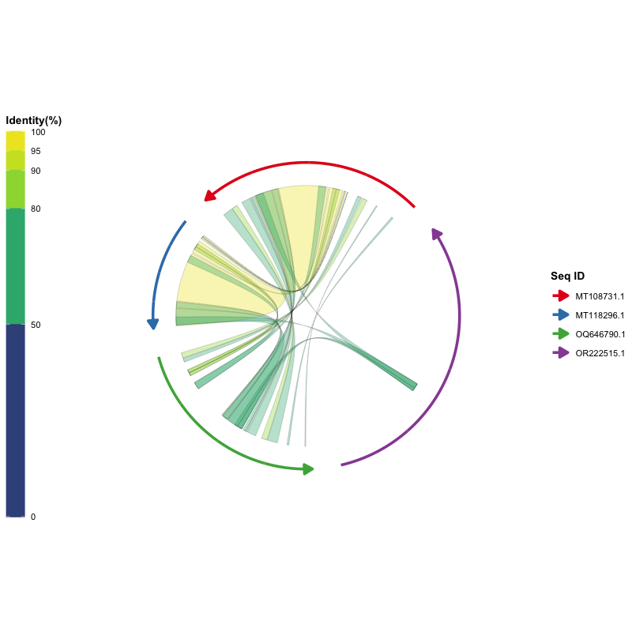
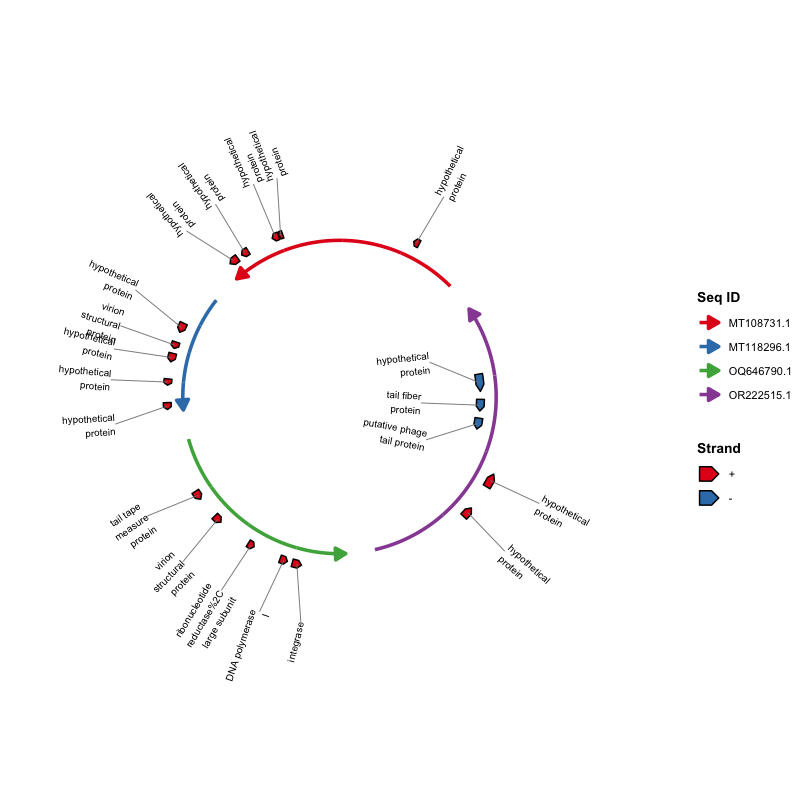
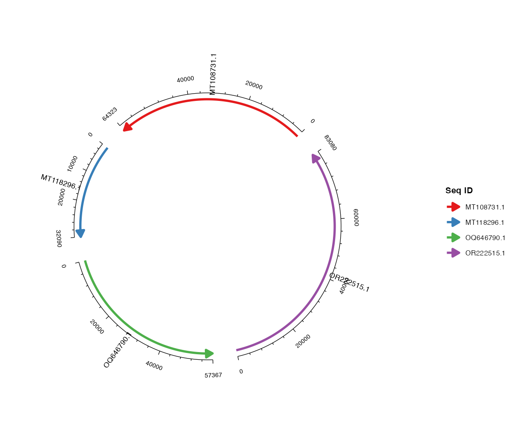
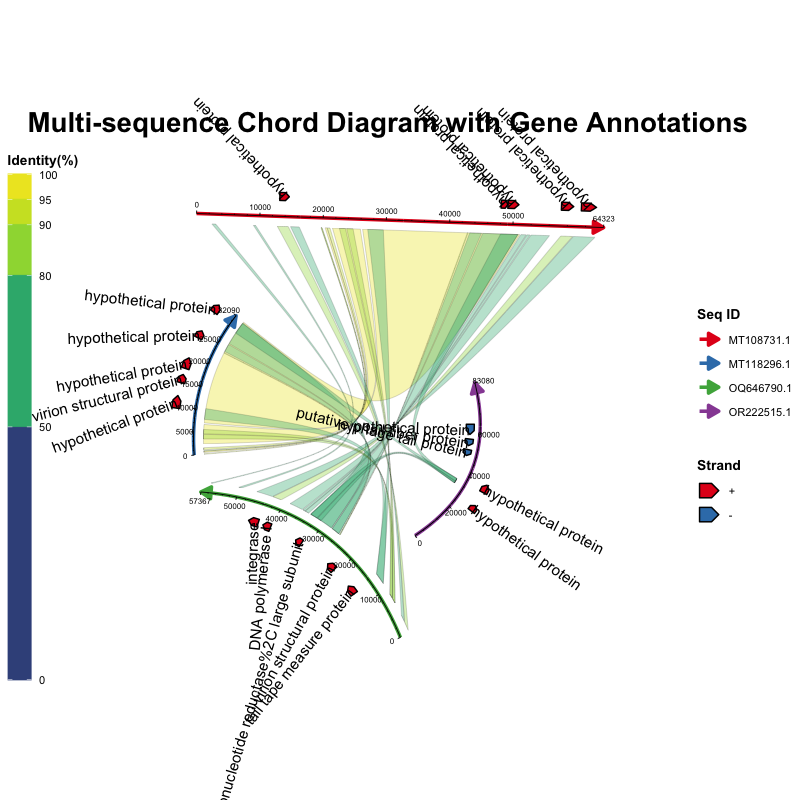

```{r setup, include=FALSE}
knitr::opts_chunk$set(
  collapse = TRUE,
  comment = "#>",
  warning = FALSE,
  message = FALSE,
  fig.width = 8,
  fig.height = 7,
  fig.align = "center"
)
```

```{r library}
library(ggchord)
library(ggplot2)

data(seq_data_example)
data(ribbon_data_example)
data(gene_data_example)
```

This tutorial walks through the complete `ggchord` workflow: preparing input
data, importing files in R, validating and cleaning data, and building plots
layer by layer.

## 1. Data preparation

Three types of input data are used. All three are plain data frames.

### [Required] Sequence data (`seq_data`)

| Column | Type | Description |
| --- | --- | --- |
| `seq_id` | character | Unique sequence identifier |
| `length` | integer | Sequence length (must be positive) |

Example:

| seq_id | length |
| --- | --- |
| MT108731.1 | 64323 |
| MT118296.1 | 32090 |
| OQ646790.1 | 57367 |
| OR222515.1 | 83080 |

A common way to build this table from FASTA files:

```bash
seqkit fx2tab -nil examples/fasta/*.fna | sed '1i seq_id\tlength' > examples/seq_track.tsv
```

### [Optional] Alignment data (`ribbon_data`)

One row per alignment block between two sequences (the column names follow
common alignment-tool conventions):

| Column | Type | Description |
| --- | --- | --- |
| `qaccver` | character | Query sequence ID |
| `saccver` | character | Subject sequence ID |
| `length` | integer | Alignment length (bp) |
| `pident` | numeric | Percent identity (0–100) |
| `qstart` | integer | Start position on the query sequence |
| `qend` | integer | End position on the query sequence |
| `sstart` | integer | Start position on the subject sequence |
| `send` | integer | End position on the subject sequence |

Example rows:

| qaccver | saccver | length | pident | qstart | qend | sstart | send |
| --- | --- | --- | --- | --- | --- | --- | --- |
| MT108731.1 | MT118296.1 | 24856 | 98.612 | 26298 | 51139 | 7121 | 31959 |
| MT108731.1 | MT118296.1 | 4412 | 97.031 | 21513 | 25922 | 2365 | 6772 |
| MT108731.1 | MT118296.1 | 464 | 94.181 | 20691 | 21146 | 1032 | 1495 |

For example, the standard BLAST `-outfmt 7` output can be parsed into this
table directly:

```bash
seqs=("MT108731.1" "MT118296.1" "OQ646790.1" "OR222515.1")
ext="fna"
for ((i=0; i<${#seqs[@]}-1; i++)); do
  for ((j=i+1; j<${#seqs[@]}; j++)); do
    blastn \
      -outfmt '7 qaccver saccver pident length mismatch gapopen qstart qend sstart send evalue bitscore qcovs qlen slen sstrand stitle' \
      -query "examples/fasta/${seqs[$i]}.${ext}" \
      -subject "examples/fasta/${seqs[$j]}.${ext}" \
      -out "examples/blastn/${seqs[$i]}__${seqs[$j]}.o7"
  done
done
```

### [Optional] Gene data (`gene_data`)

One row per gene (or feature) on a sequence:

| Column | Type | Description |
| --- | --- | --- |
| `seq_id` | character | Sequence ID the gene belongs to |
| `start` | integer | Gene start position |
| `end` | integer | Gene end position |
| `strand` | character | Strand direction (`+` or `-`) |
| `anno` | character | Gene annotation / functional category |

Example rows:

| seq_id | start | end | strand | anno |
| --- | --- | --- | --- | --- |
| MT108731.1 | 60709 | 63087 | + | hypothetical protein |
| MT118296.1 | 14628 | 16301 | + | virion structural protein |
| OQ646790.1 | 43765 | 46140 | + | integrase |
| OQ646790.1 | 13194 | 15551 | + | tail tape measure protein |

For example, this table can be converted from GFF3 files:

```r
library(tidyverse)
gff3FilesPath <- list.files(path = "examples/gff3", pattern = "\\.gff3$", full.names = TRUE)
gff3Table <- map_df(gff3FilesPath, ~read_tsv(.x, show_col_types = F, comment = "#",
  col_names = F) %>% set_names(c("seq_id", "source", "type", "start", "end",
  "score", "strand", "phase", "attributes")))
geneTrackTable <- gff3Table %>%
  filter(type == "CDS") %>%
  mutate(anno = str_extract(attributes, "(?<=product=)[^;]+(?=;)")) %>%
  select(seq_id, start, end, strand, anno)
write_tsv(geneTrackTable, "examples/gene_track.tsv")
```

## 2. Importing FASTA / BLAST / GFF3 data in R

External command-line tools (BLAST, seqkit, ...) are often used to *prepare*
the data, but the files they produce can also be read directly in R with the
built-in import helpers. This keeps the "prepare data outside R" and
"import + plot in R" steps clearly separated:

```{r import-helpers, eval=FALSE}
library(ggchord)

# FASTA -> seq_data (read and combine all example FASTA files)
seq_data <- read_fasta_lengths(files = "examples/fasta/*.fna")

# BLAST -outfmt 6/7 tabular output -> ribbon_data (12 or 17 columns auto-detected)
ribbon_data <- read_blast(files = "examples/blastn/*.o7")

# GFF3 -> gene_data (CDS features by default; anno from product/Name/...)
gene_data <- read_gff3(files = "examples/gff3/*.gff3")

ggchord(seq_data, ribbon_data, gene_data) +
  geom_seq() + geom_ribbon() + geom_gene()
```

`read_blast()` preserves useful extra columns (`evalue`, `bitscore`, `qcovs`,
`qlen`, `slen`, `sstrand`, `stitle`); `read_gff3()` preserves `type`,
`source`, `score`, `phase` and `attributes`; `read_fasta_lengths()` optionally
splits NCBI-style headers with `header_delim = "|"`.

## 3. Data validation and cleaning

Before plotting, `validate_ggchord_data()` finds problems (missing columns,
NA/Inf, duplicated IDs, unknown sequence IDs, out-of-range coordinates,
reversed intervals, bad strand, duplicates, overlapping blocks) and reports
the original row numbers of every issue:

```{r validation, eval=FALSE}
data(seq_data_example)
data(ribbon_data_example)
data(gene_data_example)

res <- validate_ggchord_data(seq_data_example, ribbon_data_example,
                             gene_data_example)

res$valid          # TRUE when the data can be safely plotted
print(res)         # human-readable report
summary(res)       # per-category counts
res$errors         # severe problems (table, category, row, column, message)
res$warnings       # non-severe issues (same columns)
res$invalid_rows   # original row numbers per problem category
res$cleanable      # fixable issues with suggested actions
as.data.frame(res) # flat table with a severity column

# stop on severe problems instead:
validate_ggchord_data(seq_data_example, ribbon_data_example,
                      gene_data_example, strict = TRUE)
```

`clean_ggchord_data()` fixes the fixable issues with explicit, conservative
policies and reports every change (original row number, reason, original/new
values, action). Your input data frames are never modified:

```{r cleaning, eval=FALSE}
out <- clean_ggchord_data(
  seq_data_example, ribbon_data_example, gene_data_example,
  unknown_id        = "drop",   # drop rows referencing unknown sequences
  out_of_range      = "clip",   # clip coordinates to [1, sequence length]
  reversed_interval = "sort",   # sort start > end (original direction recorded)
  invalid_pident    = "clip",   # clamp pident to [0, 100]
  empty_annotation  = "replace" # fill missing anno with "unannotated"
)

out                  # print() shows a summary of cleaned tables and report
head(out$report)     # one row per change: table/row/column/reason/...
p <- ggchord(out$seq_data, out$ribbon_data, out$gene_data) +
  geom_seq() + geom_ribbon() + geom_gene()
```

`ggchord()` runs this validation automatically and emits a single summary
warning (never one warning per row) when the data has problems. Use
`validate = "error"` to stop on severe problems, or `validate = "none"` to
skip the diagnostics for very large inputs. The full report is cached on the
plot: `p$ggchord$validation`.

## 4. Ribbon filtering, deduplication and merging

When an alignment table is too large or redundant, prepare it before plotting:

```{r ribbon-preprocess, eval=FALSE}
data(ribbon_data_example)

# Keep only good alignments and sort by identity
kept <- filter_ggchord_ribbons(
  ribbon_data_example,
  min_pident  = 90,
  drop_self_links = TRUE,
  sort_by     = c("pident", "-evalue")
)
ribbon_data_example <- kept$data
kept$report  # how many rows were removed and why

# Remove duplicate / near-duplicate / highly overlapping blocks
dedup <- deduplicate_ggchord_ribbons(ribbon_data_example, by = "exact",
                                     keep = "best_pident")

# Merge adjacent blocks of the same pair (length-weighted pident)
merged <- merge_ggchord_ribbons(dedup$data, max_gap = 0)
ribbon_data_example <- merged$data
merged$report  # output_row -> from_rows traceability
```

All three helpers keep extra columns and the original column order, and attach
the original row numbers as the `source_rows` attribute of the returned data,
so results can always be traced back to the input rows.

## 4b. Sequence grouping

Sequences can be grouped with `seq_group` (a `seq_data` column or a named
vector). An extra gap is added between different groups, and group labels can
be customised:

```{r seq-group}
seq_grouped <- transform(seq_data_example,
                         seq_group = c("host", "phage", "phage", "host"))

ggchord(seq_grouped, ribbon_data_example, gene_data_example) +
  geom_seq(seq_group = "seq_group",
           seq_group_colors = c(host = "#E41A1C", phage = "#377EB8")) +
  geom_ribbon() +
  geom_gene() +
  geom_axis()
```

`geom_seq(seq_group_labels = FALSE)` keeps the extra group gap but hides the
group labels. `seq_group_gap` controls the size of the inter-group gap.

## 5. Learn by examples

All examples use the built-in data sets already loaded above, so you can
copy-paste and run them directly. The key results are shown with the same
shared example images in the English and Chinese tutorials.

### Step 1: Draw the sequence arcs

The simplest plot needs only `seq_data`:

```{r seq-default, eval=FALSE}
ggchord(seq_data = seq_data_example) + geom_seq()
```

```{r seq-default-img, echo=FALSE, fig.cap="Sequence chord diagram with default parameters."}
knitr::include_graphics("../man/figures/seq_only_default.png")
```

Customize the sequence layout — order, orientation, curvature and colors all
belong to `geom_seq()`:

```{r seq-custom, eval=FALSE}
ggchord(seq_data = seq_data_example) +
  geom_seq(
    seq_order      = c("MT118296.1", "OR222515.1", "MT108731.1", "OQ646790.1"),
    seq_orientation = c(1, -1, 1, -1),
    seq_curvature   = c(0, 2, -2, 6),
    seq_colors      = c("steelblue", "orange", "pink", "yellow")
  )
```

### Step 2: Add alignment ribbons

Add `ribbon_data` and draw ribbons. By default ribbons are colored by percent
identity (`ribbon_color_scheme = "pident"`):

```{r ribbon-pident, eval=FALSE}
ggchord(seq_data_example, ribbon_data_example) +
  geom_seq() + geom_ribbon()
```

```{r ribbon-pident-img, echo=FALSE, fig.cap="Alignment ribbons colored by percent identity."}

```

Other color schemes are available:

```{r ribbon-query, eval=FALSE}
# Color ribbons by the query sequence
ggchord(seq_data_example, ribbon_data_example) +
  geom_seq() + geom_ribbon(ribbon_color_scheme = "query")
```

```{r ribbon-subject, eval=FALSE}
# Color ribbons by the subject sequence
ggchord(seq_data_example, ribbon_data_example) +
  geom_seq() + geom_ribbon(ribbon_color_scheme = "subject")
```

```{r ribbon-single, eval=FALSE}
# Use a single color for all ribbons
ggchord(seq_data_example, ribbon_data_example) +
  geom_seq() +
  geom_ribbon(ribbon_color_scheme = "single", ribbon_colors = "orange")
```

### Step 3: Add gene annotations and labels

Add `gene_data` and draw genes as arrows. By default arrows are colored by
strand (`+` / `-`):

```{r gene-strand, eval=FALSE}
ggchord(seq_data_example, gene_data = gene_data_example) +
  geom_seq() + geom_gene()
```

Color by annotation category and add labels with `geom_gene_label()`:

```{r gene-manual-label, eval=FALSE}
ggchord(seq_data_example, gene_data = gene_data_example) +
  geom_seq() +
  geom_gene(gene_color_scheme = "manual") +
  geom_gene_label(
    gene_label_rotation = 45,
    gene_label_radial_offset = 0.1
  )
```

When annotations are long or genes are dense, labels can overlap.
`geom_gene_label_repel()` pushes labels away with a ggrepel-style force layout
and connects them to their genes with leader lines; it can also wrap long
annotations (`gene_label_wrap`) and hide the most crowded labels
(`max_overlaps`):

```{r gene-repel, eval=FALSE}
ggchord(seq_data_example, gene_data = gene_data_example) +
  geom_seq() +
  geom_gene() +
  geom_gene_label_repel(
    gene_label_wrap = 15,
    max_overlaps = 5
  )
```

```{r gene-repel-img, echo=FALSE, fig.cap="Gene labels repelled with leader lines."}

```

For all-horizontal text and L-shaped leader lines, use
`gene_label_orientation = "horizontal"` and `gene_label_segment = "elbow"`:

```{r gene-repel-elbow, eval=FALSE}
ggchord(seq_data_example, gene_data = gene_data_example) +
  geom_seq() +
  geom_gene() +
  geom_gene_label_repel(
    gene_label_orientation = "horizontal",
    gene_label_segment = "elbow",
    gene_label_wrap = 0
  )
```

When ribbons fill the inside of the chord, labels on the inner side can end up
on top of them. `gene_label_side = "outside"` moves those labels to the outside
of their arcs:

```{r gene-repel-outside, eval=FALSE}
ggchord(seq_data_example, ribbon_data_example, gene_data_example) +
  geom_seq() +
  geom_ribbon() +
  geom_gene() +
  geom_gene_label_repel(
    gene_label_orientation = "horizontal",
    gene_label_segment = "elbow",
    gene_label_side = "outside",
    gene_label_wrap = 0
  )
```

### Step 4: Add axes and sequence labels

Axes annotate sequence positions with major/minor ticks.
`geom_seq_label()` places sequence names around the arcs. `seq_label_radius`
is a multiplier of the arc radius: `1` sits on the arc, `> 1` moves the label
outside, and `< 1` moves it inside:

```{r axis-label, eval=FALSE}
ggchord(seq_data_example) +
  geom_seq() +
  geom_axis(
    axis_tick_major_length = 0.03,
    axis_tick_minor_length = 0.015,
    axis_label_size = 2.5
  ) +
  geom_seq_label(seq_label_radius = 1.2)
```

```{r axis-label-img, echo=FALSE, fig.cap="Axes and sequence labels."}

```

Sequence labels can also be kept horizontal:

```{r seq-label-horizontal, eval=FALSE}
ggchord(seq_data_example, rotation = 30) +
  geom_seq() +
  geom_seq_label(
    seq_label_radius = 1.15,
    seq_label_orientation = "horizontal",
    seq_label_size = 3.5,
    colour = "#2563EB"
  )
```

### Step 5: Two-sequence comparison

Plot any subset of the data. Keep two sequences and the matching ribbons/genes:

```{r seq2, eval=FALSE}
seq2 <- seq_data_example[seq_data_example$seq_id %in%
                           c("MT108731.1", "MT118296.1"), ]
ribbon2 <- ribbon_data_example[
  ribbon_data_example$qaccver %in% seq2$seq_id &
    ribbon_data_example$saccver %in% seq2$seq_id, ]
gene2 <- gene_data_example[gene_data_example$seq_id %in% seq2$seq_id, ]

ggchord(seq2, ribbon2, gene2) +
  geom_seq() + geom_ribbon() + geom_gene() + geom_axis()
```

### Step 6: Three-sequence comparison

The same idea works for three sequences:

```{r seq3, eval=FALSE}
seq3 <- seq_data_example[seq_data_example$seq_id %in%
                           c("MT108731.1", "MT118296.1", "OQ646790.1"), ]
ribbon3 <- ribbon_data_example[
  ribbon_data_example$qaccver %in% seq3$seq_id &
    ribbon_data_example$saccver %in% seq3$seq_id, ]
gene3 <- gene_data_example[gene_data_example$seq_id %in% seq3$seq_id, ]

ggchord(seq3, ribbon3, gene3) +
  geom_seq() + geom_ribbon() + geom_gene() + geom_axis()
```

### Step 7: Add themes and scales with `+`

A ggchord plot is a real ggplot2 object, so `theme()` and `scale_*()` work as
usual:

```{r theme-scale, eval=FALSE}
ggchord(seq_data_example, ribbon_data_example, gene_data_example) +
  geom_seq() + geom_ribbon() + geom_gene() + geom_axis() +
  theme(panel.background = element_rect(fill = "grey95")) +
  scale_color_manual(
    values = c("MT108731.1" = "#E41A1C",
               "MT118296.1" = "#377EB8",
               "OQ646790.1" = "#4DAF4A",
               "OR222515.1" = "#984EA3")
  )
```

**Legend placement.** Each layer's legend is placed independently by default.
Set `legend_position = NULL` to make a legend follow
`theme(legend.position = ...)` so all legends can be grouped together:

```{r legend-bottom, eval=FALSE}
ggchord(seq_data_example, ribbon_data_example, gene_data_example) +
  geom_seq(legend_position = NULL) +
  geom_ribbon(legend_position = NULL) +
  geom_gene(legend_position = NULL) +
  geom_axis() +
  theme(legend.position = "bottom", legend.box = "horizontal")
```

```{r legend-bottom-img, echo=FALSE, fig.cap="All legends grouped at the bottom via theme()."}
knitr::include_graphics("../man/figures/legend_bottom.png")
```

### Step 8: Combine everything and fine-tune

Every layer accepts fine-grained parameters. The plot below puts them all
together:

```{r combined-fine, eval=FALSE}
ggchord(
  seq_data     = seq_data_example,
  ribbon_data  = ribbon_data_example,
  gene_data    = gene_data_example,
  title        = "ggchord",
  rotation     = 45,
  panel_margin = list(t = 1.5, r = 0.6, b = 0.6, l = 0.6)
) +
  labs(subtitle = "Layered multi-sequence chord diagrams for ggplot2") +
  geom_seq(
    seq_radius      = c(3.3, 2.5, 1.8, 1.25),
    seq_orientation = c(-1, -1, 1, -1),
    seq_curvature   = c(0.8, 1, 1.4, 1),
    seq_gap         = 0.035,
    seq_colors      = c(
      "MT108731.1" = "#E76F51",
      "MT118296.1" = "#264653",
      "OQ646790.1" = "#2A9D8F",
      "OR222515.1" = "#D9A62E"
    ),
    linewidth = 1.6
  ) +
  geom_ribbon(
    ribbon_color_scheme = "pident",
    ribbon_gap = 0.12,
    ribbon_alpha = 0.45,
    ribbon_outline_color = "#FBF9F6",
    ribbon_outline_width = 0.03
  ) +
  geom_gene(
    gene_offset = 0.1,
    gene_width = 0.06,
    gene_colors = c("+" = "#4C6EF5", "-" = "#F06595")
  ) +
  geom_gene_label_repel(
    gene_label_orientation = "horizontal",
    gene_label_segment = "elbow",
    gene_label_side = "outside",
    gene_label_wrap = 0,
    gene_label_size = 2,
    seed = 42
  ) +
  geom_seq_label(
    seq_label_radius = 1,
    seq_label_hjust = -.2,
    seq_label_size = 3.4,
    colour = "#52525B"
  ) +
  geom_axis(
    axis_gap = 0.07,
    axis_tick_major_number = 4,
    axis_tick_major_length = 0.025,
    axis_tick_minor_number = 4,
    axis_tick_minor_length = 0.012,
    axis_label_size = 1.8
  ) +
  theme(
    plot.background  = element_rect(fill = "#FBF9F6", colour = NA),
    panel.background = element_rect(fill = "#FBF9F6", colour = NA),
    plot.title       = element_text(
      size = 26, face = "bold", colour = "#1F2937",
      hjust = 0.5, margin = margin(t = 10, b = 2)
    ),
    plot.subtitle = element_text(
      size = 12, colour = "#6B7280",
      hjust = 0.5, margin = margin(b = 12)
    ),
    legend.position = "right",
    legend.title    = element_text(size = 9, face = "bold", colour = "#374151"),
    legend.text     = element_text(size = 8, colour = "#4B5563"),
    legend.key.size = unit(0.7, "cm")
  )
```

```{r combined-fine-img, echo=FALSE, fig.cap="Full chord diagram with fine-grained control."}

```

## 6. Flexible parameter formats

Sequence-level parameters (`seq_radius`, `seq_gap`, `axis_label_size`, ...)
accept **a single value, an unnamed vector, a vector/list named by sequence ID,
a list named by sequence order (`"1"`, `"2"`, ...), or an unnamed list**.
Gene-level parameters (`gene_label_rotation`, `gene_offset`, ...) additionally
accept per-strand (`+`/`-`) values. All of the following are valid:

```{r flexible-formats, eval=FALSE}
# 1. One value for everything
gene_label_rotation = 20

# 2. One value per strand, for every sequence
gene_label_rotation = c("+" = -15, "-" = -45)

# 3. By sequence ID
gene_label_rotation = list(
  "MT118296.1" = c("+" = -15, "-" = -45),
  "OR222515.1" = c("+" = 30, "-" = -30),
  "MT108731.1" = c("+" = 15, "-" = -15),
  "OQ646790.1" = c("+" = 0,  "-" = 0)
)

# 4. By sequence order ("1" = first sequence)
gene_label_rotation = list(
  "1" = c("+" = -15, "-" = -45),
  "2" = c("+" = 30, "-" = -30),
  "3" = c("+" = 15, "-" = -15),
  "4" = c("+" = 0,  "-" = 0)
)

# 5. Unnamed list: follows the sequence order (same as #4)
gene_label_rotation = list(
  c("+" = -15, "-" = -45),
  c("+" = 30, "-" = -30),
  c("+" = 15, "-" = -15),
  c("+" = 0,  "-" = 0)
)

# 6. A length-one list recycles to every sequence
gene_label_rotation = list(20)
```

## 7. Layer reference

| Layer | Function | Description |
| --- | --- | --- |
| Sequence arcs | `geom_seq()` | Draws an arc (or line) for each sequence, with direction arrows |
| Alignment ribbons | `geom_ribbon()` | Draws colored ribbons from alignment results |
| Gene arrows | `geom_gene()` | Draws gene/feature arrow polygons |
| Gene labels | `geom_gene_label()` | Draws gene labels at fixed positions |
| Repelled gene labels | `geom_gene_label_repel()` | ggrepel-style labels with leader lines, wrapping and overlap hiding |
| Axes | `geom_axis()` | Draws axis lines, major/minor ticks and tick labels |
| Sequence labels | `geom_seq_label()` | Places sequence names on/outside the arcs |

## 8. Parameter reference

### ggchord() Parameters

| Parameter | Type | Default | Description |
| --- | --- | --- | --- |
| `seq_data` | data.frame | - | Sequence info; must include `seq_id`, `length` |
| `ribbon_data` | data.frame | NULL | Alignment results |
| `gene_data` | data.frame | NULL | Gene annotation data |
| `title` | character | NULL | Plot title |
| `rotation` | numeric | 45 | Global rotation angle (degrees) |
| `panel_margin` | numeric/list | 0 | Panel margins |
| `show_legend` | logical | TRUE | Display legends |
| `debug` | logical | FALSE | Output debug info |

### geom_seq() Parameters

| Parameter | Type | Default | Description |
| --- | --- | --- | --- |
| `seq_order` | character vector | NULL | Drawing order of sequences |
| `seq_labels` | character vector | NULL | Sequence labels |
| `seq_orientation` | numeric (1/-1) | 1 | Sequence direction |
| `seq_gap` | numeric [0, 0.5) | 0.03 | Gap proportion between sequences |
| `seq_radius` | numeric (> 0) | 1.0 | Sequence arc radius |
| `seq_curvature` | numeric | 1.0 | Curvature: 0 = straight, 1 = standard, > 1 = more curved |
| `seq_colors` | color vector | Set1 | Sequence arc colors |
| `seq_group` | NULL / column name / vector | NULL | Group specification for each sequence |
| `seq_group_gap` | numeric | 0.08 | Extra gap proportion between groups |
| `seq_group_labels` | logical / character | TRUE | Draw group labels; a named vector overrides label text |
| `seq_group_label_radius` | numeric | 1.35 | Radial position of group labels (`1` = on arc, `> 1` = outside) |
| `seq_group_colors` | named color vector | grey20 | Colours for group labels |
| `linewidth` | numeric | 1.2 | Arc line width |
| `show_legend` | logical | TRUE | Show the Seq ID legend |
| `legend_position` | character | "right" | Position of the Seq ID legend: `"left"`, `"right"`, `"top"`, `"bottom"` or `"inside"` (`NULL` = follow `theme(legend.position = ...)`) |

### geom_seq_label() Parameters

| Parameter | Type | Default | Description |
| --- | --- | --- | --- |
| `seq_label_radius` | numeric/vector | 1.15 | Radial position of labels as a multiplier of the arc radius: 1 = on the arc, > 1 = outside, < 1 = inside |
| `seq_label_rotation` | numeric/vector | 0 | Additional label rotation (degrees); ignored in horizontal mode |
| `seq_label_size` | numeric/vector | 3 | Label font size |
| `seq_labels` | character vector | NULL | Override label texts (defaults to the sequence labels from `geom_seq()`) |
| `seq_label_orientation` | character | "arc" | Label text orientation: `"arc"` (rotated along the arc, kept readable) or `"horizontal"` |
| `seq_label_hjust` | numeric/vector | NULL (0.5) | Horizontal justification; automatic (text extends away from the chord) in horizontal mode |
| `seq_label_vjust` | numeric/vector | NULL (0.5) | Vertical justification |
| `check_overlap` | logical | FALSE | Skip labels that would overlap a previously drawn label |
| `show_legend` | logical | FALSE | Show legend |

### geom_ribbon() Parameters

| Parameter | Type | Default | Description |
| --- | --- | --- | --- |
| `ribbon_color_scheme` | character | "pident" | Scheme: `"pident"`, `"query"`, `"subject"`, `"single"` |
| `ribbon_colors` | color vector | auto | Ribbon color parameters |
| `ribbon_alpha` | numeric (0-1) | 0.35 | Ribbon transparency |
| `ribbon_ctrl_point` | vector/list | c(0, 0) | Bézier control points |
| `ribbon_gap` | numeric/vector | 0.15 | Radial gap between sequences and ribbons |
| `ribbon_outline_color` | character | "black" | Ribbon outline (border) color |
| `ribbon_outline_width` | numeric | 0.05 | Ribbon outline line width |
| `ribbon_outline_linetype` | numeric/character | 1 | Ribbon outline line type (1 = solid) |
| `show_legend` | logical | TRUE | Show the Identity(%) legend |
| `legend_position` | character | "left" | Position of the Identity(%) colourbar: `"left"`, `"right"`, `"top"`, `"bottom"` or `"inside"` (`NULL` = follow `theme(legend.position = ...)`) |
| `legend_key_length` | unit/number | NULL | Length of the Identity(%) colourbar (height when vertical, width when horizontal); a number is in cm, e.g. `legend_key_length = 5` or `unit(5, "cm")` |

### geom_gene() Parameters

| Parameter | Type | Default | Description |
| --- | --- | --- | --- |
| `gene_offset` | numeric/vector/list | 0.1 | Radial offset of gene arrows |
| `gene_width` | numeric/vector/list | 0.05 | Gene arrow width |
| `gene_color_scheme` | character | "strand" | Scheme: `"strand"` or `"manual"` |
| `gene_colors` | color vector | auto | Gene arrow fill colors |
| `gene_order` | character vector | NULL | Gene display order in the legend |
| `show_legend` | logical | TRUE | Show the Strand/Gene legend |
| `legend_position` | character | "right" | Position of the Strand/Gene legend: `"left"`, `"right"`, `"top"`, `"bottom"` or `"inside"` (`NULL` = follow `theme(legend.position = ...)`) |

### geom_gene_label() Parameters

| Parameter | Type | Default | Description |
| --- | --- | --- | --- |
| `gene_label_size` | numeric | 2.5 | Label font size |
| `gene_label_rotation` | numeric/vector/list | 0 | Label rotation angle |
| `gene_label_radial_offset` | numeric/vector/list | 0 | Radial offset of labels |
| `gene_label_circum_offset` | numeric/vector/list | 0 | Circumferential offset |
| `gene_label_circum_limit` | logical/vector/list | TRUE | Limit circumferential offset |
| `gene_label_wrap` | numeric | NULL | Wrap long annotations at this many characters (e.g. 15) |
| `show_legend` | logical | FALSE | Show legend |

### geom_gene_label_repel() Parameters

All `geom_gene_label()` parameters plus:

| Parameter | Type | Default | Description |
| --- | --- | --- | --- |
| `max_overlaps` | numeric | Inf | Hide labels that still overlap more than this many other labels after repulsion |
| `box_padding` | numeric | 0.25 | Extra padding around each label box (data units) |
| `point_padding` | numeric | 0.1 | Extra padding around the anchor points (data units) |
| `min_segment_length` | numeric | 0.05 | Labels that moved less than this distance draw no leader line |
| `force` | numeric | 1 | Strength of the repulsive forces |
| `seed` | numeric | 123 | Random seed for reproducible repulsion |
| `gene_label_orientation` | character | "arc" | Label text direction: `"arc"` (rotated along the arc) or `"horizontal"` |
| `gene_label_segment` | character | "line" | Leader line style: `"line"` (straight) or `"elbow"` (L-shaped) |
| `gene_label_side` | character | "auto" | Which side of the arc the labels sit on: `"auto"` (strand-based), `"outside"` (away from the chord center, avoiding ribbon overlap), or `"inside"` |
| `gene_label_segment_linetype` | character/numeric | "auto" | Leader-line linetype; `"auto"` = solid, except dashed for labels moved to the other side of their arc. Any valid ggplot2 linetype is used for all lines |

### geom_axis() Parameters

| Parameter | Type | Default | Description |
| --- | --- | --- | --- |
| `show_axis` | logical | TRUE | Display axes |
| `axis_gap` | numeric/vector | 0.05 | Radial gap to sequences |
| `axis_tick_major_number` | integer/vector | 3 | Number of major ticks |
| `axis_tick_major_length` | numeric/vector | 0.02 | Major tick length proportion |
| `axis_tick_minor_number` | integer/vector | 4 | Number of minor ticks |
| `axis_tick_minor_length` | numeric/vector | 0.01 | Minor tick length proportion |
| `axis_label_size` | numeric/vector | 3 | Tick label font size |
| `axis_label_offset` | numeric/vector | 2 | Label offset ratio |
| `axis_label_orientation` | character/numeric/vector | "parallel" | Label orientation: `"parallel"` (text parallel to the axis), `"perpendicular"` (text perpendicular to the axis), `"horizontal"` (text stays horizontal), or a numeric angle in degrees counter-clockwise from horizontal (e.g. `45`, `90`, `c(0, 45, 80, 130)`); vectors/named vectors set a different orientation per sequence |
| `axis_label_hide_overlaps` | logical | FALSE | Auto-hide axis labels that overlap the plot content or other labels |
| `show_legend` | logical | FALSE | Show legend |

## 9. Plot interpretation

- **Sequence arcs** — each colored arc is one sequence, with length
  proportional to the sequence length and arrows showing direction.
- **Ribbons** — colored regions connecting sequences represent aligned/
  homologous intervals; color encodes identity, query or subject by default.
- **Gene arrows** — arrow polygons on the sequences; color encodes strand or
  functional category, with optional labels.
- **Axes** — ticks and numbers outside each arc label sequence positions.

## Further reading

- [Function reference](https://dangjem.github.io/ggchord/reference/index.html)
- [Version history (NEWS.md)](https://dangjem.github.io/ggchord/news/index.html)
- [Package homepage](https://dangjem.github.io/ggchord/)
