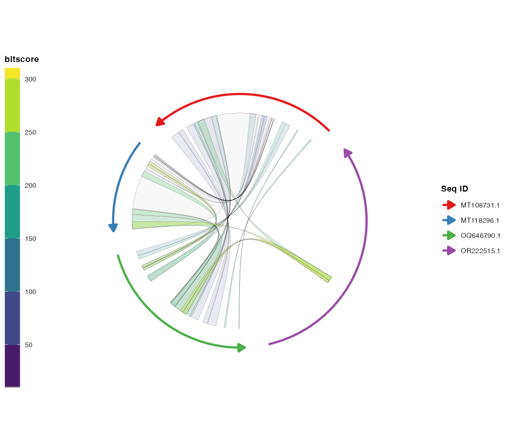
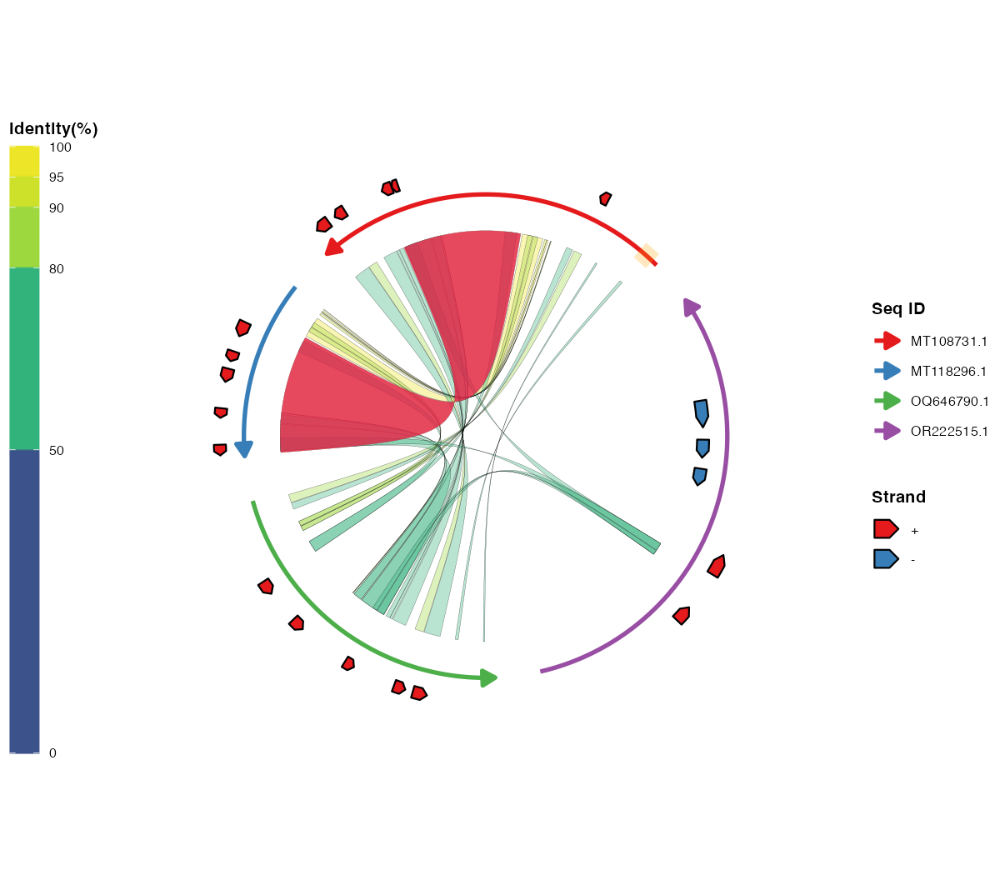
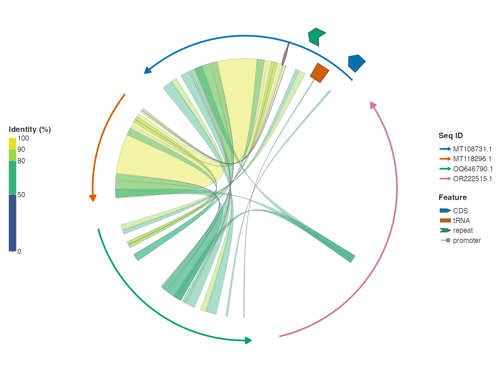

```{r setup, include=FALSE}
knitr::opts_chunk$set(
  collapse = TRUE,
  comment = "#>",
  warning = FALSE,
  message = FALSE,
  fig.width = 8,
  fig.height = 6,
  fig.align = "center",
  out.width = "100%"
)
```

```{r library}
library(ggplot2)
library(ggchord)

data(seq_data_example)
data(ribbon_data_example)
data(gene_data_example)
```

This tutorial walks through the complete `ggchord` workflow: preparing input
data, importing files in R, validating and cleaning data, and building plots
layer by layer. Code examples target **v0.11.0**. Figures are retained from earlier versions
and illustrate the concepts, not the current default appearance. The full
documentation and figure redesign will follow in a separate post-release update.

## 1. Data preparation

Three types of input data are used. All three are plain data frames.

### [Required] Sequence data (`seq_data`)

| Column | Type | Description |
| --- | --- | --- |
| `accver` | character | Unique sequence identifier |
| `length` | integer | Sequence length (must be positive) |

Example:

| accver | length |
| --- | --- |
| MT108731.1 | 64323 |
| MT118296.1 | 32090 |
| OQ646790.1 | 57367 |
| OR222515.1 | 83080 |

A common way to build this table from FASTA files:

```bash
seqkit fx2tab -nil examples/fasta/*.fna | sed '1i accver\tlength' > examples/seq_track.tsv
```

### [Optional] Alignment data (`ribbon_data`)

One row per alignment block between two sequences (the column names follow
common alignment-tool conventions):

| Column | Type | Description |
| --- | --- | --- |
| `qaccver` | character | Query sequence ID |
| `saccver` | character | Subject sequence ID |
| `length` | integer | Alignment length (bp) |
| `pident` | numeric | Percent identity (0–100) |
| `qstart` | integer | Start position on the query sequence |
| `qend` | integer | End position on the query sequence |
| `sstart` | integer | Start position on the subject sequence |
| `send` | integer | End position on the subject sequence |

Example rows:

| qaccver | saccver | length | pident | qstart | qend | sstart | send |
| --- | --- | --- | --- | --- | --- | --- | --- |
| MT108731.1 | MT118296.1 | 24856 | 98.612 | 26298 | 51139 | 7121 | 31959 |
| MT108731.1 | MT118296.1 | 4412 | 97.031 | 21513 | 25922 | 2365 | 6772 |
| MT108731.1 | MT118296.1 | 464 | 94.181 | 20691 | 21146 | 1032 | 1495 |

For example, the standard BLAST `-outfmt 7` output can be parsed into this
table directly:

```bash
seqs=("MT108731.1" "MT118296.1" "OQ646790.1" "OR222515.1")
ext="fna"
for ((i=0; i<${#seqs[@]}-1; i++)); do
  for ((j=i+1; j<${#seqs[@]}; j++)); do
    blastn \
      -outfmt '7 qaccver saccver pident length mismatch gapopen qstart qend sstart send evalue bitscore qcovs qlen slen sstrand stitle' \
      -query "examples/fasta/${seqs[$i]}.${ext}" \
      -subject "examples/fasta/${seqs[$j]}.${ext}" \
      -out "examples/blastn/${seqs[$i]}__${seqs[$j]}.o7"
  done
done
```

### [Optional] Gene data (`gene_data`)

One row per gene (or feature) on a sequence:

| Column | Type | Description |
| --- | --- | --- |
| `accver` | character | Sequence ID the gene belongs to |
| `start` | integer | Gene start position |
| `end` | integer | Gene end position |
| `strand` | character | Strand direction (`+` or `-`) |
| `anno` | character | Gene annotation / functional category |

Example rows:

| accver | start | end | strand | anno |
| --- | --- | --- | --- | --- |
| MT108731.1 | 60709 | 63087 | + | hypothetical protein |
| MT118296.1 | 14628 | 16301 | + | virion structural protein |
| OQ646790.1 | 43765 | 46140 | + | integrase |
| OQ646790.1 | 13194 | 15551 | + | tail tape measure protein |

For example, this table can be converted from GFF3 files:

```r
library(tidyverse)
gff3FilesPath <- list.files(path = "examples/gff3", pattern = "\\.gff3$", full.names = TRUE)
gff3Table <- map_df(gff3FilesPath, ~read_tsv(.x, show_col_types = F, comment = "#",
  col_names = F) %>% set_names(c("accver", "source", "type", "start", "end",
  "score", "strand", "phase", "attributes")))
geneTrackTable <- gff3Table %>%
  filter(type == "CDS") %>%
  mutate(anno = str_extract(attributes, "(?<=product=)[^;]+(?=;)")) %>%
  select(accver, start, end, strand, anno)
write_tsv(geneTrackTable, "examples/gene_track.tsv")
```

## 2. Importing FASTA / BLAST / GFF3 data in R

External command-line tools (BLAST, seqkit, ...) are often used to *prepare*
the data, but the files they produce can also be read directly in R with the
built-in import helpers. This keeps the "prepare data outside R" and
"import + plot in R" steps clearly separated:

```{r import-helpers, eval=FALSE}
library(ggchord)

# FASTA -> seq_data (read and combine all example FASTA files)
seq_data <- invisible(read_fasta_lengths(files = "examples/fasta/*.fna"))

# BLAST -outfmt 6/7 tabular output -> ribbon_data (12 or 17 columns auto-detected)
ribbon_data <- invisible(read_blast(files = "examples/blastn/*.o7"))

# GFF3 -> gene_data (CDS features by default; anno from product/Name/...)
gene_data <- invisible(read_gff3(files = "examples/gff3/*.gff3"))

ggchord(seq_data, ribbon_data, gene_data) +
  geom_seq() + geom_link_ribbon() + geom_gene()
```

`read_blast()` preserves useful extra columns (`evalue`, `bitscore`, `qcovs`,
`qlen`, `slen`, `sstrand`, `stitle`); `read_gff3()` preserves `type`,
`source`, `score`, `phase` and `attributes`; `read_fasta_lengths()` optionally
splits NCBI-style headers with `header_delim = "|"`.

## 3. Tutorial: from data to a diagram

This section turns the prepared data into a complete chord diagram. Each step
shows current code with a retained illustrative figure. Axes are automatic;
use `theme_ggchord(axis = element_blank())` to hide them.

### 3.1 Validate and clean input data

```{r validate-clean, eval=FALSE}
data(seq_data_example)
data(ribbon_data_example)
data(gene_data_example)

validate_ggchord_data(seq_data_example, ribbon_data_example, gene_data_example)

clean_ggchord_data(seq_data_example, ribbon_data_example, gene_data_example,
                   unknown_id = "drop", out_of_range = "clip",
                   reversed_interval = "sort", invalid_pident = "clip")
```

`ggchord()` also validates automatically with `validate = "warn"`. Use
`"error"` to stop on severe problems or `"none"` for large inputs.

### 3.2 Filter and merge ribbons

```{r ribbon-tidy, eval=FALSE}
kept <- filter_ggchord_ribbons(ribbon_data_example, min_pident = 90,
                               drop_self_links = TRUE,
                               sort_by = "pident")
dedup <- deduplicate_ggchord_ribbons(kept$data, by = "exact",
                                     keep = "best_pident")
merged <- merge_ggchord_ribbons(dedup$data, max_gap = 0)
```

The returned `$data` tables can be passed directly to `ggchord()`.

### 3.3 Start with sequence arcs

```{r tutorial-seq, eval=FALSE}
ggchord(seq_data_example) +
  geom_seq()
```

```{r tutorial-seq-img, echo=FALSE, fig.cap="Sequence arcs."}
knitr::include_graphics("../man/figures/seq_only_default.png")
```

### 3.4 Add alignment ribbons

```{r tutorial-ribbon, eval=FALSE}
ggchord(seq_data_example, ribbon_data_example) +
  geom_seq() + geom_link_ribbon()
```

```{r tutorial-ribbon-img, echo=FALSE, fig.cap="Ribbons coloured by percent identity."}
knitr::include_graphics("../man/figures/ribbon_pident.png")
```

### 3.5 Add genes and labels

```{r tutorial-gene, eval=FALSE}
ggchord(seq_data_example, gene_data = gene_data_example) +
  geom_seq() + geom_gene() + geom_gene_label_repel()
```

```{r tutorial-gene-img, echo=FALSE, fig.cap="Gene arrows with repelled labels."}
knitr::include_graphics("../man/figures/gene_repel.png")
```

#### Choosing a gene-label layout

`geom_gene_label_repel()` has three deterministic modes. The default
`"radial"` keeps names horizontal along each sequence's offset contour, using
normal leaders or a short normal departure followed by a connector.
`"auto"` uses shared left/right columns and radial placement elsewhere.
`"arc"` follows the local tangent and flips upside-down text automatically.
The former `"aligned"` mode has been removed; use `"auto"` for side columns.

```{r tutorial-gene-layouts, eval=FALSE}
base <- ggchord(seq_data_example, ribbon_data_example, gene_data_example) +
  geom_seq(seq_radius = c(3.3, 2.5, 1.8, 1.25),
           seq_orientation = c(1, -1, 1, -1)) +
  geom_link_ribbon() + geom_gene()

base + geom_gene_label_repel(gene_label_layout = "auto")
base + geom_gene_label_repel(gene_label_layout = "radial")
base + geom_gene_label_repel(gene_label_layout = "arc")
```

Every mode uses the real `seq_radius`, `seq_curvature`, `seq_gap`,
`seq_orientation`, rotation and local curve geometry. The local outside/inside
label concepts are informed by [SnapGene](https://support.snapgene.com/hc/en-us/articles/10383722725524-Display-Feature-Labels-Below-or-Inside-a-Map)
and [Geneious](https://manual.geneious.com/en/latest/Sequences.html), while
ggchord uses generic mode names and an independent implementation. Use
`geom_gene_label()` when manual label rotation or offsets are required.

`geom_gene_label()` is also the compact fixed-label option. Its v0.10.0
defaults keep text horizontal and outside the chord, then retain labels in
input-row order while omitting later collisions. Set
`gene_label_orientation = "radial"` or `"tangent"`, choose
`gene_label_side = "auto"` or `"inside"`, and use
`gene_label_overlap = "nudge"` or `"allow"` when preserving every requested
label is more important than a sparse default. This keeps manual rotation and
per-sequence/per-strand offsets in one fixed-label layer rather than adding a
separate manual geom.

The broader visual hierarchy draws on [Circos](https://genome.cshlp.org/content/19/9/1639),
publication-oriented gene arrows in [clinker](https://academic.oup.com/bioinformatics/article/37/16/2473/6129045),
and annotation collision ideas from [DNA Features Viewer](https://edinburgh-genome-foundry.github.io/DnaFeaturesViewer/).
These are design references only; ggchord uses independent palettes, geometry
and generic API names.

### 3.6 Add axes and sequence labels

```{r tutorial-axis, eval=FALSE}
ggchord(seq_data_example) +
  geom_seq() + geom_seq_label()
```

```{r tutorial-axis-img, echo=FALSE, fig.cap="Axes and sequence labels."}
knitr::include_graphics("../man/figures/axis_seq_label.png")
```

### 3.7 Map numeric ribbon columns and direction

```{r tutorial-ribbon-map, eval=FALSE}
rb_scored <- transform(ribbon_data_example,
                       bitscore = seq_len(nrow(ribbon_data_example)) * 10)

ggchord(seq_data_example, rb_scored) +
  geom_seq() +
  geom_link_ribbon(aes(ribbon_fill = bitscore, ribbon_alpha = bitscore,
                  ribbon_linetype = direction))
```

```{r tutorial-ribbon-map-img, echo=FALSE, fig.cap="Continuous ribbon fill, alpha and direction mapping."}

```

### 3.8 Highlight regions and ribbons

```{r tutorial-highlight, eval=FALSE}
regions <- data.frame(accver = "MT108731.1",
                      start = 1000, end = 4000, color = "orange")

ggchord(seq_data_example, ribbon_data_example) +
  geom_seq() + geom_link_ribbon() +
  geom_seq_region(data = regions) +
  geom_link_ribbon(data = ribbon_data_example[1, ], fill = "orange")
```

```{r tutorial-highlight-img, echo=FALSE, fig.cap="Sequence regions and ribbon highlight."}

```

### 3.9 Draw generic features

```{r tutorial-feature, eval=FALSE}
features <- data.frame(accver = rep("MT108731.1", 4),
                       start = c(1000, 7000, 13000, 19000),
                       end = c(5000, 11000, 17000, 23000),
                       strand = c("+", "-", "+", "-"),
                       type = c("CDS", "tRNA", "repeat", "promoter"))

ggchord(seq_data_example, ribbon_data_example) +
  geom_seq() + geom_link_ribbon() +
  geom_feature(aes(feature_shape = type), data = features,
               feature_width = 0.10) +
  scale_feature_shape_manual(values = c(
    CDS = "arrow", tRNA = "block", "repeat" = "chevron",
    promoter = "lollipop"
  ))
```

```{r tutorial-feature-img, echo=FALSE, fig.cap="Four feature geometries drawn with geom_feature()."}

```

### 3.10 Apply themes and scales

```{r tutorial-theme, eval=FALSE}
ggchord(seq_data_example, ribbon_data_example, gene_data_example) +
  geom_seq() + geom_link_ribbon() + geom_gene() +
  scale_seq_colour_manual(values = c("MT108731.1" = "#E41A1C",
                                "MT118296.1" = "#377EB8",
                                "OQ646790.1" = "#4DAF4A",
                                "OR222515.1" = "#984EA3")) +
  theme(panel.background = element_rect(fill = "grey95"),
        legend.position = "bottom", legend.box = "horizontal")
```

```{r tutorial-theme-img, echo=FALSE, fig.cap="A themed plot with all legends grouped."}
knitr::include_graphics("../man/figures/legend_bottom.png")
```

### 3.11 Fine-tuned publication-style plot

```{r tutorial-fine, eval=FALSE}
ggchord(seq_data_example, ribbon_data_example, gene_data_example) +
  labs(title = "ggchord") +
  geom_seq(seq_radius = c(3.3, 2.5, 1.8, 1.25),
           seq_orientation = c(-1, -1, 1, -1)) +
  scale_seq_colour_manual(values = c("MT108731.1" = "#E76F51",
                          "MT118296.1" = "#264653",
                          "OQ646790.1" = "#2A9D8F",
                          "OR222515.1" = "#D9A62E")) +
  geom_link_ribbon(alpha = 0.45) +
  geom_gene() +
  geom_gene_label_repel(size = 2,
                        gene_label_layout = "auto") +
  geom_seq_label() +
  theme(plot.background = element_rect(fill = "#FBF9F6", colour = NA),
        panel.background = element_rect(fill = "#FBF9F6", colour = NA))
```

```{r tutorial-fine-img, echo=FALSE, fig.cap="A complete fine-tuned chord diagram."}
knitr::include_graphics("../man/figures/combined_fine.png")
```

## 6. Flexible parameter formats

Sequence-level parameters (`seq_radius`, `seq_gap`, `seq_curvature`, ...)
accept **a single value, an unnamed vector, a vector/list named by sequence ID,
a list named by sequence order (`"1"`, `"2"`, ...), or an unnamed list**.
Gene-level parameters of the fixed-position `geom_gene_label()` layer
(`gene_label_rotation`, `gene_offset`, ...) additionally accept per-strand
(`+`/`-`) values. The automatic `geom_gene_label_repel()` modes intentionally
manage their own rotation and offsets. All of the following are valid for
fixed labels:

```{r flexible-formats, eval=FALSE}
# 1. One value for everything
gene_label_rotation = 20

# 2. One value per strand, for every sequence
gene_label_rotation = c("+" = -15, "-" = -45)

# 3. By sequence ID
gene_label_rotation = list(
  "MT118296.1" = c("+" = -15, "-" = -45),
  "OR222515.1" = c("+" = 30, "-" = -30),
  "MT108731.1" = c("+" = 15, "-" = -15),
  "OQ646790.1" = c("+" = 0,  "-" = 0)
)

# 4. By sequence order ("1" = first sequence)
gene_label_rotation = list(
  "1" = c("+" = -15, "-" = -45),
  "2" = c("+" = 30, "-" = -30),
  "3" = c("+" = 15, "-" = -15),
  "4" = c("+" = 0,  "-" = 0)
)

# 5. Unnamed list: follows the sequence order (same as #4)
gene_label_rotation = list(
  c("+" = -15, "-" = -45),
  c("+" = 30, "-" = -30),
  c("+" = 15, "-" = -15),
  c("+" = 0,  "-" = 0)
)

# 6. A length-one list recycles to every sequence
gene_label_rotation = list(20)
```

## 7. Layer reference

| Layer | Function | Description |
| --- | --- | --- |
| Sequence arcs | `geom_seq()` | Draws an arc (or line) for each sequence, with direction arrows |
| Alignment ribbons | `geom_link_ribbon()` | Draws colored ribbons from alignment results |
| Gene arrows | `geom_gene()` | Draws gene/feature arrow polygons |
| Gene labels | `geom_gene_label()` | Draws gene labels at fixed positions |
| Automatic gene labels | `geom_gene_label_repel()` | Deterministic auto, radial or arc layouts with collision-free leaders |
| Axes | `theme_ggchord(axis.*)` | Styles automatic axes; use `scale_seq_position_continuous()` for breaks |
| Sequence labels | `geom_seq_label()` | Places sequence names on/outside the arcs |

## 8. Plot interpretation

- **Sequence arcs** — each colored arc is one sequence, with length
  proportional to the sequence length and arrows showing direction.
- **Ribbons** — colored regions connecting sequences represent aligned/
  homologous intervals; color encodes identity, query or subject by default.
- **Gene arrows** — arrow polygons on the sequences; color encodes strand or
  functional category, with optional labels.
- **Axes** — ticks and numbers outside each arc label sequence positions.


## Further reading

- [Function reference](https://dangjem.github.io/ggchord/reference/index.html)
- [Version history (NEWS.md)](https://dangjem.github.io/ggchord/news/index.html)
- [Package homepage](https://dangjem.github.io/ggchord/)


## Single circular sequences and restriction sites

Use `coord_circular()` when the input describes one complete circular
sequence. A zero gap closes the circle; `gap` opens it by a number of degrees.
The coordinate owns genomic-origin rotation and direction. Since v0.13,
`geom_gene()` uses `position = "identity"`; use `position = "strand"` for the
former strand-separated default, or `position = "plasmid"` for a shared inner
band.

A basic pUC19c map needs only the circular backbone and centre metadata:

```{r puc19c-map, eval=FALSE}
data(plasmid_example_pUC19c)
puc <- plasmid_example_pUC19c
ggchord(puc) +
  geom_seq() +
  geom_seq_center_label() +
  scale_seq_position_continuous() +
  coord_circular(rotation = 90) +
  theme_ggchord_plasmid()
```

```{r single-genome, eval=FALSE}
data(plasmid_example_pBR322)
seq <- plasmid_example_pBR322
features <- find_common_features(seq)
sites <- find_restriction_sites(seq,
  enzymes = c("EcoRI", "BamHI", "HindIII", "PstI", "SalI", "PvuII")) |>
  filter_restriction_sites(set = "unique_dual")
plasmid_tracks <- position_feature_stack(
  spacing = 0.10, base_position = position_plasmid()
)

ggchord(seq) +
  geom_seq() +
  geom_feature_plasmid(data = features, position = plasmid_tracks) +
  geom_feature_label_repel(data = features, position = plasmid_tracks) +
  geom_restriction_site(data = sites, leader = "radial") +
  geom_seq_center_label() +
  scale_seq_position_continuous() +
  coord_circular(rotation = 90) +
  theme_ggchord_plasmid()
```

The dense pBluescript II SK(+) multiple-cloning region is a restriction-label
stress test. Real sites retain their anchors. Sparse labels remain on a natural
radial contour, while dense lateral clusters switch to a compact stacked column
with one inner boundary and uniform measured row spacing. Each dense site keeps
a short independent radial root before fanning out in genomic order; sparse
sites may use a direct connector. Leaders are clipped to the actual text edge:

```{r pbluescript-restriction-map, eval=FALSE}
data(plasmid_example_pBluescript_II_SK_plus)
blue <- plasmid_example_pBluescript_II_SK_plus
blue_sites <- find_restriction_sites(blue,
  enzymes = c("PsiI", "BsaAI", "DraIII", "BtgZI", "NgoMIV", "NaeI",
    "Acc65I", "KpnI", "PspOMI", "EcoO109I", "ApaI", "XhoI", "SalI",
    "AccI", "HincII", "ClaI", "HindIII", "EcoRV", "EcoRI", "PstI",
    "XmaI", "SmaI", "BamHI", "SpeI", "XbaI", "NotI", "BspQI",
    "SapI", "AflIII", "PciI", "NspI", "BseYI", "PspFI", "AlwNI",
    "BsaI", "NmeAIII", "ScaI", "TatI", "BsaHI", "XmnI"))
blue_features <- find_common_features(blue)
blue_tracks <- position_feature_stack(
  spacing = 0.10, base_position = position_plasmid()
)
ggchord(blue) +
  geom_seq() +
  geom_feature_plasmid(data = blue_features, position = blue_tracks) +
  geom_feature_label_repel(data = blue_features, position = blue_tracks) +
  geom_restriction_site(data = blue_sites, leader = "radial") +
  geom_seq_center_label() +
  scale_seq_position_continuous() +
  coord_circular(rotation = 90) +
  theme_ggchord_plasmid()
```

Restriction-site calculation is independent from drawing. The result records
recognition and cut coordinates, overhang type, strand, and a traceable pattern
identity. Display filtering is a separate step. Supply a definition data frame
or named character vector for custom IUPAC motifs.

```{r restriction-search, eval=FALSE}
sites <- find_restriction_sites(c(plasmid = "AAAAGAATTCTTTGGATCC"),
  patterns = c(EcoRI = "GAATTC", BamHI = "GGATCC")) |>
  filter_restriction_sites(set = "unique_6plus")
```

## v0.13 data contracts and point links

`accver` follows BLAST's accession/version naming, with `q` and `s` identifying
query and subject. Custom identifiers are valid; versions are never added or
removed. In v0.13, use `accver`; the former `seq_id` compatibility entry no longer exists.

Ribbons require only `qaccver/saccver/qstart/qend/sstart/send`. Missing `pident`
uses a fixed fill without an Identity guide. Alignment `length` is not inferred
from endpoint spans. Filters and weighted statistics require the columns they
use. Gene `anno` and feature categories/text are optional; accessions, coordinates
and feature strands remain required. Missing annotations do not create labels.

Ribbon `link_avoid` defaults to `uniform`, using one obstacle-aware clearance
across each endpoint. Set it to `smooth` for local clearance or `none` for
fixed spacing. Explicit gaps win.
`link_branch` defaults to `none`, with optional `query` or `subject` trunks
for identical endpoints and final styles within one layer. Ribbons match the
whole ordered interval. Records remain separate and trunk `source_rows` lists
members. Fork cross-sections partition geometric width, not statistical weights.

```{r v013-links}
s <- data.frame(accver = c("A", "B", "C"), length = 1000)
links <- data.frame(qaccver = "A", saccver = c("B", "C"), qpos = 200, spos = 500)
p <- ggchord(s) + geom_seq() +
  geom_link_line(data = links, link_branch = "query",
    arrow = arrow(length = unit(2, "mm")))
invisible(export_ggchord_layout(p, include = "link"))
```
